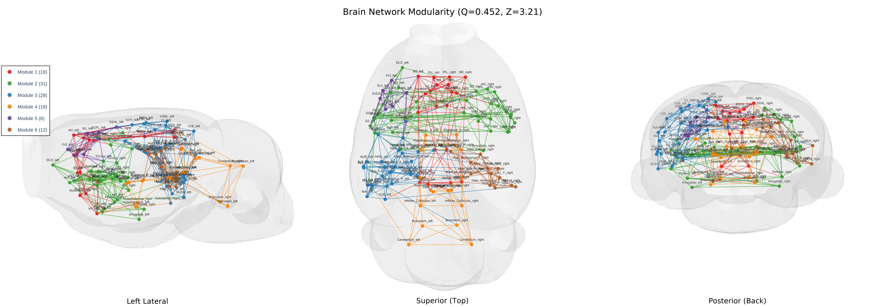
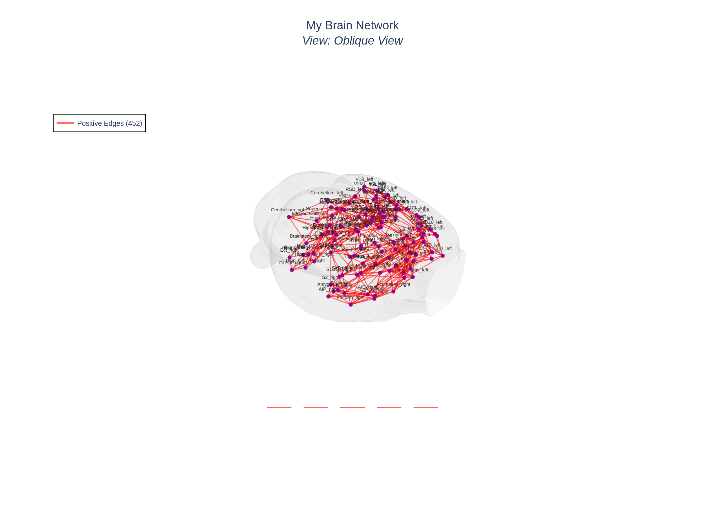

# HarrisLabPlotting



A Python + CLI toolkit for publication-quality **3D interactive brain connectivity
visualizations**. Plotly-based HTML output, PNG/SVG/PDF static export, and a complete
pipeline from raw NIfTI atlas volumes all the way to a finished figure.

Built for neuroscience researchers working with ROI-level connectivity matrices,
graph metrics, modularity analysis, and statistical-comparison outputs
(e.g. GraphVar, Brain Connectivity Toolbox, NBS, GLM).

Two ways to use it:

- **`hlplot` command-line interface** — for quick figures, batch processing, and
  shell pipelines.
- **`HarrisLabPlotting` Python package** — for programmatic use inside notebooks
  and larger analysis scripts.

Both APIs cover the same feature set.

---

## Features

**Plotting**
- Interactive 3D Plotly plots — rotate, zoom, hover tooltips, toggleable legends.
- Connectivity matrices as weights (sign-colored, width scaled by `|weight|`).
- **P-value matrices** with built-in `-log10(p)` transform, significance threshold, and optional sign matrix.
- **Modularity plots** with module-colored nodes and sign- or module-colored edges, Q/Z scores in the title.
- Per-node sizing from CSV/NPY, per-node color from module assignments, hover-tooltip metrics, border colors.
- Auto **size and width legend keys**, labelable by any column in a node-metrics file.
- 9 camera presets plus fully-custom eye/center/up cameras, and a live camera-readout overlay for picking the right angle.
- Mesh lighting presets (`flat` / `matte` / `smooth` / `glossy` / `mirror`) plus per-knob overrides.

**Inputs & pre-processing**
- NIfTI atlas → per-ROI center-of-gravity coordinates (`hlplot coords generate`).
- Map a full atlas to a study-specific subset by ROI name (`hlplot coords map-subset`).
- Read BrainNet Viewer `.node` and `.edge` files directly; combine a folder of per-contrast `.node`/`.edge` pairs into one block-diagonal total (`hlplot combine`).
- Accepts connectivity matrices as `.npy`, `.csv`, `.edge`, `.txt`, or `.mat`.

**Export & automation**
- Multi-view stitched PNG — re-render the same plot from N camera angles and stitch them into a 1×N strip in one call.
- Clean publication export (`--export-no-title` / `--export-no-legend`) in PNG, SVG, or PDF.
- Batch mode driven by a YAML config (`hlplot batch`).
- Utilities: matrix info/density, file-compatibility validation, matrix thresholding, format conversion.

---

## Installation

Requires **Python ≥ 3.9**.

### Option 1 — Conda (recommended)

```bash
git clone https://github.com/AzadAzargushasb/HarrisLabPlotting.git
cd HarrisLabPlotting

conda env create -f environment.yml
conda activate harris_lab_plotting
pip install -e .
```

### Option 2 — pip only

```bash
git clone https://github.com/AzadAzargushasb/HarrisLabPlotting.git
cd HarrisLabPlotting
pip install -e .
```

### Verify

```bash
hlplot --version
hlplot --help
```

Notes:
- `kaleido` (included in the deps) is required for PNG/SVG/PDF static export.
- `python-pptx` is **not** a dependency of the package — it's only used by an external example notebook that builds a PowerPoint from stitched outputs.

---

## Data pipeline

Every plot consumes **three required inputs** and there is one
**non-negotiable constraint** on how they relate to each other. Read
this once and the rest of the tutorials will make sense.

### The three required inputs

#### 1. Brain mesh — the anatomical surface

A 3D triangular mesh of the brain. This is the gray semi-transparent
shell that nodes and edges get drawn ON. Without a mesh, the plot
would just be floating dots in empty space with no anatomical
context — there'd be no way to tell whether a node is in cortex,
thalamus, or off the brain entirely.

**Formats:** `.gii` (GIFTI, recommended — the standard neuroimaging
format), `.obj` (Wavefront, common 3D format), `.ply`, `.mz3`
(Surfice native). GIFTI uses NIFTI intent codes
(`NIFTI_INTENT_POINTSET` for vertices, `NIFTI_INTENT_TRIANGLE` for
faces) and is what most neuroimaging pipelines emit.

**Where it comes from:** you almost never have a mesh ready to go.
You take a NIfTI volume of your brain atlas / parcellation and convert
it to a surface mesh using nii2mesh, Surfice, or similar — see
[tutorial/MESH_CREATION_GUIDE.md](tutorial/MESH_CREATION_GUIDE.md).
This is a one-time step per atlas.

#### 2. ROI coordinates — where each region lives in the mesh's space

A CSV with one row per region of interest (ROI), giving each ROI a
spatial position (`cog_x, cog_y, cog_z`) and a name (`roi_name`).
This is what tells the package **where to draw each node**.

The connectivity matrix only knows about ROIs by integer index
(`0, 1, 2, …`) — it has no idea where in 3D space ROI #5 actually
sits. The coordinates file is the bridge from those integer indices
to xyz positions on the mesh. Without it, the package would have
nowhere to place nodes.

**Format:** comma- or tab-delimited CSV with at minimum `cog_x`,
`cog_y`, `cog_z`, and `roi_name` columns. Extra columns
(`participation_coef`, `within_module_zscore`, etc.) are tolerated
and surface as hover-tooltip metadata when you pass them via
`--node-metrics`.

**Where it comes from:** `hlplot coords generate` reads a labeled
NIfTI atlas plus a labels file and computes the center of gravity of
every labeled voxel cluster, writing one row per ROI. You can also
hand-author a CSV (MNI peak coords from a paper, atlas tables, etc.)
as long as the coordinates are in the same space as the mesh.

#### 3. Connectivity matrix — the actual data being visualized

A square N×N matrix where cell `[i, j]` is the connection strength
(or p-value, correlation, t-stat, …) between ROI `i` and ROI `j`.
This is the actual signal the plot communicates — anatomy + ROI
placement only matter because they're the canvas this matrix paints
onto.

**Formats:** `.npy` (NumPy binary, fastest), `.csv`, `.txt`, `.edge`
(BrainNet Viewer), `.mat` (MATLAB). Cells may be raw weights (use
`--matrix-type weight`, the default) or p-values (use
`--matrix-type pvalue` — see
[tutorial/PVALUE_PLOTTING_TUTORIAL.md](tutorial/PVALUE_PLOTTING_TUTORIAL.md)).

**Where it comes from:** whatever statistical pipeline produced it —
GraphVar, Brain Connectivity Toolbox, NBS, GLM contrasts, your own
permutation test. The package doesn't care, as long as the matrix is
square and its row/column ordering matches the ROI ordering in the
coordinates file.

### ⚠️ The coordinate-space contract

> **All three files MUST share the same atlas / coordinate space and
> the same ROI ordering.** The connectivity matrix is N×N; the coords
> file has N rows in the same order; the mesh occupies the same
> anatomical space those coords sit in.

**The most common mistake:** matrix is 28×28 but the coords file has
170 ROIs. Symptom: `Matrix size (28) differs from ROI count (170)`
error. Fix: use `hlplot coords map-subset` to extract only the 28
coords your matrix indexes (see step 3 below), then re-run.

A second, subtler mistake: matrix and coords have the same N but
different ROI ordering — the plot draws but the ROI labels don't
match the actual data. There's no automatic check for this; the
fix is to make sure both come from the same labels file.

### Starting from a NIfTI atlas (typical workflow)

Most users start with a single NIfTI volume of a labeled parcellation
(`brain_atlas.nii.gz`) plus a connectivity matrix from their analysis
pipeline. The mesh and the coordinates file both come *out* of that
NIfTI:

```
                      ┌─────────────────────────┐
                      │   NIfTI Volume File     │
                      │   (brain_atlas.nii.gz)  │
                      └───────────┬─────────────┘
                                  │
           ┌──────────────────────┼──────────────────────┐
           │                      │                      │
           ▼                      ▼                      │
    ┌─────────────┐      ┌─────────────────┐            │
    │ Create Mesh │      │ Generate ROI    │            │
    │ (Surfice or │      │ Coordinates     │            │
    │ nii2mesh)   │      │ (hlplot coords  │            │
    └──────┬──────┘      │  generate)      │            │
           │             └────────┬────────┘            │
           │                      │                     │
           │                      ▼                     │
           │             ┌─────────────────┐            │
           │             │ Map to Subset   │            │
           │             │ (Optional)      │            │
           │             │ (hlplot coords  │            │
           │             │  map-subset)    │            │
           │             └────────┬────────┘            │
           │                      │                     │
           └──────────┬───────────┘                     │
                      │                                 │
                      ▼                                 │
              ┌───────────────┐     ┌───────────────┐   │
              │  Mesh File    │     │ Connectivity  │◄──┘
              │  (brain.gii)  │     │ Matrix        │ (your data)
              └───────┬───────┘     └───────┬───────┘
                      │                     │
                      └──────────┬──────────┘
                                 │
                                 ▼
                      ┌─────────────────────┐
                      │ hlplot plot/modular │
                      │ (Visualization)     │
                      └─────────────────────┘
```

### Pipeline steps explained

#### Step 1 — NIfTI volume → brain mesh (one-time, external tool)

**What it does:** converts the volumetric atlas (a 3D array of integer
labels, one per voxel) into a triangular surface mesh that wraps the
labeled voxels.

**Why you need it:** Plotly's 3D scenes render meshes, not voxel
grids. The mesh is what gives the brain its shape — without it, none
of the nodes or edges are anatomically grounded. Run this once per
atlas; the resulting `.gii` is reusable across every plot you make
from that atlas.

**How to do it:** [tutorial/MESH_CREATION_GUIDE.md](tutorial/MESH_CREATION_GUIDE.md)
covers the three usual options (nii2mesh web, Surfice, nii2mesh CLI).
Three minutes once per atlas.

**Common pitfall:** smoothing too aggressive → mesh loses sulci /
gyri and looks like a balloon; smoothing too weak → mesh looks blocky
and pixelated. The default settings in nii2mesh / Surfice are
usually fine for a first pass.

#### Step 2 — NIfTI volume → ROI coordinates (one-time, `hlplot coords generate`)

**What it does:** for every integer label in the NIfTI atlas, computes
the center of gravity (mean voxel position, in the volume's world
coordinates) of that label's region and records it in a CSV. Output
has one row per ROI with `cog_x, cog_y, cog_z, roi_name`.

**Why you need it:** the connectivity matrix indexes ROIs by integer
position (0..N) but says nothing about spatial location. The
coordinates file is what tells `hlplot` where to draw node 5 in 3D.
Run this once per atlas; the resulting CSV is reusable across every
plot you make from that atlas (subject only to the optional subset
mapping in step 3).

**Common pitfall:** the labels file must list *every* integer label
present in the NIfTI volume. Missing labels → ROIs without names →
they get silently dropped from the output CSV, which then doesn't
match your connectivity matrix's row count.

#### Step 3 — Map to subset (optional, `hlplot coords map-subset`)

**What it does:** filters the full atlas's coords CSV down to a subset
of ROIs that match a specific connectivity matrix.

**Why you need it:** standard atlases often have 170+ ROIs but
real-world matrices are usually a subset (28, 64, 114). The
connectivity matrix and the coords file need to have the same N in
the same order — see the coordinate-space contract above. This step
is what enforces that contract when your matrix doesn't cover the
whole atlas. Skip it if your matrix already has one row per atlas
ROI in atlas order.

**How to do it:** pass either a `.node` file (BrainNet Viewer format,
ROI list with coords), a `.txt` of ROI names (one per line), or a
`.csv` with a `roi_name` column. The output CSV keeps only the rows
whose names appear in the subset, in subset order.

#### Step 4 — Make the plot (`hlplot plot` or `hlplot modular`)

**What it does:** loads the mesh, coords, and matrix; builds the
interactive 3D plot; writes an HTML file; and optionally exports a
static PNG / SVG / PDF.

**Why you need it:** this is the actual visualization. Everything
above just gets the inputs ready; this step is where the figure gets
produced. From here on, all the customization knobs (node colors,
edge widths, multi-view export, p-value mode, modularity, role
classification, …) are flags on this step.

**How to do it:** see the [Quick start](#quick-start) below for the
minimal command, or
[tutorial/CLI_TUTORIAL.md](tutorial/CLI_TUTORIAL.md) for every flag
demonstrated end-to-end on the shipped tutorial data.

Tutorial files for all three required inputs live in
[test_files/tutorial_files/](test_files/tutorial_files/) so every
example in the docs is reproducible out of the box.

---

## Quick start

The same minimal figure, both ways. Run from the repo root after installation:

```bash
cd test_files/tutorial_files
```

### CLI

```bash
hlplot plot \
  --mesh brain_mesh.gii \
  --coords atlas_114_coordinates.csv \
  --matrix k5_state_0/connectivity_matrix.csv \
  --output brain_network.html \
  --title "My Brain Network"
```


*Static snapshot of `brain_network.html` — an interactive 3D plot of the 114-ROI connectivity matrix on the brain mesh, with sign-colored edges and a legend you can click to toggle positive/negative edges. The Python equivalent below produces the same plot.*

### Python

```python
import pandas as pd
from HarrisLabPlotting import load_mesh_file, create_brain_connectivity_plot

vertices, faces = load_mesh_file("brain_mesh.gii")
coords = pd.read_csv("atlas_114_coordinates.csv")

fig, stats = create_brain_connectivity_plot(
    vertices=vertices,
    faces=faces,
    roi_coords_df=coords,
    connectivity_matrix="k5_state_0/connectivity_matrix.csv",
    save_path="brain_network.html",
    plot_title="My Brain Network",
)
print(f"{stats['total_nodes']} nodes, {stats['total_edges']} edges")
```

Produces the same HTML. `fig` is a Plotly figure you can further customize; `stats` is a dict of network metrics (density, degree, hubs, etc.).

---

## Feature tour

Every capability links to the tutorial that demonstrates it — see that tutorial
for runnable snippets, flag explanations, and expected output.

**Plotting**
- **Basic connectivity plot** — `hlplot plot` / `create_brain_connectivity_plot`. See [tutorial/CLI_TUTORIAL.md](tutorial/CLI_TUTORIAL.md) §4–5.
- **Modularity plot** — `hlplot modular` / `create_brain_connectivity_plot_with_modularity`, Q/Z scores, edge-color modes. See [tutorial/CLI_TUTORIAL.md](tutorial/CLI_TUTORIAL.md) §12.
- **Node-role classification (PC + within-module Z-score)** — opt in with `--node-roles` (CLI) or `node_roles=True` (Python). Renders dual-layer node markers: a role-colored border ring (Connector Hub / Provincial Hub / Satellite Connector / Kinless / Peripheral / Ultra-peripheral) around the module-colored fill. Pairs with `--node-size-mode pc|zscore|both` for dynamic sizing and `--viz-type intra|inter|nodes_only` for edge filtering. Requires `--node-metrics` with `participation_coef` and `within_module_zscore` columns. Run `hlplot modular --help` for the full flag set.
- **P-value matrix plotting** — `--matrix-type pvalue`, `--pvalue-threshold`, `--sign-matrix`. See [tutorial/PVALUE_PLOTTING_TUTORIAL.md](tutorial/PVALUE_PLOTTING_TUTORIAL.md).
- **Size + width legend keys** — auto-generated sample-dot / sample-line keys for vector sizes and scaled widths, labelable by metric. See [tutorial/legend key and 3 view display test.ipynb](tutorial/legend%20key%20and%203%20view%20display%20test.ipynb) §1–3.
- **Mesh lighting presets** — `--mesh-style flat|matte|smooth|glossy|mirror` plus per-knob overrides. See [tutorial/PVALUE_PLOTTING_TUTORIAL.md](tutorial/PVALUE_PLOTTING_TUTORIAL.md) §10.

**Inputs & pre-processing**
- **ROI coordinate pipeline** — `hlplot coords generate` / `map-subset` / `load` / `extract` (Python: `coordinate_function`, `map_coordinate`, `load_and_clean_coordinates`). See [tutorial/CLI_TUTORIAL.md](tutorial/CLI_TUTORIAL.md) §2–3.
- **BrainNet `.node` / `.edge` folder combining** — `hlplot combine` / `combine_node_edge_folder` (block-diagonal concatenation with matching stem ordering).
- **Brain mesh creation** — converting NIfTI volumes to `.gii` / `.obj` / `.ply` / `.mz3`. See [tutorial/MESH_CREATION_GUIDE.md](tutorial/MESH_CREATION_GUIDE.md).

**Export & automation**
- **Static image export** — `--export-image` for PNG/SVG/PDF via kaleido; `--export-no-title` / `--export-no-legend` for clean figures. See [tutorial/CLI_TUTORIAL.md](tutorial/CLI_TUTORIAL.md) §8–9.
- **Multi-view stitched PNG** — re-render N camera angles into a single 1×N strip via `--multi-view` / `export_multi_view_stitched_png`. See [tutorial/legend key and 3 view display test.ipynb](tutorial/legend%20key%20and%203%20view%20display%20test.ipynb) §4.
- **Camera views + custom cameras** — 9 presets, `--custom-camera-eye/center/up`, live camera-readout overlay. See [tutorial/CLI_TUTORIAL.md](tutorial/CLI_TUTORIAL.md) §14.
- **Batch processing** — YAML-driven `hlplot batch --config` for many subjects / contrasts. Run `hlplot batch --help` for the full flag list.
- **Utilities** — `hlplot utils info` / `validate` / `threshold` / `convert`. See [tutorial/CLI_TUTORIAL.md](tutorial/CLI_TUTORIAL.md) §6.

---

## Python API reference

All names below are re-exported from `HarrisLabPlotting` and importable directly (`from HarrisLabPlotting import load_mesh_file`, …).

| Area | Names | Notes |
|---|---|---|
| Mesh | `load_mesh_file` | Load `.gii` / `.obj` / `.ply` / `.mz3` → `(vertices, faces)`. |
| Camera | `CameraController` | Manage 3D camera presets & custom eye/center/up views. |
| Connectivity | `create_brain_connectivity_plot`, `create_brain_connectivity_plot_with_modularity`, `quick_brain_plot`, `export_multi_view_stitched_png` | Core plotting entry points. |
| Modularity | `create_enhanced_modularity_visualization`, `create_interactive_camera_control_panel`, `run_enhanced_visualization_pipeline` | Advanced modularity layouts with PC/within-module-Z node roles. |
| ROI coordinates | `coordinate_function`, `map_coordinate`, `load_and_clean_coordinates`, `load_matrix_replace_nan` | NIfTI → COG coords, subset mapping, CSV cleaning, matrix loading. |
| Folder combining | `combine_edge_folder`, `combine_node_folder`, `combine_node_edge_folder` | Block-diagonal `.edge` + concatenated `.node` from a folder. |
| P-value transform | `transform_pvalue_matrix` | Standalone `-log10(p)` transform with optional sign & threshold. |
| Node/edge utilities | `load_node_file`, `load_edge_file`, `node_edge_to_roi_matrix`, `load_connectivity_input`, `load_node_metrics`, `load_edge_color_matrix` | Parsing helpers. |
| Styling utilities | `calculate_node_size`, `calculate_edge_width`, `generate_module_colors`, `classify_node_role`, `threshold_matrix_top_n`, `filter_matrix_by_sign`, `filter_edges_by_module`, `convert_node_size_input`, `convert_node_color_input` | Shared helpers used by the plot functions. |
| Loaders | `NetNeurotoolsModularityLoader` | Read netneurotools modularity summary CSVs. |

For full signatures, use `help(name)` in a Python shell or read the module source — [connectivity.py](connectivity.py), [modularity.py](modularity.py), [roi_coordinates.py](roi_coordinates.py), [utils.py](utils.py), [combine.py](combine.py), [loaders.py](loaders.py), [mesh.py](mesh.py), [camera.py](camera.py).

---

## CLI reference

Run `hlplot <command> --help` for the full flag list of any sub-command.

| Command | Purpose |
|---|---|
| `hlplot plot` | Interactive 3D connectivity plot from a mesh + coords + matrix. Supports weight mode and p-value mode. |
| `hlplot modular` | Modularity plot with module-colored nodes; optional Q/Z title, sign- or module-colored edges. |
| `hlplot batch --config <yaml>` | Render many plots from a single YAML config. |
| `hlplot coords generate` | Extract per-ROI center-of-gravity coords from a NIfTI atlas. |
| `hlplot coords map-subset` | Subset a full atlas coords CSV to match a `.node` / `.txt` / `.csv` ROI list. |
| `hlplot coords load` | Inspect / validate / stat a coords file. |
| `hlplot coords extract` | Simple extraction without a labels file. |
| `hlplot combine` | Combine paired `.node` / `.edge` files in a folder into block-diagonal totals (sub-commands: `node`, `edge`). |
| `hlplot utils info` | Matrix shape, density, positive/negative edge counts, symmetry check. |
| `hlplot utils validate` | Check mesh + coords + matrix are compatible. |
| `hlplot utils threshold` | Threshold a matrix (by value, top-N, or percentile). |
| `hlplot utils convert` | Convert between matrix file formats. |
| `hlplot config` | Show/manage CLI configuration defaults. |

---

## Documentation

Everything beyond the basics lives in [tutorial/](tutorial/):

- [tutorial/CLI_TUTORIAL.md](tutorial/CLI_TUTORIAL.md) — every CLI flag demonstrated on the shipped 28- and 114-ROI tutorial data.
- [tutorial/PVALUE_PLOTTING_TUTORIAL.md](tutorial/PVALUE_PLOTTING_TUTORIAL.md) — p-value matrices, `-log10(p)` transform, signed p-values, per-edge color matrices.
- [tutorial/LEGEND_AND_MULTIVIEW_TUTORIAL.md](tutorial/LEGEND_AND_MULTIVIEW_TUTORIAL.md) — size / width legend keys and multi-view stitched PNG export, with side-by-side Python + CLI examples.
- [tutorial/MESH_CREATION_GUIDE.md](tutorial/MESH_CREATION_GUIDE.md) — converting a NIfTI volume into a brain mesh.
- [tutorial/legend key and 3 view display test.ipynb](tutorial/legend%20key%20and%203%20view%20display%20test.ipynb) — runnable notebook version of the legend / multi-view tutorial.
- [tutorial/pvalue plotting tutorial.ipynb](tutorial/pvalue%20plotting%20tutorial.ipynb) — runnable notebook version of the p-value tutorial.
- [brain connectivity example.ipynb](brain%20connectivity%20example.ipynb) — an end-to-end example at the repo root.

---

## Project structure

```
HarrisLabPlotting/
├── __init__.py              Public Python API
├── connectivity.py          create_brain_connectivity_plot (+ p-value, multi-view)
├── modularity.py            create_brain_connectivity_plot_with_modularity
├── mesh.py                  load_mesh_file (.gii / .obj / .ply / .mz3)
├── camera.py                CameraController, preset + custom views
├── roi_coordinates.py       NIfTI → coords, map-subset, cleaning
├── combine.py               Block-diagonal .node / .edge folder combining
├── loaders.py               netneurotools modularity loader
├── utils.py                 Shared helpers (p-value transform, styling, I/O)
├── cli/
│   ├── main.py              hlplot entry point
│   └── commands/            plot, modular, batch, coords, utils, combine, config
├── tutorial/                Tutorials and example notebooks
├── test_files/tutorial_files/  Reproducible fixture data for every tutorial
└── examples/                Additional example scripts
```

---

## Troubleshooting

- **`ModuleNotFoundError: No module named 'HarrisLabPlotting'`** — activate the conda env (`conda activate harris_lab_plotting`) and run `pip install -e .` from the repo root.
- **`Matrix size (N) differs from ROI count (M)`** — your connectivity matrix and your coords file disagree on how many ROIs there are. Use `hlplot coords map-subset` to extract coords for only the ROIs your matrix covers.
- **Mesh appears hollow or inverted** — re-convert with different smoothing / threshold settings; see [tutorial/MESH_CREATION_GUIDE.md](tutorial/MESH_CREATION_GUIDE.md).
- **Static image export fails (`kaleido` error)** — `pip install -U kaleido`. On some systems `kaleido==0.2.1` is the last version that works out of the box.
- **P-value plot shows no edges** — check that `--pvalue-threshold` isn't too strict (default `0.05`) and that your matrix values actually live in `(0, 1]`. Run `hlplot utils info --matrix <file>` to see the distribution.

Further help: `hlplot --help`, `hlplot <command> --help`, or open an issue at
<https://github.com/AzadAzargushasb/HarrisLabPlotting/issues>.

---

## License

MIT License.

## Author

Harris Lab — Brain Connectivity Analysis Tools.

## Citation

If you use this software in your research, please cite:

```
HarrisLabPlotting (v1.0.0)
https://github.com/AzadAzargushasb/HarrisLabPlotting
```
