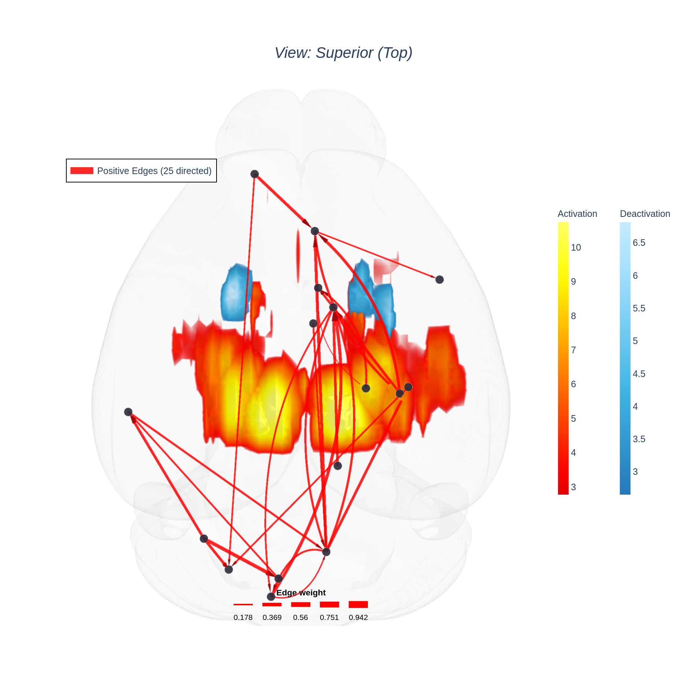
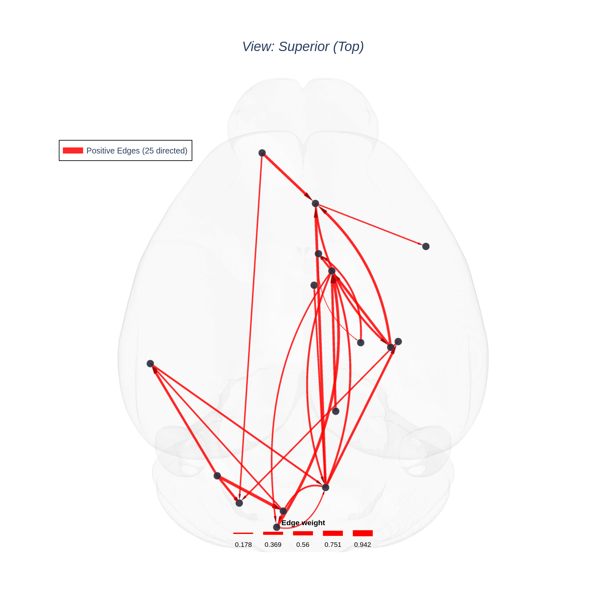
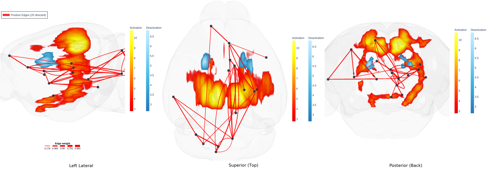

# HarrisLabPlotting — Voxel Maps and Networks in One Figure

Voxel maps are **voxel-level**; connectivity plots are **ROI-level**. They answer
different questions about the same brain, and putting them in one figure lets you
ask whether they agree — does the network's activity sit where the statistics
found an effect?

Both features compose: pass `volume_overlays=` to either plotting function, or
`--volume` alongside a matrix.


*Mouse Fig 1 activation and deactivation clouds with a directed ROI network on
top. The **network here is synthetic** — the ROI coordinates are real centres of
gravity from the 146-region Allen atlas, but the connections are fabricated with
a fixed seed to demonstrate the composition.*

---

## 1. The one requirement

Both layers must be in the **same world space**. The mesh, the voxel map and the
ROI coordinates all end up as world millimetres; if any of them came from a
different template, that layer floats off on its own.

Since the ROI coordinates here are generated *from an atlas in the same space as
the mesh*, and the z-maps were warped into that space, all three agree. See
[`VOXEL_PLOTTING.md` §2](VOXEL_PLOTTING.md#2-️-same-space-or-nothing-works)
for how to get there, and check with:

```bash
hlplot utils check-alignment --volume map.nii.gz --mesh brain.obj
hlplot utils check-alignment --coords rois.csv  --mesh brain.obj
```

---

## 2. Python

```python
import pandas as pd
from HarrisLabPlotting import load_mesh_file, create_brain_connectivity_plot

vertices, faces = load_mesh_file("mouse/bin_dilD_Parc_Atlas_0.obj")
coords = pd.read_csv("mouse/allen_roi_coords.csv")

fig, stats = create_brain_connectivity_plot(
    vertices=vertices, faces=faces, roi_coords_df=coords,
    connectivity_matrix="my_directed_matrix.csv",
    volume_overlays=[
        dict(path="mouse/Fig1_RM_Sham_pos_z_allen.nii.gz", name="Activation",
             cmap="hot32", threshold=3.1, smooth_fwhm="0.54,0.11,0.11", step=7),
        dict(path="mouse/Fig1_RM_Sham_neg_z_allen.nii.gz", name="Deactivation",
             cmap="ice28", threshold=3.1, smooth_fwhm="0.54,0.11,0.11", step=7),
    ],
    mesh_opacity=0.05,          # thinner shell: two layers inside it now
    node_size=13, node_color="#2b2b3a", node_border_color="white",
    camera_view="superior", zoom=1.25,
    save_path="combined.html",
)
```

`volume_overlays` accepts the same four forms as `hlplot volume`: a path, a list
of paths, a list of dicts, or a YAML spec file. `volume_options=dict(...)`
overrides one key across every overlay.

The same parameter exists on `create_brain_connectivity_plot_with_modularity`.

## 3. CLI

```bash
hlplot plot \
  --mesh mouse/bin_dilD_Parc_Atlas_0.obj \
  --coords mouse/allen_roi_coords.csv \
  --matrix my_directed_matrix.csv \
  --volume mouse/Fig1_RM_Sham_pos_z_allen.nii.gz --volume-cmap hot32 \
  --volume mouse/Fig1_RM_Sham_neg_z_allen.nii.gz --volume-cmap ice28 \
  --volume-threshold 3.1 --volume-smooth-fwhm "0.54,0.11,0.11" --volume-step 7 \
  --mesh-opacity 0.05 --node-size 13 \
  --multi-view "left,superior,posterior" \
  --no-html --export-image combined.png
```

---

## 4. Layer order

Drawn back to front:

1. **the brain shell** — translucent, so everything else shows through
2. **the voxel cloud(s)** — added right after the mesh
3. **edges and arrowheads**
4. **nodes and their labels** — always on top

So the network is never buried under the cloud. What *can* happen is the reverse:
a bright cloud makes dark edges hard to follow.

---

## 5. Keeping both readable

Three layers compete for the same pixels. What actually helps:

**Thin the brain shell.** With a cloud inside it too, the default
`--ghost-opacity 0.04` / `--mesh-opacity 0.15` is one layer too many. Drop the
shell to ~0.05.

**Give the nodes a contrasting border.** Dark nodes with a white border read
against both the hot cloud and the pale brain; the default purple-on-magenta
does not.

```bash
--node-color "#2b2b3a" --node-border-color white
```

**Lower the cloud's ceiling, not its floor.** `--volume-opacity 0.6` keeps the
map's full extent visible (the floor still guarantees the fringe shows) while
letting edges read through it. Lowering `--volume-opacity-floor` instead would
delete the fringe — the opposite of what you want.

**Or raise gamma.** `--volume-gamma 1.6` keeps only the cores solid and fades
everything else, which clears space for the network without changing what is
drawn.

**If the arrows still get lost,** render the two as separate panels and place
them side by side with `hlplot montage` — sometimes two clear figures beat one
crowded one.

| network alone | with the voxel maps |
|---|---|
|  |  |

---

## 6. Multi-view

Works exactly as everywhere else, and both layers follow the camera:



Directed arcs are recomputed per panel under the default
`--arrow-view-mode camera`, so reciprocal pairs stay separated in each view.

---

## 7. Cost

The voxel layer dominates: see
[`VOXEL_PLOTTING.md` §10](VOXEL_PLOTTING.md#10-appendix-how-the-grid-works-and-what-it-costs).
Use `--volume-step` and `--no-html` — a combined interactive file carries the
whole grid *and* every edge trace.

---

## Regenerating the figures

```bash
cd test_files/tutorial_files/new_atlas_demo
python render_combined.py       # -> docs/images/combined/
```

## See also

* [`DIRECTED_GRAPHS.md`](directed_graphs.md)
* [`VOXEL_PLOTTING.md`](voxel_plotting.md)
