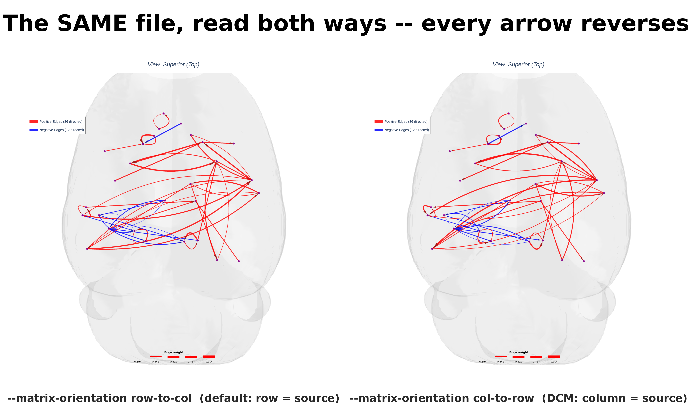
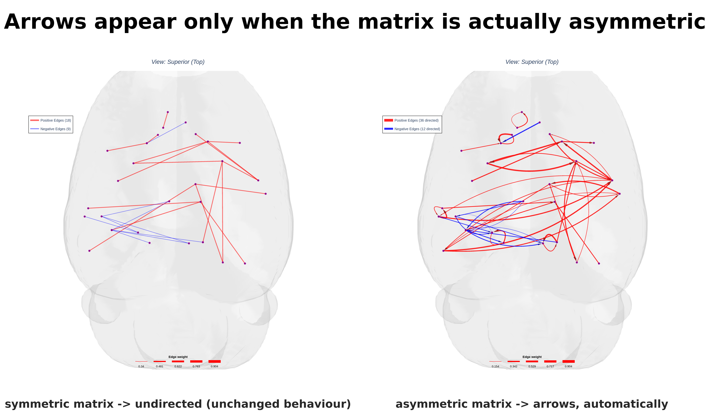
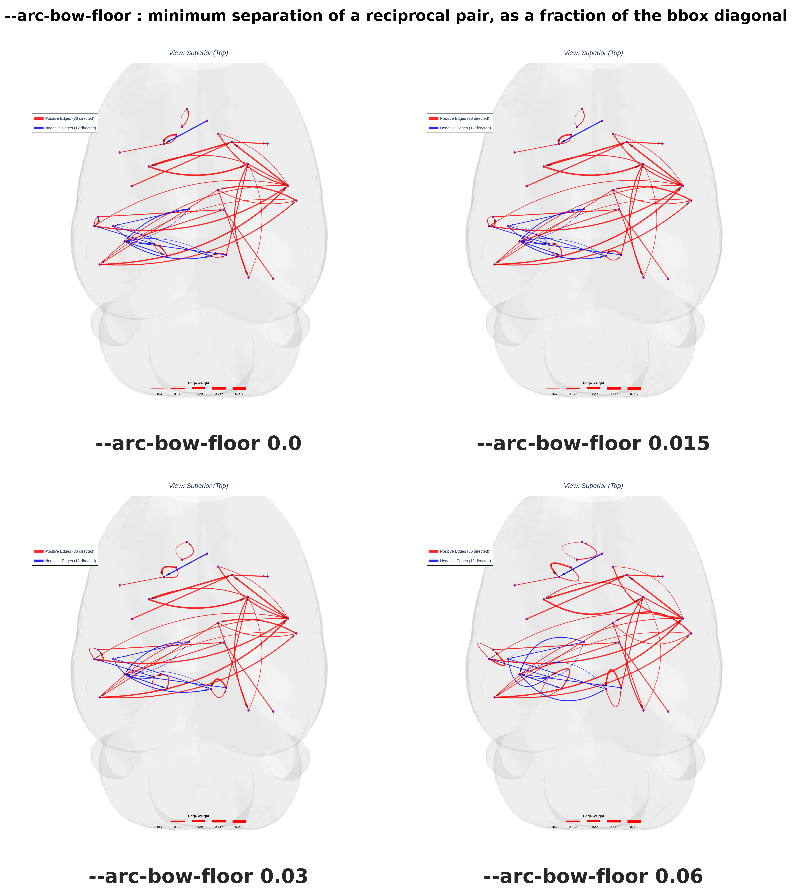
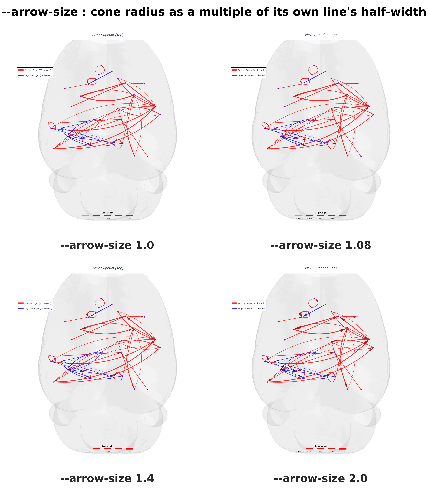
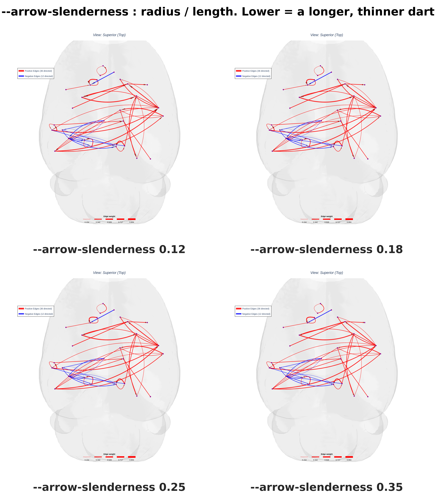
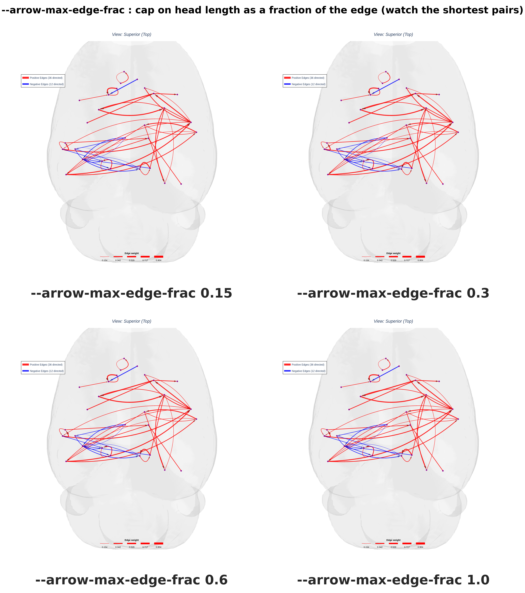
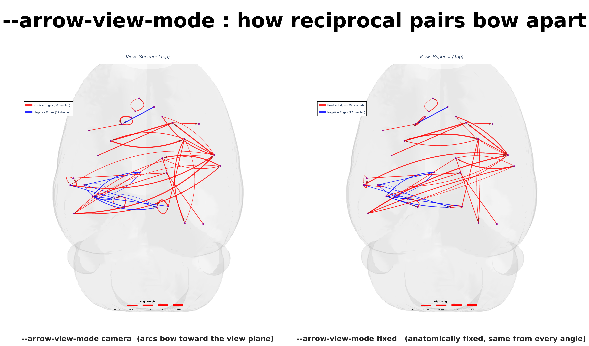
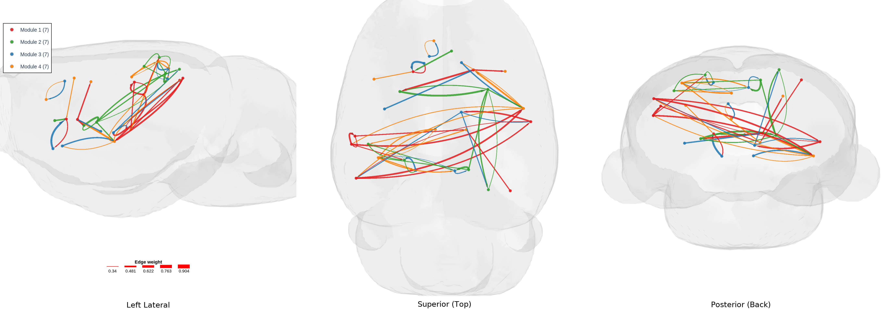

# HarrisLabPlotting — Directed (Causal) Graphs

Most connectivity matrices are symmetric: `M[i, j] == M[j, i]`, and an edge is
just "these two regions are connected". A **directed** matrix is not symmetric —
`M[i, j]` and `M[j, i]` are different numbers describing different things, one
for each direction of influence. DCM, Granger causality and transition-
probability matrices are all like this.

`hlplot` detects that automatically, draws arrowheads, and — because getting the
direction backwards is silent and invisible — **reports what it decided on every
single plot**.

---

## Table of contents

1. [Read this first: which index is the source?](#1-read-this-first-which-index-is-the-source)
2. [Quick start](#2-quick-start)
3. [The symmetry report](#3-the-symmetry-report)
4. [Reciprocal pairs and one-way edges](#4-reciprocal-pairs-and-one-way-edges)
5. [Self-connections (the diagonal)](#5-self-connections-the-diagonal)
6. [Tuning the arrows](#6-tuning-the-arrows)
7. [Camera-aware arcs](#7-camera-aware-arcs)
8. [Directed modularity plots](#8-directed-modularity-plots)
9. [p-value matrices](#9-p-value-matrices)
10. [Full flag reference](#10-full-flag-reference)

All commands run from `test_files/tutorial_files`.

---

## 1. Read this first: which index is the source?

This is the one thing that will silently ruin a figure, so it comes before
anything else.

> ### `hlplot` reads `M[i, j]` as the connection **i → j**.
> ### **Row = SOURCE. Column = TARGET.**

That is the numpy / networkx / graph-theory convention. If your matrix uses the
opposite one, every arrow in your figure points the wrong way, the picture still
looks completely reasonable, and nothing warns you.

### Does my matrix need transposing?

| Where it came from | Convention | Action |
|---|---|---|
| numpy / `networkx.to_numpy_array` (DiGraph) | `A[i,j]` = i → j | none |
| MATLAB `digraph` adjacency | `A[i,j]` = i → j | none |
| Brain Connectivity Toolbox | `W[i,j]` = i → j | none |
| **SPM DCM** (`DCM.Ep.A`, `.B`) | **`A[i,j]` = j → i** | **transpose** |
| **Row**-stochastic transition matrix (rows sum to 1) | `P[i,j]` = i → j | none |
| **Column**-stochastic transition matrix (columns sum to 1) | `P[i,j]` = j → i | **transpose** |
| anything else | unknown | test it — see below |

**Why DCM is the odd one out.** SPM's state equation is `dx/dt = A·x`, and the
matrix–vector product is `(A·x)_i = Σⱼ A[i,j]·xⱼ`. So `A(i,j)` describes how
region *j* drives region *i* — the column is the source. That is the opposite of
`hlplot`'s convention, so **DCM matrices must be transposed.**

**Transition matrices usually do NOT need transposing.** The common convention
is row-stochastic: `P[i,j] = P(next = j | current = i)`, so the row is the
current state — the source — which already matches `hlplot`. Only the
column-stochastic variety needs flipping.

### Test your own matrix

If it is stochastic, the sums tell you outright:

```python
import numpy as np
M = np.loadtxt("my_matrix.csv", delimiter=",")
print("row sums:", M.sum(axis=1)[:5])   # ~1 -> row-stochastic  -> row = source -> no transpose
print("col sums:", M.sum(axis=0)[:5])   # ~1 -> col-stochastic  -> col = source -> TRANSPOSE
```

`hlplot` runs this check for you and says what it implies:

```bash
hlplot utils info --matrix my_matrix.csv
```

```
  Matrix symmetry  : ASYMMETRIC (directed)
    max|M - M.T|   : 0.84774
    asymmetric cells: 66
    edges          : 48 (15 reciprocal pairs, 18 one-way)

[INFO] Rows sum to 1: this is a ROW-stochastic transition matrix, so row =
current state = SOURCE. That already matches hlplot's convention -- do NOT
transpose.
```

It **only reports** — it never transposes anything behind your back, because a
silent flip is exactly the failure this section exists to prevent.

If your matrix is not stochastic, use ground truth instead: take one connection
whose direction you already know, read the cell both ways, and keep whichever
matches.

### Fixing it — one line either way

```python
M = M.T          # col->row  becomes  row->col
```

```bash
# transform on load, leaving your file untouched
hlplot plot --matrix DCM_A.csv --matrix-orientation col-to-row ...

# or write a transposed copy, with the verdict printed before and after
hlplot utils transpose --matrix DCM_A.csv --output DCM_A_rowcol.csv
```


*The identical matrix rendered with `--matrix-orientation row-to-col` (left) and
`col-to-row` (right). Every arrowhead swaps ends. Nothing else about the figure
changes — which is precisely why this is dangerous.*

---

## 2. Quick start

Nothing special is required: pass an asymmetric matrix and arrows appear.

```bash
hlplot plot \
  --mesh brain_mesh.gii \
  --coords output/atlas_28_test_comma.csv \
  --matrix node_edge_28/directed_28.csv \
  --edge-width-min 1 --edge-width-max 9 \
  --camera superior --zoom 1.3 \
  --output output/directed.html \
  --export-image output/directed.png
```

```python
import pandas as pd
from HarrisLabPlotting import load_mesh_file, create_brain_connectivity_plot

vertices, faces = load_mesh_file("brain_mesh.gii")
coords = pd.read_csv("output/atlas_28_test_comma.csv")

fig, stats = create_brain_connectivity_plot(
    vertices=vertices, faces=faces, roi_coords_df=coords,
    connectivity_matrix="node_edge_28/directed_28.csv",
    edge_width=(1.0, 9.0), camera_view="superior", zoom=1.3,
    save_path="output/directed.html",
)
print(stats["symmetry"])      # the same report, as a dict
```


*28 ROIs, 48 directed edges. Arrowheads sit at the target end and scale with
their own edge's width.*


*The same network as a `--multi-view "left,superior,posterior"` strip.*

---

## 3. The symmetry report

Printed on **every** plot, directed or not:

```
  Matrix symmetry  : ASYMMETRIC (directed)
    max|M - M.T|   : 0.84774
    asymmetric cells: 66
    edges          : 48 (15 reciprocal pairs, 18 one-way)
    diagonal       : 3 nonzero (self-loops) -> IGNORED, not drawn
  -> drawing DIRECTED (arrowheads on)
     orientation: row = source -> column = target
```

A symmetric matrix says so and behaves exactly as it always has:

```
  Matrix symmetry  : SYMMETRIC (undirected)
    max|M - M.T|   : 0
    edges          : 54 (27 reciprocal pairs, 0 one-way)
  -> drawing UNDIRECTED
```


*Arrows appear only when the matrix is genuinely asymmetric. Existing symmetric
figures are unchanged.*

The same information comes back in `graph_stats["symmetry"]`:

```python
fig, stats = create_brain_connectivity_plot(...)
stats["symmetry"]
# {'is_symmetric': False, 'directed': True, 'max_asymmetry': 0.84774,
#  'n_asym_cells': 66, 'n_reciprocal': 15, 'n_oneway': 18, 'n_edges': 48,
#  'n_diagonal': 3, 'orientation': 'row-to-col', 'tol': None}
```

### Float noise is not asymmetry

A symmetric matrix written to CSV and read back typically differs from its
transpose by ~1e-16. Treating that as "directed" would put arrows on every
existing figure, so symmetry uses `numpy.allclose` (rtol 1e-5, atol 1e-8) rather
than exact equality. Tighten it with `--symmetry-tol` if you need to.

### Forcing it either way

```bash
hlplot plot ... --directed      # arrows even on a symmetric matrix
hlplot plot ... --undirected    # no arrows even on an asymmetric one
```

`--undirected` on an asymmetric matrix falls back to the upper triangle, so the
lower half is not drawn. The report still tells you the matrix was asymmetric.

---

## 4. Reciprocal pairs and one-way edges

Two cases, drawn differently:

* **One-way** — only `M[i,j]` is nonzero. Drawn as a **straight** line with one
  arrowhead. This includes edges stored only in the *lower* triangle, which an
  upper-triangle-only reader would silently drop.
* **Reciprocal** — both `M[i,j]` and `M[j,i]` are nonzero, usually with
  different weights. Drawn as **two arcs bowing to opposite sides**, each with
  its own width and its own arrowhead, so both weights stay readable.

The bow is `max(--arc-bow-frac × chord length, --arc-bow-floor × bbox diagonal)`.
The floor matters: without it a very short pair bows by almost nothing and the
two arcs collapse onto each other.


*`--arc-bow-floor` at 0 / 0.015 / 0.03 (default) / 0.06. At 0 the shortest
reciprocal pairs overlap.*

---

## 5. Self-connections (the diagonal)

A nonzero diagonal means "region influences itself" — normal in a transition
matrix, where it is the probability of staying put. `hlplot` **ignores the
diagonal for drawing** (an arrow from a node to itself has nowhere to go) but
**counts it in the report** so you know it was there:

```
    diagonal       : 3 nonzero (self-loops) -> IGNORED, not drawn
```

To visualise self-connection strength, feed the diagonal in as a node property:

```python
import numpy as np, pandas as pd
M = np.loadtxt("transitions.csv", delimiter=",")
self_p = np.diag(M)
sizes = 6 + (self_p - self_p.min()) / np.ptp(self_p) * 18   # -> 6..24 px
pd.DataFrame({"size": sizes}).to_csv("self_sizes.csv", index=False)
# then: --node-size self_sizes.csv
```

---

## 6. Tuning the arrows

Every knob is exposed on both `hlplot plot` and `hlplot modular`, and in Python.
The defaults were chosen from rendered comparisons; these sheets show what each
one does.

### `--arrow-size` — how much wider than its own line

The cone's radius is a multiple of **that edge's own line half-width**, so a
thin edge gets a thin head and a thick edge a thick one. `1.0` is exactly as
wide as its line.



A pixel floor (`--arrow-min-radius-px`, default 1.2) keeps the very thinnest
edges from losing their head entirely.

### `--arrow-slenderness` — dart or stub

Radius ÷ length. **Lower is longer and thinner**, which is what keeps a minimal
arrowhead readable where several converge on one node.



### `--arrow-max-edge-frac` — the short-edge cap

Without a cap, a thick edge between two nearby nodes gets an arrowhead longer
than the edge itself. This bounds head length to a fraction of the edge.



---

## 7. Camera-aware arcs

Reciprocal pairs have to bow *somewhere*, and which direction reads best depends
on where the camera is.

* `--arrow-view-mode camera` **(default)** — each arc bows perpendicular to the
  viewing axis, so a pair separates as widely as that projection allows. In a
  `--multi-view` export this is recomputed per panel, so every panel is optimal.
* `--arrow-view-mode fixed` — the arc bows in an anatomically fixed direction,
  identical from every angle.



> **The saved HTML always uses `fixed`.** Camera-aware geometry is baked in at
> save time, so it would stop being correct the moment you rotated the plot.
> Static exports use whichever mode you asked for; the HTML stays rotatable.

---

## 8. Directed modularity plots

Everything works with `hlplot modular`. Arrows are coloured by their source
node's module (or by sign with `--edge-color-mode sign`) and share that module's
legend group, so clicking a module still hides its nodes **and** its arrows.

```bash
hlplot modular \
  --mesh brain_mesh.gii \
  --coords output/atlas_28_test_comma.csv \
  --matrix node_edge_28/directed_28.csv \
  --modules node_edge_28/modules_28.csv \
  --multi-view "left,superior,posterior" \
  --output output/directed_modular.html \
  --export-image output/directed_modular.png
```



`--viz-type intra` / `inter` filter arrows the same way they filter undirected
edges, and `--node-roles` still works.

---

## 9. p-value matrices

`--matrix-type pvalue` composes with directed rendering: the `-log10(p)`
transform runs first, and the resulting weight matrix is then tested for
symmetry. A directed p-value matrix (different evidence in each direction) draws
arrows; a symmetric one does not.

```bash
hlplot plot ... --matrix directed_pvalues.csv --matrix-type pvalue \
  --pvalue-threshold 0.05 --sign-matrix signs.csv
```

`--sign-matrix` is transposed along with the main matrix when you pass
`--matrix-orientation col-to-row`, so the two never fall out of step.

---

## 10. Full flag reference

| Flag | Default | What it does |
|---|---|---|
| `--directed` / `--undirected` | auto | Force arrows on or off. Auto draws them when the matrix is asymmetric. |
| `--matrix-orientation` | `row-to-col` | Which index is the source. `col-to-row` transposes on load (DCM, column-stochastic). |
| `--symmetry-tol` | numpy `allclose` | Absolute tolerance for calling a matrix symmetric. Same units as the matrix. |
| `--arrow-view-mode` | `camera` | `camera` bows arcs toward the view plane per panel; `fixed` is camera-independent. HTML always uses `fixed`. |
| `--arrow-size` | `1.08` | Cone radius ÷ that edge's own line half-width. Unitless. |
| `--arrow-slenderness` | `0.18` | Cone radius ÷ length. Lower = longer, thinner dart. |
| `--arrow-max-edge-frac` | `0.30` | Cap on head length as a fraction of the edge. |
| `--arrow-min-radius-px` | `1.2` | Floor on head radius, in screen pixels. |
| `--arc-bow-frac` | `0.10` | Reciprocal bow as a fraction of the chord. |
| `--arc-bow-floor` | `0.03` | Minimum bow as a fraction of the bbox diagonal. |
| `--arrow-darken` | `0.74` | Arrowheads are this shade of their line colour. |
| `--no-html` | off | Write only the static export. |

In Python each is a keyword argument of the same name, and
`arrow_params=dict(...)` overrides `ARROW_DEFAULTS` wholesale.

---

## Regenerating the figures

```bash
cd test_files/tutorial_files/new_atlas_demo
python generate_directed_demo.py   # builds node_edge_28/directed_28.csv
python render_directed.py          # -> docs/images/directed/
```
