# Figure creation with new atlases

This tutorial walks through making publication figures on **two new atlases** —
a human **HCP-MMP1** (360 regions, MNI152) and a macaque **Brainnetome (MacBNA)**
(304 regions) — end to end: extract real ROI coordinates from the atlas, fabricate
a small network, and render the figure.

:::{admonition} What's real and what's synthetic
:class: note
The ROI **coordinates** and **names** are real (extracted from the atlas volumes
and their label tables). Every **connectivity matrix, module assignment, node
size and metric below is synthetic** — generated with fixed random seeds purely
to demonstrate the rendering. This is **not** the full set of figures the lab
uses; it's a worked template you can adapt.

The atlas volumes and meshes are large, external data you supply yourself — they
are not bundled with the package. All the generated data + the script that builds
it live under `test_files/tutorial_files/new_atlas_demo/`.
:::

:::{admonition} Where to download the atlases
:class: tip
- **Human — HCP-MMP1 (360 regions, MNI152):** the lateralized volumetric Glasser
  parcellation, [NeuroVault image 29489](https://neurovault.org/images/29489/)
  (`MMP_in_MNI_corr.nii.gz`). Region names are in the companion `roi_names.csv`.
- **Macaque — Brainnetome (MacBNA, 304 regions):** the
  [MacBNA dataset on Science Data Bank](https://www.scidb.cn/en/detail?dataSetId=f6eead10c2f84e9d91951cee2837048f)
  (free account + license agreement). Use the **native ex-vivo** label volume
  `MacBNA__LR_304.nii.gz` — it aligns with the macaque mesh — **not** the
  `…_in_NMT2asym.nii.gz` variant, which is in a different (NMT) space. Region
  names come from `Nomenclature_MBNA_304.xlsx`.

A surface mesh can be generated from each volume — see
[NIfTI → mesh](../data_preparation/nifti_to_mesh.md). Always run the
[alignment pre-flight checks](../how_to/check_atlas_mesh_alignment.md) on a new
atlas/mesh pair before plotting.
:::

## 0. Prepare the data (LUT → coordinates)

Each atlas needs a tab-delimited label file (`index<TAB>name`) and a coordinates
CSV. The names come from each atlas's own table (`roi_names.csv` for HCP-MMP1;
`Nomenclature_MBNA_304.xlsx` for MacBNA); the script
[`new_atlas_demo/generate_figure_data.py`](https://github.com/AzadAzargushasb/HarrisLabPlotting)
builds the LUTs, extracts coordinates, and fabricates the synthetic networks in
one deterministic pass.

```bash
# From test_files/tutorial_files — generate coordinates from the atlas volume.
hlplot coords generate \
  --volume "parcellation and meshes/HCPMMP1_on_MNI152_ICBM2009a_nlin_hd.nii/MMP_in_MNI_corr.nii.gz" \
  --labels new_atlas_demo/human/hcpmmp1_labels.txt \
  --output-dir new_atlas_demo/human --name hcpmmp1
```

```python
from HarrisLabPlotting import coordinate_function

coordinate_function(
    volume_file_location=".../MMP_in_MNI_corr.nii.gz",
    roi_label_file="new_atlas_demo/human/hcpmmp1_labels.txt",
    name_of_file="hcpmmp1", save_directory="new_atlas_demo/human",
)  # round_labels=True by default
```

:::{tip}
**Always sanity-check a new atlas/mesh pair first** — see
[Checking atlas/mesh alignment](../how_to/check_atlas_mesh_alignment.md). A quick
`hlplot utils check-alignment --coords … --mesh …` catches float labels, wrong
template spaces, and midline-collapsed bilateral atlases before you ever plot.
:::

---

## 1. Human — modularity across six views (2×3 grid)

A clean 2×3 multi-view grid of a 50-edge / 5-module synthetic network on the
human brain. The five modules are spatially compact (k-means on the ROI
coordinates), nodes are colored by module (the default), and the grid is exported
with no title and no edge-width key — just the module legend in the first panel.

```python
import pandas as pd
from HarrisLabPlotting import load_mesh_file, create_brain_connectivity_plot_with_modularity

vertices, faces = load_mesh_file(".../HCPMMP1_on_MNI152_ICBM2009a_nlin_hd_0.obj")
coords = pd.read_csv("new_atlas_demo/human/hcpmmp1_coords.csv")

create_brain_connectivity_plot_with_modularity(
    vertices=vertices, faces=faces, roi_coords_df=coords,
    connectivity_matrix="new_atlas_demo/human/hcpmmp1_modular_network.csv",
    module_assignments="new_atlas_demo/human/hcpmmp1_modules.csv",
    multi_view=["anterior", "posterior", "left", "right", "superior", "oblique"],
    multi_view_grid=(2, 3),
    multi_view_panel_size=(700, 700),
    show_node_labels=True,      # label nodes with HCP-MMP short names (V1_L, ...)
    label_font_size=9,          # small so 30 labels stay legible
    show_width_legend=False,    # clean: drop the edge-width key
    plot_title="",              # clean: no combined title
    zoom=1.3, image_dpi=600,
    save_path="human_grid.html",
    export_image="human_modularity_grid_2x3.png",
)
```

```bash
hlplot modular \
  --mesh "parcellation and meshes/HCPMMP1_on_MNI152_ICBM2009a_nlin_hd_0.obj" \
  --coords new_atlas_demo/human/hcpmmp1_coords.csv \
  --matrix new_atlas_demo/human/hcpmmp1_modular_network.csv \
  --modules new_atlas_demo/human/hcpmmp1_modules.csv \
  --multi-view "anterior,posterior,left,right,superior,oblique" \
  --multi-view-grid "2,3" \
  --multi-view-panel-size "700,700" \
  --show-node-labels true \
  --label-font-size 9 \
  --no-width-legend \
  --title "" \
  --zoom 1.3 --image-dpi 600 \
  --output human_grid.html \
  --export-image human_modularity_grid_2x3.png
```


*Six preset views (row-major: anterior / posterior / left, then right / superior /
oblique) of the same 5-module network. Modules are spatially compact; the legend
appears in the first panel only. Nodes are labeled with their HCP-MMP short names
(`show_node_labels=True`, e.g. `V1_L`, `MST_L`).*

---

## 2. Monkey — per-node sizes and legend keys

These reproduce the legend-key behavior on the macaque brain, reusing the bundled
28-node example topology (`node_edge_28/connectivity_28.edge`) hung on 28 real
MacBNA ROIs. Node sizes are pre-scaled from a synthetic participation
coefficient.

**(a) Vector node sizes + scaled edges → both keys appear automatically.**

```python
from HarrisLabPlotting import load_mesh_file, create_brain_connectivity_plot
import pandas as pd

vertices, faces = load_mesh_file(".../monkey_brain_mesh_MacBNA.obj")
coords = pd.read_csv("new_atlas_demo/monkey/coords_28.csv")

create_brain_connectivity_plot(
    vertices=vertices, faces=faces, roi_coords_df=coords,
    connectivity_matrix="node_edge_28/connectivity_28.edge",
    node_size="new_atlas_demo/monkey/sizes_from_pc.csv",  # vector → size key
    edge_width=(1.0, 8.0),                                # scaled → width key
    node_size_scale=0.5, zoom=1.5, camera_view="oblique",
    save_path="monkey_a.html", export_image="monkey_size_key.png",
)
```

```bash
hlplot plot \
  --mesh "parcellation and meshes/monkey_brain_mesh_MacBNA.obj" \
  --coords new_atlas_demo/monkey/coords_28.csv \
  --matrix node_edge_28/connectivity_28.edge \
  --node-size new_atlas_demo/monkey/sizes_from_pc.csv \
  --edge-width-min 1 --edge-width-max 8 \
  --node-size-scale 0.5 --zoom 1.5 --camera oblique \
  --output monkey_a.html --export-image monkey_size_key.png
```


**(b) Scalar size + fixed width → both keys are auto-skipped** (5 identical
samples would carry no information):

```python
create_brain_connectivity_plot(
    vertices=vertices, faces=faces, roi_coords_df=coords,
    connectivity_matrix="node_edge_28/connectivity_28.edge",
    node_size=10, edge_width=2.0, zoom=1.5, camera_view="oblique",
    save_path="monkey_b.html", export_image="monkey_no_keys.png",
)
```


**(c) Label the size key with the metric, not pixel sizes.** Pass `node_metrics`
and `node_size_legend_metric` so the key shows participation-coefficient values:

```python
create_brain_connectivity_plot(
    vertices=vertices, faces=faces, roi_coords_df=coords,
    connectivity_matrix="node_edge_28/connectivity_28.edge",
    node_size="new_atlas_demo/monkey/sizes_from_pc.csv",
    node_metrics="new_atlas_demo/monkey/metrics.csv",
    node_size_legend_metric="participation_coef",
    edge_width=(1.0, 8.0), node_size_scale=0.5, zoom=1.5, camera_view="oblique",
    save_path="monkey_c.html", export_image="monkey_metric_key.png",
)
```

```bash
hlplot plot \
  --mesh "parcellation and meshes/monkey_brain_mesh_MacBNA.obj" \
  --coords new_atlas_demo/monkey/coords_28.csv \
  --matrix node_edge_28/connectivity_28.edge \
  --node-size new_atlas_demo/monkey/sizes_from_pc.csv \
  --node-metrics new_atlas_demo/monkey/metrics.csv \
  --node-size-legend-metric participation_coef \
  --edge-width-min 1 --edge-width-max 8 \
  --node-size-scale 0.5 --zoom 1.5 --camera oblique \
  --output monkey_c.html --export-image monkey_metric_key.png
```


*The size-key dots are drawn at the actual rendered pixel sizes, but labeled with
5 evenly-spaced `participation_coef` values rather than raw pixel sizes.*

---

## 3. Monkey — default vs. customized

The same network, rendered two ways, to anchor what the knobs do.

| | Default | Customized |
| --- | --- | --- |
| Node size | scalar `8` | vector, scaled from PC |
| Node color | default purple | by module (+ black border) |
| Edge width | fixed `2.0` | scaled `(1, 8)` by `|weight|` |
| Legend keys | none | size key (PC) + width key |

```python
import numpy as np
modules = (np.arange(len(coords)) % 4) + 1   # synthetic 4-module coloring

# Default
create_brain_connectivity_plot(
    vertices=vertices, faces=faces, roi_coords_df=coords,
    connectivity_matrix="node_edge_28/connectivity_28.edge",
    node_size=8, edge_width=2.0, zoom=1.5, camera_view="oblique",
    save_path="monkey_default.html", export_image="monkey_default.png",
)

# Customized
create_brain_connectivity_plot(
    vertices=vertices, faces=faces, roi_coords_df=coords,
    connectivity_matrix="node_edge_28/connectivity_28.edge",
    node_size="new_atlas_demo/monkey/sizes_from_pc.csv", node_size_scale=0.5,
    node_color=modules, node_border_color="black",
    node_metrics="new_atlas_demo/monkey/metrics.csv",
    node_size_legend_metric="participation_coef",
    edge_width=(1.0, 8.0), zoom=1.5, camera_view="oblique",
    save_path="monkey_custom.html", export_image="monkey_customized.png",
)
```

::::{grid} 1 2 2 2
:::{grid-item}

*Default: scalar size, fixed width, purple nodes.*
:::
:::{grid-item}

*Customized: PC-scaled sizes, module colors + border, scaled edges, metric key.*
:::
::::

---

## Modularity visualization types (114-ROI k5 example)

The `create_brain_connectivity_plot_with_modularity` knobs `viz_type`,
`inter_edge_color`, and `node_roles` render the *same* community-detection result
several different ways. These examples use the bundled **rat** tutorial brain
(`brain_mesh.gii`) with a **real** *k=5* modularity result (`k5_state_0/`:
114 ROIs, 6 modules, per-node metrics). The 114 region names are rodent
(`Accumbens_left`, `RSGc_left`, `S1_left`, `Thalamus_A_right`, …), matching that
mesh. Each type below is exported as a 3-view
multi-view PNG (left / superior / posterior) plus a single superior view and an
interactive HTML (HTMLs are written locally by the script, not committed).

Shared Python setup:

```python
import pandas as pd
from HarrisLabPlotting import load_mesh_file, create_brain_connectivity_plot_with_modularity

vertices, faces = load_mesh_file("brain_mesh.gii")
coords = pd.read_csv("output/atlas_114_test/atlas_114_test_comma.csv")
base = dict(
    vertices=vertices, faces=faces, roi_coords_df=coords,
    connectivity_matrix="k5_state_0/connectivity_matrix.csv",
    module_assignments="k5_state_0/module_assignments.csv",
    node_metrics="k5_state_0/combined_metrics.csv",
    multi_view=["left", "superior", "posterior"], show_node_labels=False,
)
# e.g. create_brain_connectivity_plot_with_modularity(**base, viz_type="intra",
#         save_path="k5_intra.html", export_image="k5_intra_multiview.png")
```

| Type | Key arguments |
| --- | --- |
| All edges (default) | `viz_type="all"` |
| All edges, inter-module black | `viz_type="all", inter_edge_color="black"` |
| Intra-module edges only | `viz_type="intra"` |
| Inter-module edges only | `viz_type="inter"` |
| Inter-module edges only, black | `viz_type="inter", inter_edge_color="black"` |
| Nodes only | `viz_type="nodes_only"` |
| Nodal roles, no edges | `viz_type="nodes_only", node_roles=True` |
| Nodal roles, with edges | `viz_type="all", node_roles=True` |

**All edges (default)** — `viz_type="all"`


**All edges, inter-module edges black** — `inter_edge_color="black"`


**Intra-module edges only** — `viz_type="intra"`


**Inter-module edges only** — `viz_type="inter"`


**Inter-module edges only, black** — `viz_type="inter", inter_edge_color="black"`


**Nodes only** — `viz_type="nodes_only"`


**Nodal roles (Guimerà–Amaral)** — `node_roles=True`
(needs `node_metrics` with `participation_coef` + `within_module_zscore`; node
fill = module, border ring = role). It composes with any `viz_type`, so you can
show roles with **no edges** (`viz_type="nodes_only"`) or with the **full edge
set** (`viz_type="all"`):

::::{grid} 1 2 2 2
:::{grid-item}
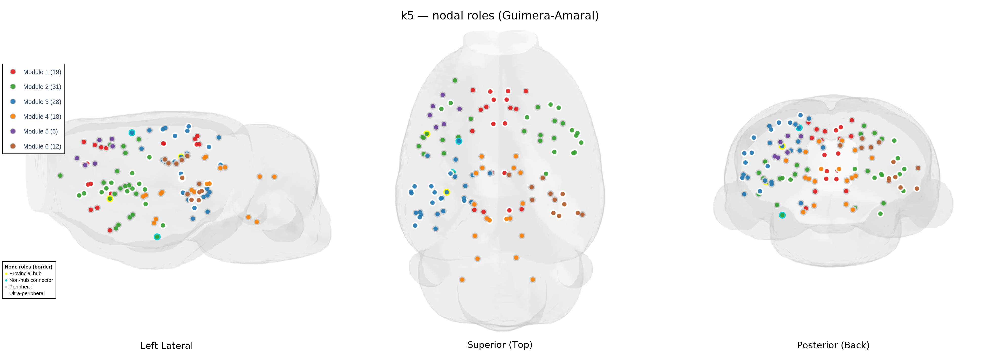
*`viz_type="nodes_only", node_roles=True` — roles only.*
:::
:::{grid-item}
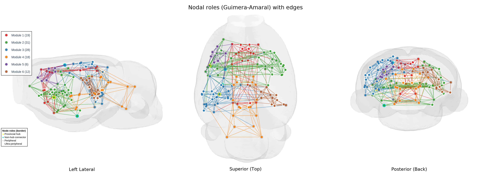
*`viz_type="all", node_roles=True` — roles + edges.*
:::
::::

Best read from above (roles, no edges):


CLI equivalent (vary `--viz-type`, add `--inter-edge-color black` or
`--node-roles` per row):

```bash
hlplot modular \
  --mesh test_files/tutorial_files/brain_mesh.gii \
  --coords test_files/tutorial_files/output/atlas_114_test/atlas_114_test_comma.csv \
  --matrix test_files/tutorial_files/k5_state_0/connectivity_matrix.csv \
  --modules test_files/tutorial_files/k5_state_0/module_assignments.csv \
  --node-metrics test_files/tutorial_files/k5_state_0/combined_metrics.csv \
  --viz-type intra \
  --multi-view "left,superior,posterior" \
  --output k5_intra.html \
  --export-image k5_intra_multiview.png
```

## Cross-species comparison grid (human / rat / macaque)

`--multi-view` renders **one** mesh from several cameras. To place **different
meshes side by side** — human, rat and macaque in one figure — render each panel
separately and compose them with the `hlplot montage` command (the CLI face of
`compose_image_grid`). It is a general image-grid composer: hand it pre-rendered
panel PNGs and it auto-crops each one and adds column headers, per-cell labels,
and an optional title.

The grid below is 2×3: columns are the three species, and the six cells are the
six canonical BrainNet views (row 1 = left / superior / right, row 2 = anterior /
inferior / posterior). Each species shows a minimal module-colored network on its
own mesh. Three versions are produced (labels off, full names, and short-form) —
shown below.

```python
from HarrisLabPlotting import (
    create_brain_connectivity_plot_with_modularity, compose_image_grid,
)

# 1) Render each (species, view) panel as a single-view PNG (no legend). Using
#    multi_view=[one_view] gives a tight, auto-cropped panel at a controlled size.
create_brain_connectivity_plot_with_modularity(
    vertices=v, faces=f, roi_coords_df=coords,
    connectivity_matrix=matrix, module_assignments=modules,
    node_size=10, edge_width=2.0, show_node_labels=False,
    show_width_legend=False, plot_title="",
    multi_view=["left"], multi_view_panel_size=(500, 500),
    multi_view_keep_first_legend=False, multi_view_panel_labels=[""],
    image_dpi=600, zoom=1.3,
    save_path="dummy.html", export_image="human_left.png",
)

# 2) Compose the six panels row-major into the grid.
compose_image_grid(
    ["human_left.png", "rat_superior.png", "macaque_right.png",
     "human_anterior.png", "rat_inferior.png", "macaque_posterior.png"],
    "species_grid.png",
    grid=(2, 3),
    col_labels=["Human", "Rat", "Macaque"],
    panel_labels=["Left", "Superior", "Right", "Anterior", "Inferior", "Posterior"],
)
```

```bash
hlplot montage \
  --images "human_left.png,rat_superior.png,macaque_right.png,human_anterior.png,rat_inferior.png,macaque_posterior.png" \
  --grid "2,3" \
  --col-labels "Human,Rat,Macaque" \
  --panel-labels "Left,Superior,Right,Anterior,Inferior,Posterior" \
  --output species_grid.png
```

Three versions are produced — labels off, full `roi_name` labels, and **short-form**
labels (the hemisphere suffix stripped: `V1_L`→`V1`, `AUD_left`→`AUD`,
`IFG.cv_left`→`IFG.cv`), which keeps the labels legible when 28–30 nodes are on
screen:

::::{grid} 1 2 2 2
:::{grid-item}
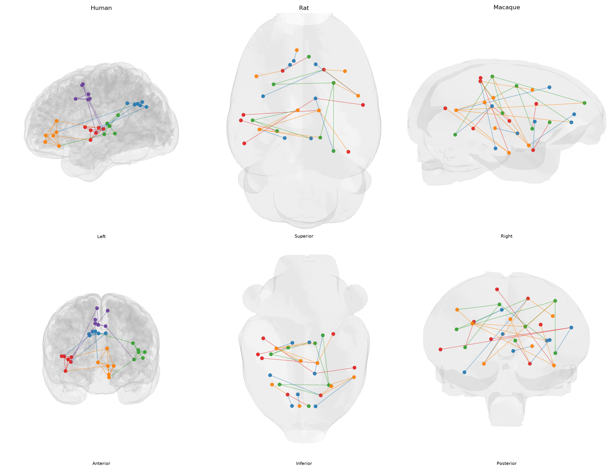
*ROI labels off.*
:::
:::{grid-item}
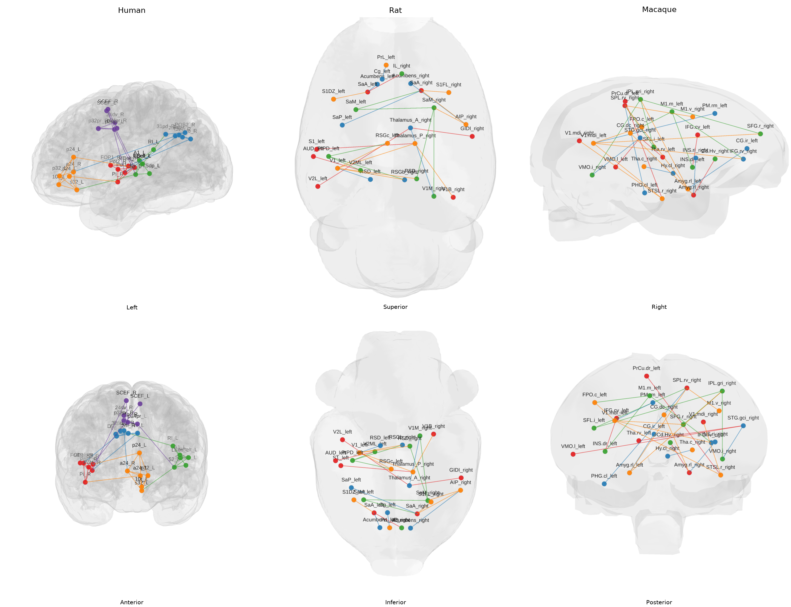
*Full `roi_name` labels.*
:::
::::

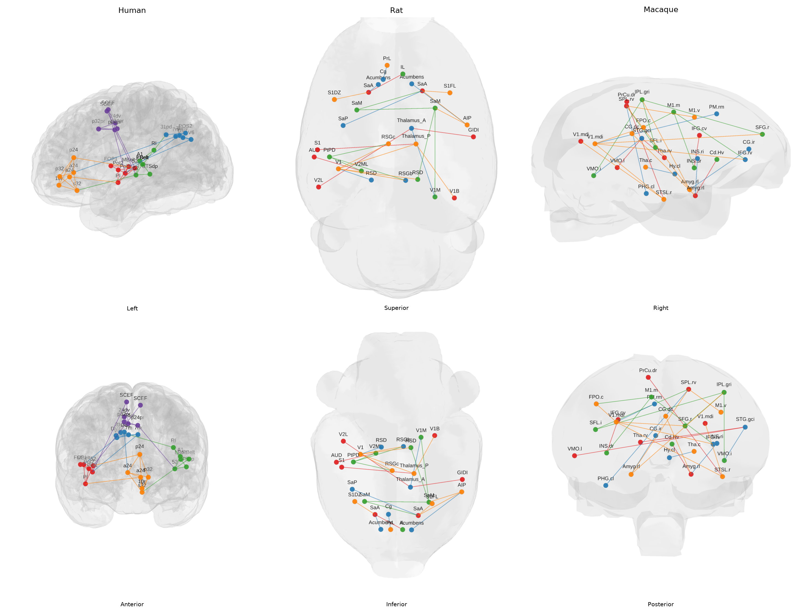
*Short-form labels — `roi_name` minus the hemisphere suffix.*

Camera zoom is set **per (species, view)** (`SPECIES_ZOOM`), since a view whose
brain fills more of its panel otherwise reads as "too zoomed in" beside the others.

The full six-panel-per-version loop is in
`new_atlas_demo/render_species_grid.py`. The rat mesh is the bundled
`brain_mesh.gii`; human and macaque use the HCP-MMP1 and MacBNA surfaces.

---

## Scaling edges and nodes by p-value significance

A p-value network can encode significance twice: **edge width** by `-log10(p)`
(built in via `matrix_type="pvalue"`) and **node size** by a per-node significance
you derive. A `sign_matrix` additionally colors each edge by **direction — red =
positive, blue = negative** (opposite-direction) effect. The pair below contrasts a
flat baseline with the fully scaled figure, using `pvalues_28_spread.csv`
(significance spread over ~5 orders of magnitude so the widths span the full range).

```python
import numpy as np, pandas as pd
from HarrisLabPlotting import create_brain_connectivity_plot

pvals = "node_edge_28/pvalues_28_spread.csv"
signs = "node_edge_28/pvalues_28_signs.csv"   # +1/-1 direction -> red / blue

# Per-node significance = sum of -log10(p) over each node's surviving edges.
P = np.loadtxt(pvals, delimiter=",")
thr = 0.05
W = np.where((P > 0) & (P <= thr), -np.log10(np.clip(P, 1e-300, 1.0)), 0.0)
np.fill_diagonal(W, 0.0)
sig = W.sum(axis=1)
node_px = 6 + (sig - sig.min()) / (sig.max() - sig.min()) * (24 - 6)   # -> [6, 24] px

common = dict(
    vertices=v, faces=f, roi_coords_df=coords,
    connectivity_matrix=pvals, matrix_type="pvalue", pvalue_threshold=thr,
    sign_matrix=signs, edge_width_scale=2, camera_view="superior", image_dpi=600)

# (a) uniform baseline: fixed width + scalar size (direction still shown by color)
create_brain_connectivity_plot(**common, edge_width=2.0, node_size=8,
    export_image="pval_uniform.png", save_path="pval_uniform.html")

# (b) scaled: edge width ~ -log10(p), node size ~ per-node significance
create_brain_connectivity_plot(**common,
    edge_width=(1.0, 9.0), node_size=node_px,
    node_metrics=pd.DataFrame({"roi_name": coords["roi_name"], "node_significance": sig}),
    node_size_legend_metric="node_significance",
    export_image="pval_scaled.png", save_path="pval_scaled.html")
```

::::{grid} 1 2 2 2
:::{grid-item}
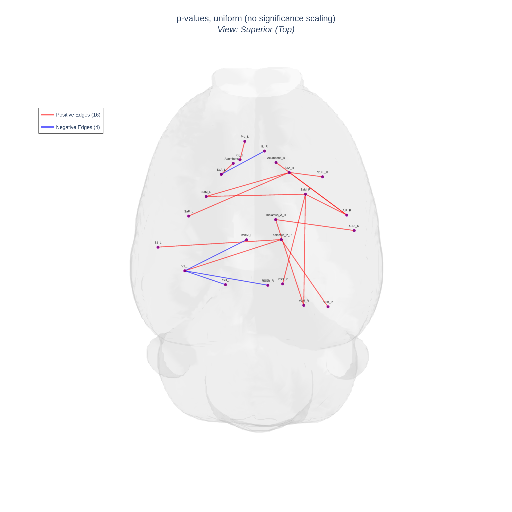
*Uniform — direction (red/blue) only.*
:::
:::{grid-item}
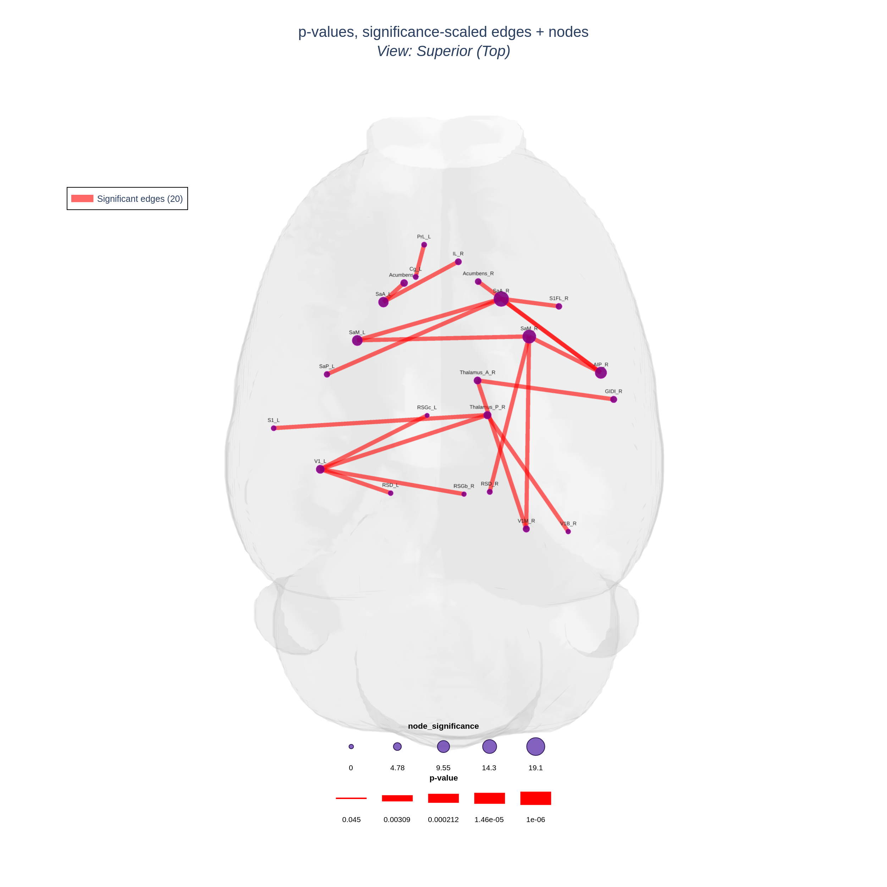
*Scaled — width = smaller p, size = summed significance, red/blue = direction.*
:::
::::

Same figures as a 3-view multi-view strip (left / superior / posterior):

::::{grid} 1 2 2 2
:::{grid-item}
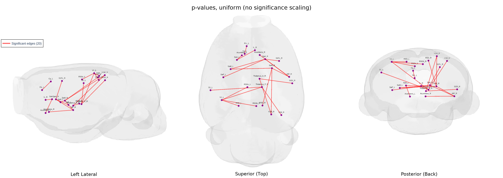
:::
:::{grid-item}
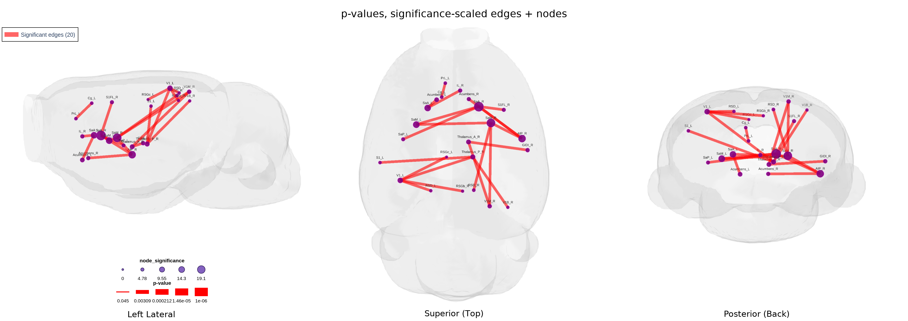
:::
::::

Red edges are positive, blue edges negative — the legend splits into "Positive
Edges" / "Negative Edges". The `PVALUE_THRESHOLD`, edge-width and size ranges are
exposed at the top of `render_pvalue_scaling.py` (and the matching notebook cell)
so they are easy to tweak. See also the
[p-value plotting tutorial](pvalue_plotting.md).

---

---

## 7. Directed networks

An **asymmetric** matrix — DCM, Granger causality, transition probabilities —
carries a different number in each direction, so `hlplot` draws arrowheads. It
detects this automatically and reports the verdict on every plot.

> **Which index is the source?** `hlplot` reads `M[i, j]` as **i → j** (row =
> source). SPM DCM stores the transpose and needs
> `--matrix-orientation col-to-row`; a row-stochastic transition matrix does
> not. Getting this wrong reverses every arrow and nothing warns you — see
> [DIRECTED_GRAPHS.md](directed_graphs.md) §1.

```bash
hlplot plot \
  --mesh brain_mesh.gii \
  --coords output/atlas_28_test_comma.csv \
  --matrix node_edge_28/directed_28.csv \
  --edge-width-min 1 --edge-width-max 9 \
  --multi-view "left,superior,posterior" --zoom 1.3 \
  --output new_atlas_demo/output/directed.html \
  --export-image new_atlas_demo/output/directed_multiview.png
```

```python
from HarrisLabPlotting import load_mesh_file, create_brain_connectivity_plot
import pandas as pd

vertices, faces = load_mesh_file("brain_mesh.gii")
coords = pd.read_csv("output/atlas_28_test_comma.csv")

fig, stats = create_brain_connectivity_plot(
    vertices=vertices, faces=faces, roi_coords_df=coords,
    connectivity_matrix="node_edge_28/directed_28.csv",
    edge_width=(1.0, 9.0), zoom=1.3,
    multi_view=["left", "superior", "posterior"],
    save_path="directed.html", export_image="directed_multiview.png",
)
print(stats["symmetry"])
```

**Figure 8 — three views:**

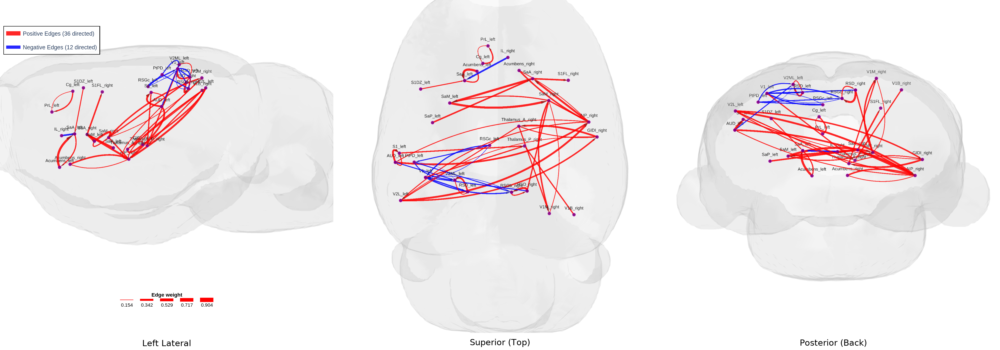

**and the same network from a single superior view:**

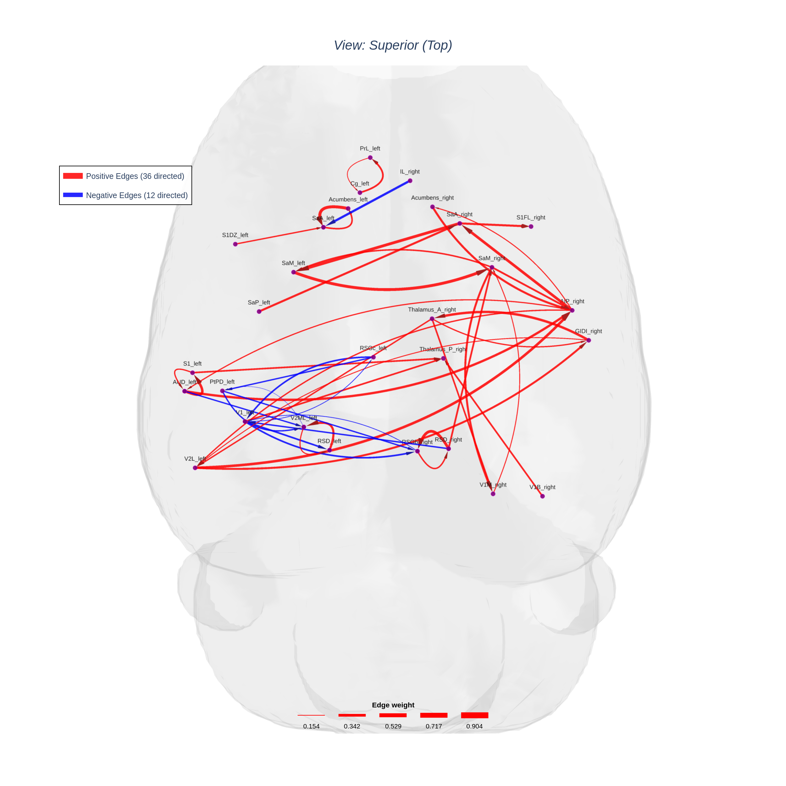

*One-way edges are straight; reciprocal pairs bow to opposite sides so both
directions keep their own width and arrowhead. Arrowheads scale with their own
edge's width and are capped so a short edge never gets a head longer than
itself.*

---

## 8. Voxel maps on a glass brain

Statistical volumes render as a soft ray-cast cloud inside a translucent brain.
The mouse Fig 1 z-maps ship under `test_files/tutorial_files/mouse/`.

```bash
hlplot volume \
  --mesh mouse/bin_dilD_Parc_Atlas_0.obj \
  --volume mouse/Fig1_RM_Sham_pos_z_allen.nii.gz \
      --volume-cmap hot32 --volume-name Activation \
  --volume mouse/Fig1_RM_Sham_neg_z_allen.nii.gz \
      --volume-cmap ice28 --volume-name Deactivation \
  --volume-threshold 3.1 --volume-smooth-fwhm "0.54,0.11,0.11" \
  --volume-step 7 --zoom 1.25 \
  --multi-view "left,superior,posterior" \
  --no-html --export-image new_atlas_demo/output/voxels_multiview.png
```

```python
from HarrisLabPlotting import create_brain_volume_plot

create_brain_volume_plot(
    mesh="mouse/bin_dilD_Parc_Atlas_0.obj",
    volumes=[
        dict(path="mouse/Fig1_RM_Sham_pos_z_allen.nii.gz", name="Activation",
             cmap="hot32", threshold=3.1, smooth_fwhm="0.54,0.11,0.11", step=7),
        dict(path="mouse/Fig1_RM_Sham_neg_z_allen.nii.gz", name="Deactivation",
             cmap="ice28", threshold=3.1, smooth_fwhm="0.54,0.11,0.11", step=7),
    ],
    zoom=1.25, multi_view=["left", "superior", "posterior"],
    no_html=True, export_image="voxels_multiview.png",
)
```

**Figure 9 — three views:**


**and a single superior view:**


*`hot32` / `ice28` are matplotlib's `hot` truncated at 0.32 and a custom `ice`
at 0.28 — the same colormaps as the study's 2-D coronal montages. The
`--volume-smooth-fwhm` value is the ORIGINAL pre-warp voxel size, which is what
removes the stair-steps left by resampling 16 thick slices onto a 25 µm grid.
Full detail in [VOXEL_PLOTTING.md](voxel_plotting.md).*

---

*Reproduce everything: `python new_atlas_demo/generate_figure_data.py`, then
`python new_atlas_demo/render_figures.py`,
`python new_atlas_demo/render_k5_viztypes.py`,
`python new_atlas_demo/render_species_grid.py`,
`python new_atlas_demo/generate_pvalue_spread.py`,
`python new_atlas_demo/render_pvalue_scaling.py`,
`python new_atlas_demo/generate_directed_demo.py`,
`python new_atlas_demo/render_directed.py`,
`python new_atlas_demo/render_voxels.py`, and
`python new_atlas_demo/render_combined.py`, or run
`tutorial/figure_creation_new_atlases.ipynb`. All figures render at 600 DPI.*
