# Figure creation with new atlases

This tutorial walks through making publication figures on **two new atlases** —
a human **HCP-MMP1** (360 regions, MNI152) and a macaque **Brainnetome (MacBNA)**
(304 regions) — end to end: extract real ROI coordinates from the atlas, fabricate
a small network, and render the figure.

:::{admonition} What's real and what's synthetic
:class: note
The ROI **coordinates** and **names** are real (extracted from the atlas volumes
and their label tables). Every **connectivity matrix, module assignment, node
size and metric below is synthetic** — generated with fixed random seeds purely
to demonstrate the rendering. This is **not** the full set of figures the lab
uses; it's a worked template you can adapt.

The atlas volumes and meshes are large, external data you supply yourself — they
are not bundled with the package. All the generated data + the script that builds
it live under `test_files/tutorial_files/new_atlas_demo/`.
:::

:::{admonition} Where to download the atlases
:class: tip
- **Human — HCP-MMP1 (360 regions, MNI152):** the lateralized volumetric Glasser
  parcellation, [NeuroVault image 29489](https://neurovault.org/images/29489/)
  (`MMP_in_MNI_corr.nii.gz`). Region names are in the companion `roi_names.csv`.
- **Macaque — Brainnetome (MacBNA, 304 regions):** the
  [MacBNA dataset on Science Data Bank](https://www.scidb.cn/en/detail?dataSetId=f6eead10c2f84e9d91951cee2837048f)
  (free account + license agreement). Use the **native ex-vivo** label volume
  `MacBNA__LR_304.nii.gz` — it aligns with the macaque mesh — **not** the
  `…_in_NMT2asym.nii.gz` variant, which is in a different (NMT) space. Region
  names come from `Nomenclature_MBNA_304.xlsx`.

A surface mesh can be generated from each volume — see
[NIfTI → mesh](../data_preparation/nifti_to_mesh.md). Always run the
[alignment pre-flight checks](../how_to/check_atlas_mesh_alignment.md) on a new
atlas/mesh pair before plotting.
:::

## 0. Prepare the data (LUT → coordinates)

Each atlas needs a tab-delimited label file (`index<TAB>name`) and a coordinates
CSV. The names come from each atlas's own table (`roi_names.csv` for HCP-MMP1;
`Nomenclature_MBNA_304.xlsx` for MacBNA); the script
[`new_atlas_demo/generate_figure_data.py`](https://github.com/AzadAzargushasb/HarrisLabPlotting)
builds the LUTs, extracts coordinates, and fabricates the synthetic networks in
one deterministic pass.

```bash
# From test_files/tutorial_files — generate coordinates from the atlas volume.
hlplot coords generate \
  --volume "parcellation and meshes/HCPMMP1_on_MNI152_ICBM2009a_nlin_hd.nii/MMP_in_MNI_corr.nii.gz" \
  --labels new_atlas_demo/human/hcpmmp1_labels.txt \
  --output-dir new_atlas_demo/human --name hcpmmp1
```

```python
from HarrisLabPlotting import coordinate_function

coordinate_function(
    volume_file_location=".../MMP_in_MNI_corr.nii.gz",
    roi_label_file="new_atlas_demo/human/hcpmmp1_labels.txt",
    name_of_file="hcpmmp1", save_directory="new_atlas_demo/human",
)  # round_labels=True by default
```

:::{tip}
**Always sanity-check a new atlas/mesh pair first** — see
[Checking atlas/mesh alignment](../how_to/check_atlas_mesh_alignment.md). A quick
`hlplot utils check-alignment --coords … --mesh …` catches float labels, wrong
template spaces, and midline-collapsed bilateral atlases before you ever plot.
:::

---

## 1. Human — modularity across six views (2×3 grid)

A clean 2×3 multi-view grid of a 50-edge / 5-module synthetic network on the
human brain. The five modules are spatially compact (k-means on the ROI
coordinates), nodes are colored by module (the default), and the grid is exported
with no title and no edge-width key — just the module legend in the first panel.

```python
import pandas as pd
from HarrisLabPlotting import load_mesh_file, create_brain_connectivity_plot_with_modularity

vertices, faces = load_mesh_file(".../HCPMMP1_on_MNI152_ICBM2009a_nlin_hd_0.obj")
coords = pd.read_csv("new_atlas_demo/human/hcpmmp1_coords.csv")

create_brain_connectivity_plot_with_modularity(
    vertices=vertices, faces=faces, roi_coords_df=coords,
    connectivity_matrix="new_atlas_demo/human/hcpmmp1_modular_network.csv",
    module_assignments="new_atlas_demo/human/hcpmmp1_modules.csv",
    multi_view=["anterior", "posterior", "left", "right", "superior", "oblique"],
    multi_view_grid=(2, 3),
    multi_view_panel_size=(700, 700),
    show_node_labels=True,      # label nodes with HCP-MMP short names (V1_L, ...)
    label_font_size=9,          # small so 30 labels stay legible
    show_width_legend=False,    # clean: drop the edge-width key
    plot_title="",              # clean: no combined title
    zoom=1.3, image_dpi=150,
    save_path="human_grid.html",
    export_image="human_modularity_grid_2x3.png",
)
```

```bash
hlplot modular \
  --mesh "parcellation and meshes/HCPMMP1_on_MNI152_ICBM2009a_nlin_hd_0.obj" \
  --coords new_atlas_demo/human/hcpmmp1_coords.csv \
  --matrix new_atlas_demo/human/hcpmmp1_modular_network.csv \
  --modules new_atlas_demo/human/hcpmmp1_modules.csv \
  --multi-view "anterior,posterior,left,right,superior,oblique" \
  --multi-view-grid "2,3" \
  --multi-view-panel-size "700,700" \
  --show-node-labels true \
  --label-font-size 9 \
  --no-width-legend \
  --title "" \
  --zoom 1.3 --image-dpi 150 \
  --output human_grid.html \
  --export-image human_modularity_grid_2x3.png
```

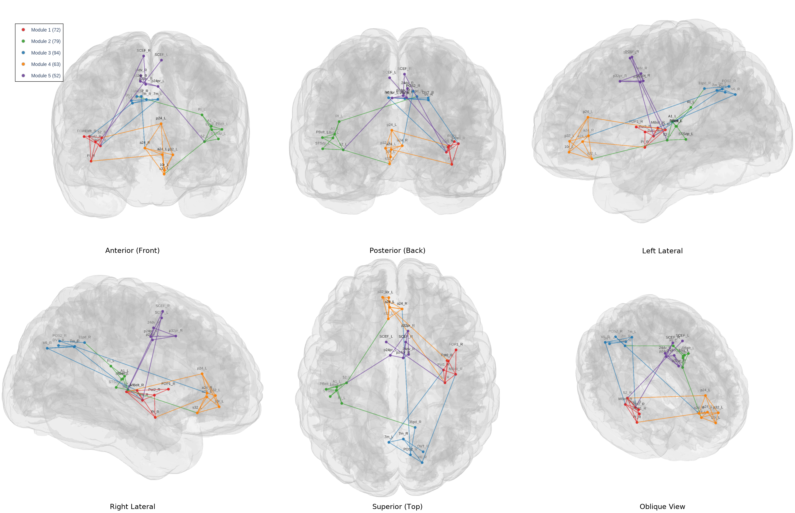

*Six preset views (row-major: anterior / posterior / left, then right / superior /
oblique) of the same 5-module network. Modules are spatially compact; the legend
appears in the first panel only. Nodes are labeled with their HCP-MMP short names
(`show_node_labels=True`, e.g. `V1_L`, `MST_L`).*

---

## 2. Monkey — per-node sizes and legend keys

These reproduce the legend-key behavior on the macaque brain, reusing the bundled
28-node example topology (`node_edge_28/connectivity_28.edge`) hung on 28 real
MacBNA ROIs. Node sizes are pre-scaled from a synthetic participation
coefficient.

**(a) Vector node sizes + scaled edges → both keys appear automatically.**

```python
from HarrisLabPlotting import load_mesh_file, create_brain_connectivity_plot
import pandas as pd

vertices, faces = load_mesh_file(".../monkey_brain_mesh_MacBNA.obj")
coords = pd.read_csv("new_atlas_demo/monkey/coords_28.csv")

create_brain_connectivity_plot(
    vertices=vertices, faces=faces, roi_coords_df=coords,
    connectivity_matrix="node_edge_28/connectivity_28.edge",
    node_size="new_atlas_demo/monkey/sizes_from_pc.csv",  # vector → size key
    edge_width=(1.0, 8.0),                                # scaled → width key
    node_size_scale=0.5, zoom=1.5, camera_view="oblique",
    save_path="monkey_a.html", export_image="monkey_size_key.png",
)
```

```bash
hlplot plot \
  --mesh "parcellation and meshes/monkey_brain_mesh_MacBNA.obj" \
  --coords new_atlas_demo/monkey/coords_28.csv \
  --matrix node_edge_28/connectivity_28.edge \
  --node-size new_atlas_demo/monkey/sizes_from_pc.csv \
  --edge-width-min 1 --edge-width-max 8 \
  --node-size-scale 0.5 --zoom 1.5 --camera oblique \
  --output monkey_a.html --export-image monkey_size_key.png
```

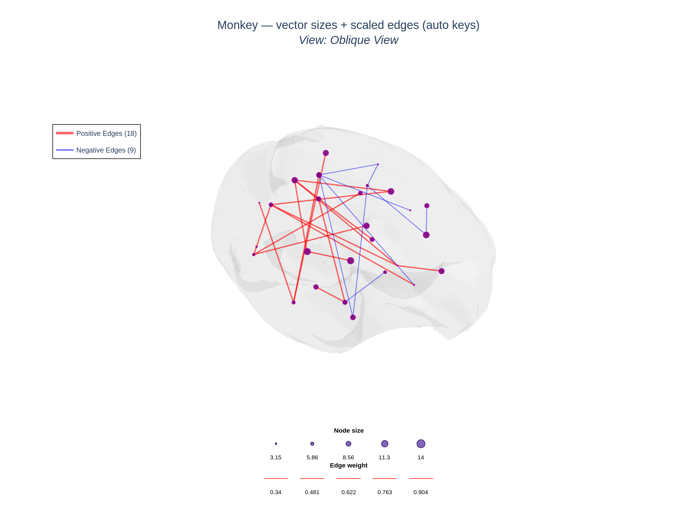

**(b) Scalar size + fixed width → both keys are auto-skipped** (5 identical
samples would carry no information):

```python
create_brain_connectivity_plot(
    vertices=vertices, faces=faces, roi_coords_df=coords,
    connectivity_matrix="node_edge_28/connectivity_28.edge",
    node_size=10, edge_width=2.0, zoom=1.5, camera_view="oblique",
    save_path="monkey_b.html", export_image="monkey_no_keys.png",
)
```

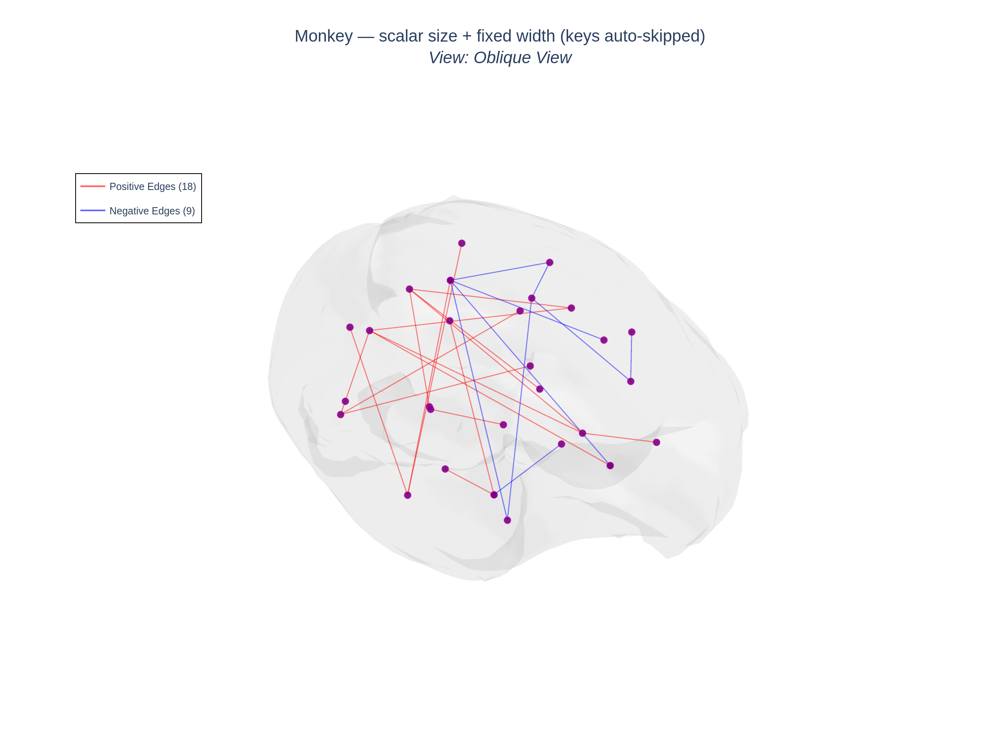

**(c) Label the size key with the metric, not pixel sizes.** Pass `node_metrics`
and `node_size_legend_metric` so the key shows participation-coefficient values:

```python
create_brain_connectivity_plot(
    vertices=vertices, faces=faces, roi_coords_df=coords,
    connectivity_matrix="node_edge_28/connectivity_28.edge",
    node_size="new_atlas_demo/monkey/sizes_from_pc.csv",
    node_metrics="new_atlas_demo/monkey/metrics.csv",
    node_size_legend_metric="participation_coef",
    edge_width=(1.0, 8.0), node_size_scale=0.5, zoom=1.5, camera_view="oblique",
    save_path="monkey_c.html", export_image="monkey_metric_key.png",
)
```

```bash
hlplot plot \
  --mesh "parcellation and meshes/monkey_brain_mesh_MacBNA.obj" \
  --coords new_atlas_demo/monkey/coords_28.csv \
  --matrix node_edge_28/connectivity_28.edge \
  --node-size new_atlas_demo/monkey/sizes_from_pc.csv \
  --node-metrics new_atlas_demo/monkey/metrics.csv \
  --node-size-legend-metric participation_coef \
  --edge-width-min 1 --edge-width-max 8 \
  --node-size-scale 0.5 --zoom 1.5 --camera oblique \
  --output monkey_c.html --export-image monkey_metric_key.png
```

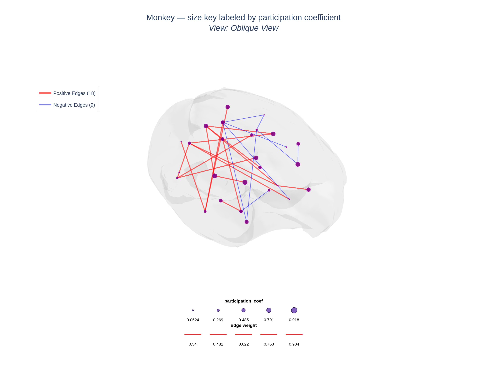

*The size-key dots are drawn at the actual rendered pixel sizes, but labeled with
5 evenly-spaced `participation_coef` values rather than raw pixel sizes.*

---

## 3. Monkey — default vs. customized

The same network, rendered two ways, to anchor what the knobs do.

| | Default | Customized |
| --- | --- | --- |
| Node size | scalar `8` | vector, scaled from PC |
| Node color | default purple | by module (+ black border) |
| Edge width | fixed `2.0` | scaled `(1, 8)` by `|weight|` |
| Legend keys | none | size key (PC) + width key |

```python
import numpy as np
modules = (np.arange(len(coords)) % 4) + 1   # synthetic 4-module coloring

# Default
create_brain_connectivity_plot(
    vertices=vertices, faces=faces, roi_coords_df=coords,
    connectivity_matrix="node_edge_28/connectivity_28.edge",
    node_size=8, edge_width=2.0, zoom=1.5, camera_view="oblique",
    save_path="monkey_default.html", export_image="monkey_default.png",
)

# Customized
create_brain_connectivity_plot(
    vertices=vertices, faces=faces, roi_coords_df=coords,
    connectivity_matrix="node_edge_28/connectivity_28.edge",
    node_size="new_atlas_demo/monkey/sizes_from_pc.csv", node_size_scale=0.5,
    node_color=modules, node_border_color="black",
    node_metrics="new_atlas_demo/monkey/metrics.csv",
    node_size_legend_metric="participation_coef",
    edge_width=(1.0, 8.0), zoom=1.5, camera_view="oblique",
    save_path="monkey_custom.html", export_image="monkey_customized.png",
)
```

::::{grid} 1 2 2 2
:::{grid-item}

*Default: scalar size, fixed width, purple nodes.*
:::
:::{grid-item}
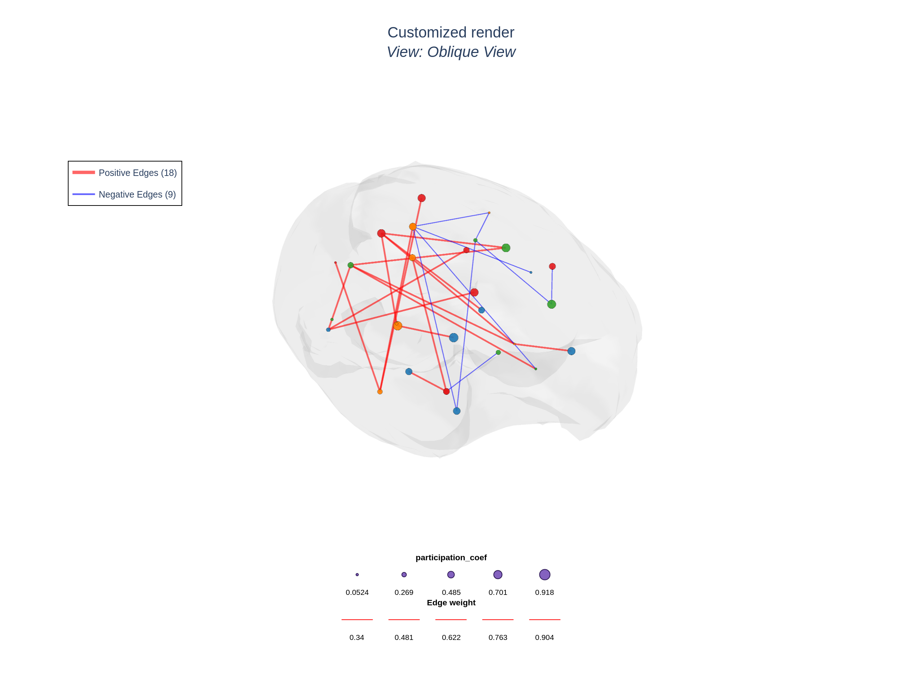
*Customized: PC-scaled sizes, module colors + border, scaled edges, metric key.*
:::
::::

---

## Modularity visualization types (114-ROI k5 example)

The `create_brain_connectivity_plot_with_modularity` knobs `viz_type`,
`inter_edge_color`, and `node_roles` render the *same* community-detection result
several different ways. These examples use the bundled human tutorial brain
(`brain_mesh.gii`) with a **real** *k=5* modularity result (`k5_state_0/`:
114 ROIs, 6 modules, per-node metrics). Each type below is exported as a 3-view
multi-view PNG (left / superior / posterior) plus a single superior view and an
interactive HTML (HTMLs are written locally by the script, not committed).

Shared Python setup:

```python
import pandas as pd
from HarrisLabPlotting import load_mesh_file, create_brain_connectivity_plot_with_modularity

vertices, faces = load_mesh_file("brain_mesh.gii")
coords = pd.read_csv("output/atlas_114_test/atlas_114_test_comma.csv")
base = dict(
    vertices=vertices, faces=faces, roi_coords_df=coords,
    connectivity_matrix="k5_state_0/connectivity_matrix.csv",
    module_assignments="k5_state_0/module_assignments.csv",
    node_metrics="k5_state_0/combined_metrics.csv",
    multi_view=["left", "superior", "posterior"], show_node_labels=False,
)
# e.g. create_brain_connectivity_plot_with_modularity(**base, viz_type="intra",
#         save_path="k5_intra.html", export_image="k5_intra_multiview.png")
```

| Type | Key arguments |
| --- | --- |
| All edges (default) | `viz_type="all"` |
| All edges, inter-module black | `viz_type="all", inter_edge_color="black"` |
| Intra-module edges only | `viz_type="intra"` |
| Inter-module edges only | `viz_type="inter"` |
| Inter-module edges only, black | `viz_type="inter", inter_edge_color="black"` |
| Nodes only | `viz_type="nodes_only"` |
| Nodal roles (Guimerà–Amaral) | `viz_type="nodes_only", node_roles=True` |

**All edges (default)** — `viz_type="all"`
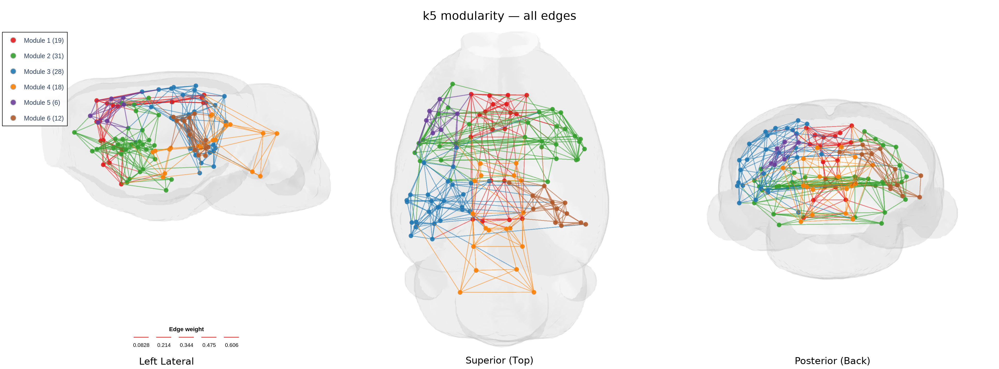

**All edges, inter-module edges black** — `inter_edge_color="black"`
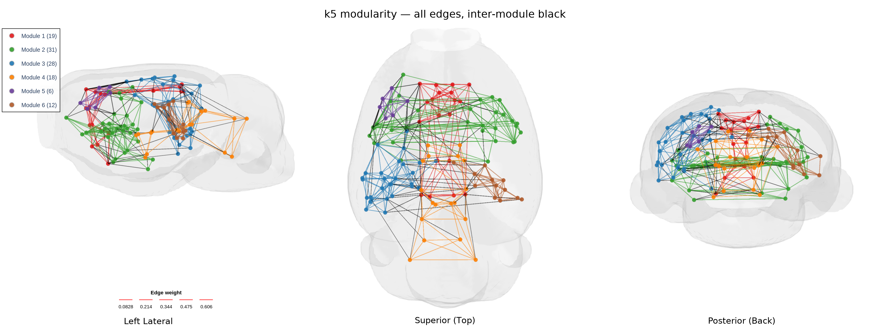

**Intra-module edges only** — `viz_type="intra"`
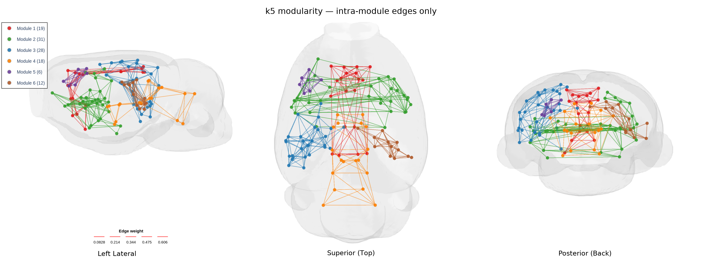

**Inter-module edges only** — `viz_type="inter"`
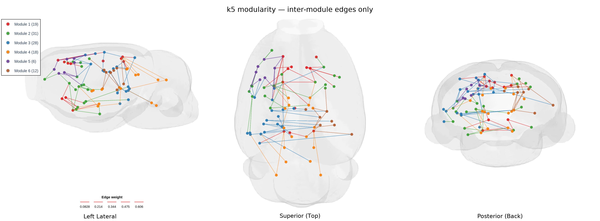

**Inter-module edges only, black** — `viz_type="inter", inter_edge_color="black"`
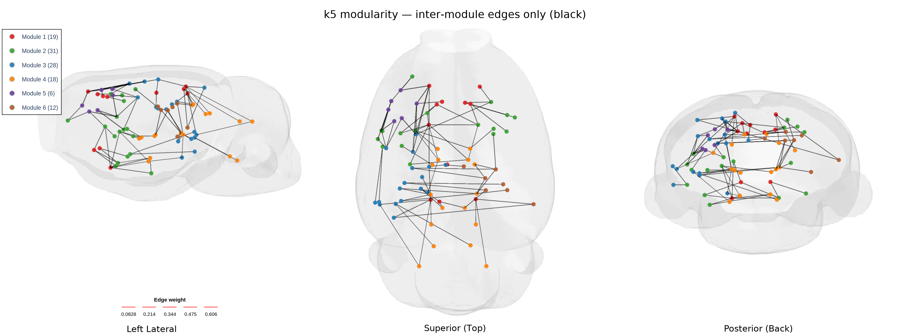

**Nodes only** — `viz_type="nodes_only"`
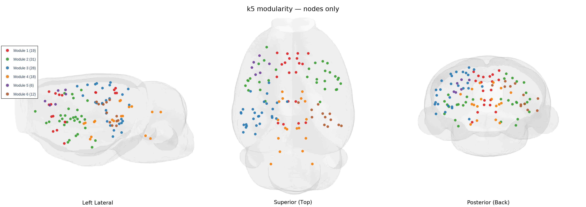

**Nodal roles (Guimerà–Amaral)** — `viz_type="nodes_only", node_roles=True`
(needs `node_metrics` with `participation_coef` + `within_module_zscore`; node
fill = module, border = role). Best read from above:
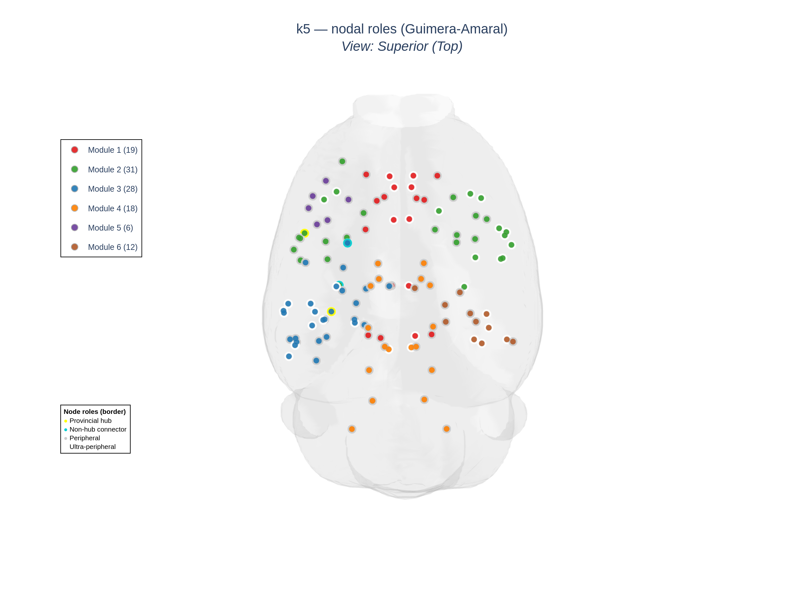

CLI equivalent (vary `--viz-type`, add `--inter-edge-color black` or
`--node-roles` per row):

```bash
hlplot modular \
  --mesh test_files/tutorial_files/brain_mesh.gii \
  --coords test_files/tutorial_files/output/atlas_114_test/atlas_114_test_comma.csv \
  --matrix test_files/tutorial_files/k5_state_0/connectivity_matrix.csv \
  --modules test_files/tutorial_files/k5_state_0/module_assignments.csv \
  --node-metrics test_files/tutorial_files/k5_state_0/combined_metrics.csv \
  --viz-type intra \
  --multi-view "left,superior,posterior" \
  --output k5_intra.html \
  --export-image k5_intra_multiview.png
```

## Reproduce everything

```bash
cd test_files/tutorial_files/new_atlas_demo
python generate_figure_data.py   # builds LUTs, coords, synthetic networks
python render_figures.py         # renders the human + monkey PNGs above
python render_k5_viztypes.py     # renders the k5 viz-type PNGs (+ local HTMLs)
```

The notebook
[`tutorial/figure_creation_new_atlases.ipynb`](https://github.com/AzadAzargushasb/HarrisLabPlotting/blob/main/tutorial/figure_creation_new_atlases.ipynb)
runs the same steps interactively.
