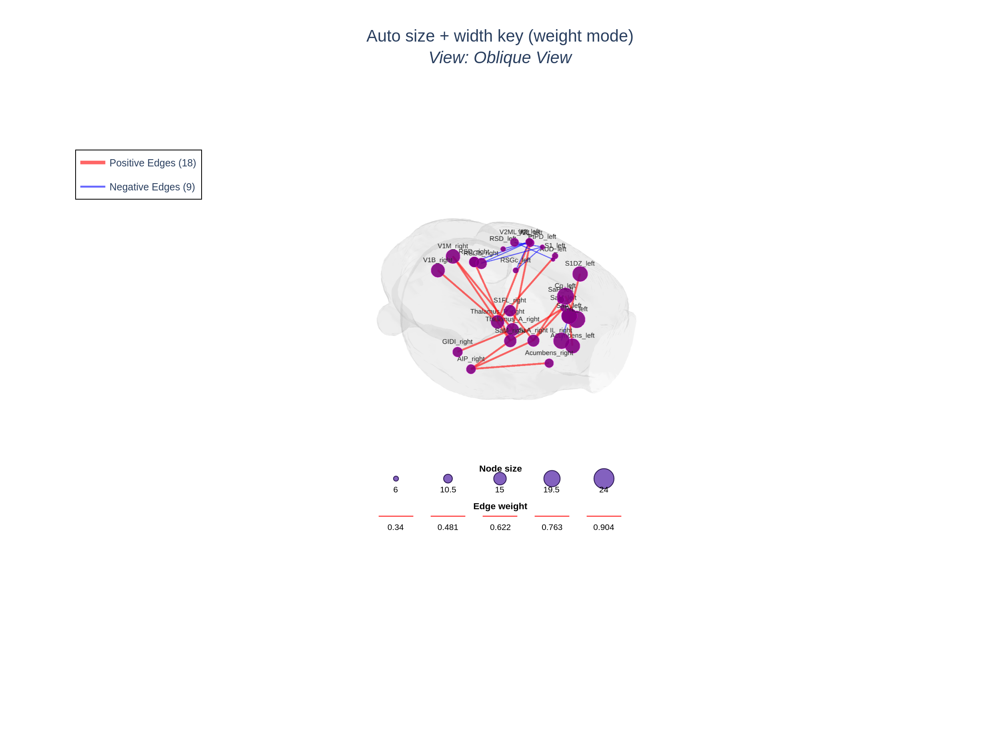
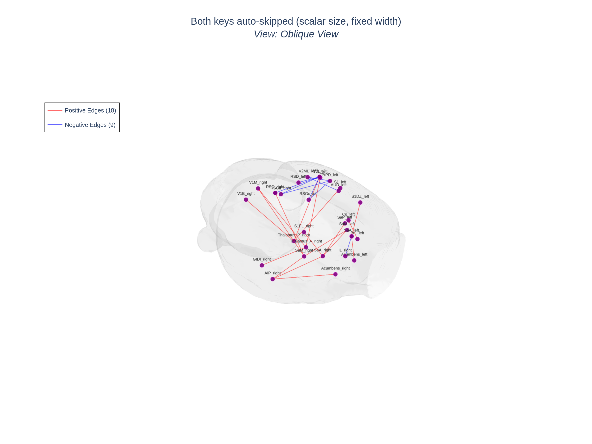
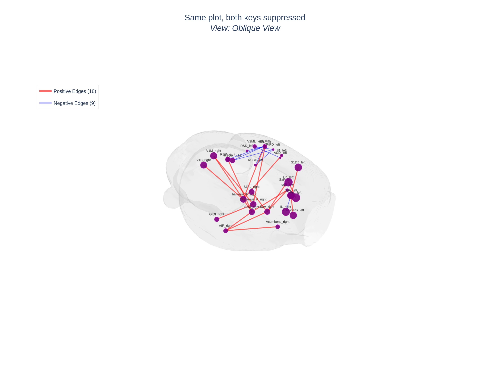
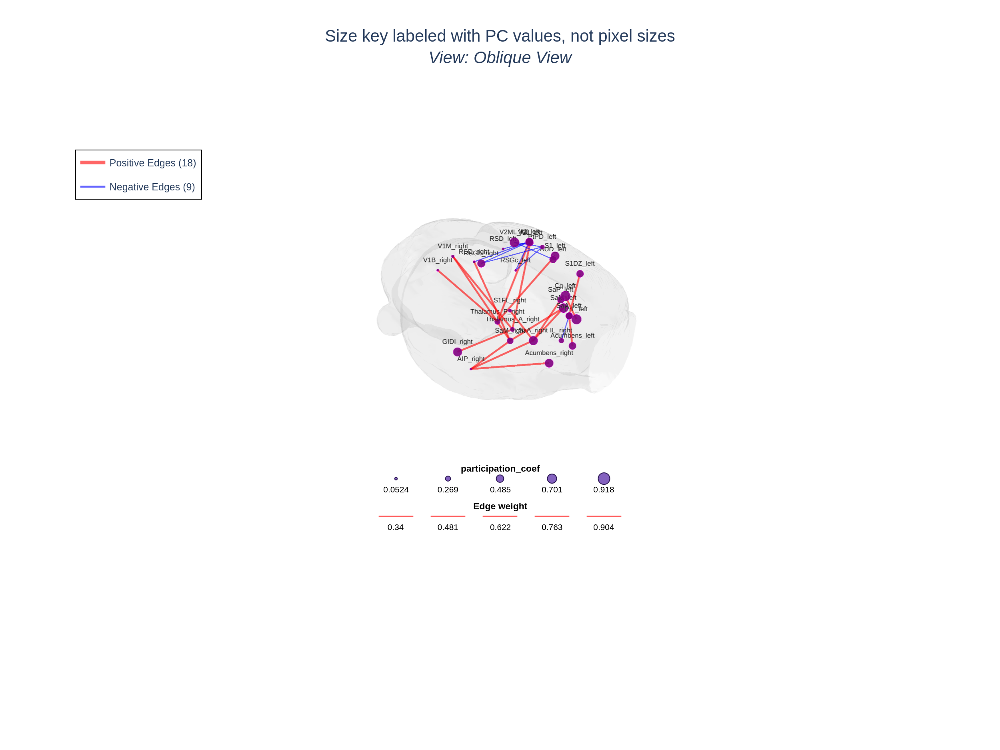
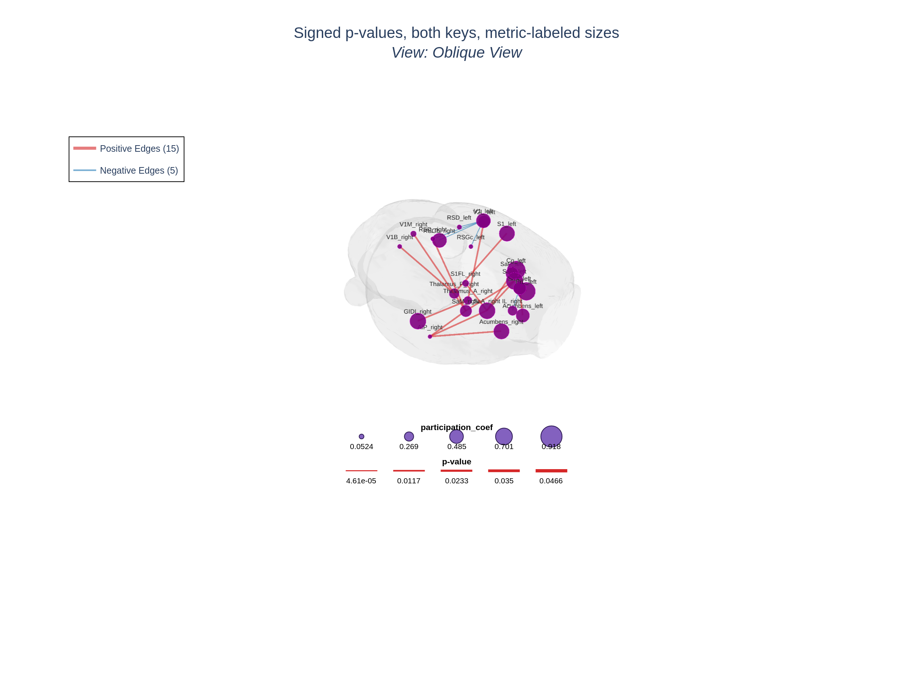
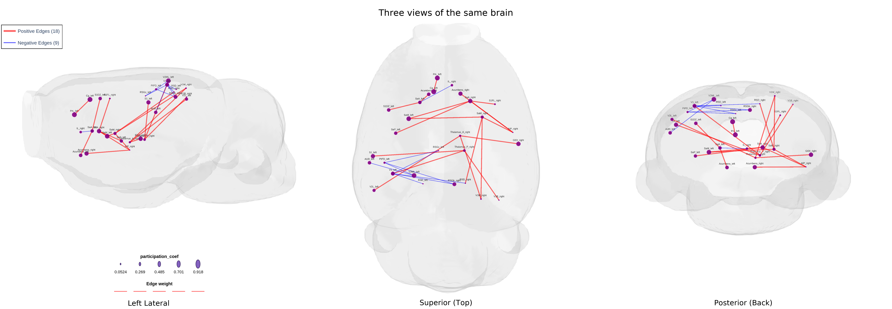
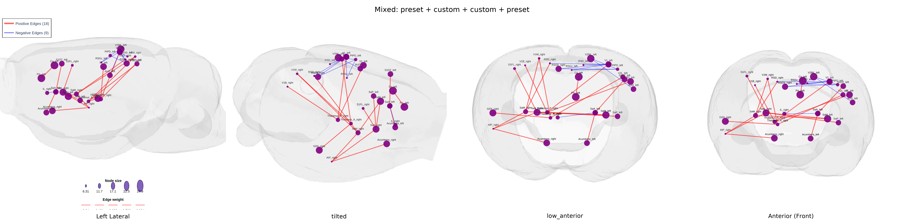
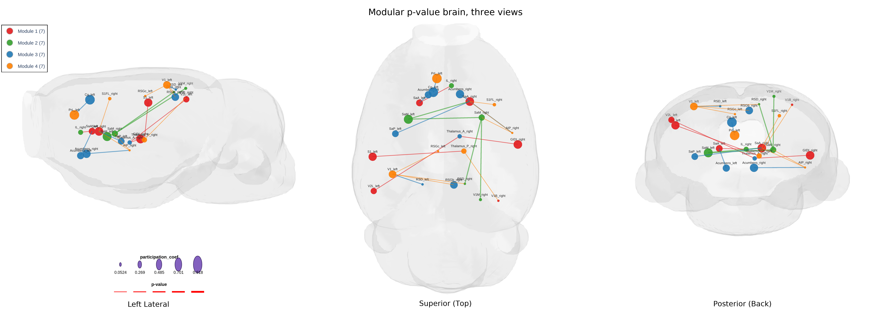
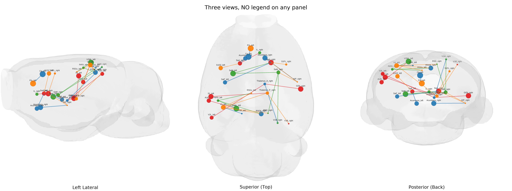
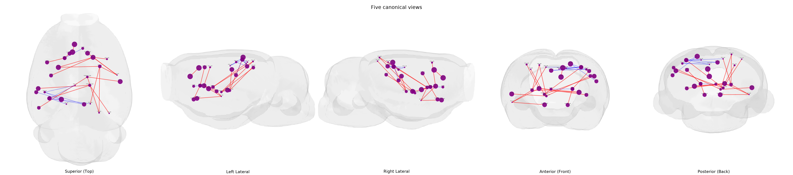

# HarrisLabPlotting — Legend Keys and Multi-View Stitched Export

> Markdown sibling of [`https://github.com/AzadAzargushasb/HarrisLabPlotting/blob/main/tutorial/legend%20key%20and%203%20view%20display%20test.ipynb`](https://github.com/AzadAzargushasb/HarrisLabPlotting/blob/main/tutorial/legend%20key%20and%203%20view%20display%20test.ipynb).
> Same content, same images, but readable straight on GitHub without
> launching Jupyter. If you want to edit and re-run the cells live,
> use the notebook; if you just want to read the tutorial, this file.

This tutorial covers two related features:

1. **Size + width legend keys** — small overlay near the bottom of the
   plot showing 5 sample dots (for vector node sizes) and 5 sample
   line widths (for weight-scaled edges), each labeled with the value
   it represents. The keys live in paper coordinates so they appear
   identically in the saved HTML AND in any PNG/SVG/PDF you export.
   They are auto-skipped for the trivial cases (scalar size, fixed
   width) where they would be pointless.

2. **Multi-view stitched export** — render the same brain from N
   camera angles and stitch the panels into a single 1×N PNG strip.
   The user can mix built-in presets (`left`, `superior`,
   `posterior`, …) with custom views (`eye` / `center` / `up`
   triples), name each panel, and keep the legend in the first panel
   only so the strip stays clean.

> **Heads up**: the node-size legend has two label modes. By default
> the labels show the literal pixel sizes from your `--node-size`
> array. When you also pass `node_size_legend_metric=COL` (and a
> `node_metrics` table that contains `COL`), the labels switch to 5
> evenly-spaced values from that column instead, with the column name
> as the title. The dots themselves are still drawn at the actual
> rendered pixel sizes — the metric only changes the LABELS so the
> reader sees what you actually care about (e.g. participation
> coefficient values, not raw pixel sizes you scaled them to).

---

## 0. Setup

We resolve every input path relative to the repo root so this tutorial
works whether you're sitting in `tutorial/`, the repo root, or
somewhere else. The standard 28-ROI tutorial files (mesh, coordinates,
connectivity, p-values) ship with the repo, so the snippets below are
fully reproducible.

```python
import os
from pathlib import Path

import numpy as np
import pandas as pd

# Walk up from this notebook's CWD to the repo root.
here = Path.cwd()
repo_root = here
for p in [here, *here.parents]:
    if (p / 'test_files').is_dir() and (p / 'tutorial').is_dir():
        repo_root = p
        break
print('Repo root :', repo_root)

TUTORIAL_FILES = repo_root / 'test_files' / 'tutorial_files'
NODE_EDGE_28 = TUTORIAL_FILES / 'node_edge_28'
OUTPUT_DIR = repo_root / 'tutorial' / 'output_legend_views'
OUTPUT_DIR.mkdir(parents=True, exist_ok=True)

from HarrisLabPlotting import (
    load_mesh_file,
    create_brain_connectivity_plot,
    create_brain_connectivity_plot_with_modularity,
    export_multi_view_stitched_png,
    CameraController,
)

# Load mesh + coordinates once.
vertices, faces = load_mesh_file(str(TUTORIAL_FILES / 'brain_mesh.gii'))
coords_df = pd.read_csv(TUTORIAL_FILES / 'output' / 'atlas_28_test_comma.csv')
n_rois = len(coords_df)
print(f'Loaded mesh ({len(vertices)} verts) + {n_rois} ROIs')
```

---

## 1. Vector node sizes → auto size key

When `node_size` is a scalar number (the default), every dot in the
brain is the same size and a "5 sample dots" key would just show 5
identical dots — pointless. So the size key is automatically
suppressed in that case.

When `node_size` is a vector (a CSV file or numpy array with one value
per node) the size key is rendered automatically: 5 sample dots, each
labeled with the pixel size it represents, in a small strip near the
bottom-center of the plot.

The cell below builds a fake per-node size vector that linearly grows
from 6 to 24 pixels and saves it to a CSV so we can reference it from
both the Python API and the CLI.

```python
sizes = np.linspace(6, 24, n_rois)
sizes_path = OUTPUT_DIR / 'sizes.csv'
pd.DataFrame({'size': sizes}).to_csv(sizes_path, index=False)
print('Saved', sizes_path)
print('Per-node sizes (px):', sizes.round(1).tolist())
```

```python
fig, _ = create_brain_connectivity_plot(
    vertices=vertices,
    faces=faces,
    roi_coords_df=coords_df,
    connectivity_matrix=str(NODE_EDGE_28 / 'connectivity_28.edge'),
    node_size=str(sizes_path),       # vector node sizes → size key auto-on
    edge_width=(1.0, 8.0),           # scaled widths       → width key auto-on
    plot_title='Auto size + width key (weight mode)',
    save_path=str(OUTPUT_DIR / 'auto_size_and_width.html'),
    camera_view='oblique',
)
fig.show()
```

#### CLI equivalent

```bash
hlplot plot \
  --mesh test_files/tutorial_files/brain_mesh.gii \
  --coords test_files/tutorial_files/output/atlas_28_test_comma.csv \
  --matrix test_files/tutorial_files/node_edge_28/connectivity_28.edge \
  --node-size tutorial/output_legend_views/sizes.csv \
  --edge-width-min 1 --edge-width-max 8 \
  --camera oblique \
  --title "Auto size + width key (weight mode)" \
  --output tutorial/output_legend_views/auto_size_and_width.html
```


*Vector node sizes (6 → 24 px linear ramp) and weight-scaled edges. Both legend keys appear automatically near the bottom of the plot.*

### 1a. The auto-skip rules

A scalar node size hides the size key (5 identical dots are
pointless). A fixed edge width hides the width key (5 identical lines
are pointless). Both keys are independent — you can have one without
the other.

```python
# Scalar size + fixed width → NEITHER key is rendered.
fig, _ = create_brain_connectivity_plot(
    vertices=vertices,
    faces=faces,
    roi_coords_df=coords_df,
    connectivity_matrix=str(NODE_EDGE_28 / 'connectivity_28.edge'),
    node_size=10,                    # scalar
    edge_width=2.0,                  # fixed
    plot_title='Both keys auto-skipped (scalar size, fixed width)',
    save_path=str(OUTPUT_DIR / 'no_keys.html'),
    camera_view='oblique',
)
fig.show()
```

#### CLI equivalent

```bash
hlplot plot \
  --mesh test_files/tutorial_files/brain_mesh.gii \
  --coords test_files/tutorial_files/output/atlas_28_test_comma.csv \
  --matrix test_files/tutorial_files/node_edge_28/connectivity_28.edge \
  --node-size 10 \
  --edge-width-fixed 2.0 \
  --camera oblique \
  --title "Both keys auto-skipped (scalar size, fixed width)" \
  --output tutorial/output_legend_views/no_keys.html
```


*Scalar size + fixed width: neither the size key nor the width key is rendered (5 identical samples would carry no information).*

### 1b. Manually disabling the keys

The auto-skip is for the trivial cases. To disable a key on a plot
where it would otherwise be drawn (e.g. for a clean publication
figure), set `show_size_legend=False` and/or `show_width_legend=False`
explicitly.

```python
fig, _ = create_brain_connectivity_plot(
    vertices=vertices,
    faces=faces,
    roi_coords_df=coords_df,
    connectivity_matrix=str(NODE_EDGE_28 / 'connectivity_28.edge'),
    node_size=str(sizes_path),
    edge_width=(1.0, 8.0),
    show_size_legend=False,          # explicit off
    show_width_legend=False,         # explicit off
    plot_title='Same plot, both keys suppressed',
    save_path=str(OUTPUT_DIR / 'manual_off.html'),
    camera_view='oblique',
)
fig.show()
```

#### CLI equivalent

```bash
hlplot plot \
  --mesh test_files/tutorial_files/brain_mesh.gii \
  --coords test_files/tutorial_files/output/atlas_28_test_comma.csv \
  --matrix test_files/tutorial_files/node_edge_28/connectivity_28.edge \
  --node-size tutorial/output_legend_views/sizes.csv \
  --edge-width-min 1 --edge-width-max 8 \
  --no-size-legend --no-width-legend \
  --camera oblique \
  --title "Same plot, both keys suppressed" \
  --output tutorial/output_legend_views/manual_off.html
```


*Same vector-size + scaled-width inputs as §1, but `show_size_legend=False` and `show_width_legend=False` strip the keys for a cleaner figure.*

---

## 2. Labeling the size key with a METRIC instead of pixel sizes

This is the part to read carefully.

By default the size key labels each sample dot with **the actual pixel
size that dot is drawn at** (e.g. `6, 10.5, 15, 19.5, 24`). That's
honest but not always meaningful — if you pre-scaled a metric like
participation coefficient (PC) into pixel sizes, what readers actually
care about is the PC value, not the pixel size.

The fix is the `node_size_legend_metric` parameter. When you set it,
the key:

- uses **the column name** as the title (e.g. `participation_coef`);
- uses **5 evenly-spaced values from that column** as the labels
  (e.g. `0.10, 0.30, 0.50, 0.70, 0.90`);
- still draws each dot at the **actual pixel size**, paired by index
  with the node whose metric value is closest to each tick.

Two requirements:

1. You must also pass `node_metrics` (a CSV/DataFrame). The metric
   column has to live there.
2. You're responsible for converting your metric values into pixel
   sizes BEFORE passing them via `node_size`. The legend mode does
   NOT rescale anything; it only changes the LABELS.

Below we mimic the realistic workflow:

1. Build a fake `metrics_df` with a `participation_coef` column.
2. Pre-scale PC into pixel sizes (`5 + pc * 25`) and save THAT as the
   `--node-size` CSV.
3. Plot with both files and the new flag.

```python
rng = np.random.default_rng(0)
pc_values = rng.uniform(0.05, 0.92, size=n_rois)
metrics_df = pd.DataFrame({
    'roi_name': coords_df['roi_name'],
    'participation_coef': pc_values,
    'within_module_zscore': rng.normal(0, 1.5, size=n_rois),
})
metrics_path = OUTPUT_DIR / 'metrics.csv'
metrics_df.to_csv(metrics_path, index=False)

# Pre-scale PC into pixel sizes [5, 30] and save as the node_size CSV.
sizes_from_pc = 5 + pc_values * 25
sizes_from_pc_path = OUTPUT_DIR / 'sizes_from_pc.csv'
pd.DataFrame({'size': sizes_from_pc}).to_csv(sizes_from_pc_path, index=False)

print('PC value range :', float(pc_values.min()), '..', float(pc_values.max()))
print('px size range  :', float(sizes_from_pc.min()), '..', float(sizes_from_pc.max()))
```

```python
fig, _ = create_brain_connectivity_plot(
    vertices=vertices,
    faces=faces,
    roi_coords_df=coords_df,
    connectivity_matrix=str(NODE_EDGE_28 / 'connectivity_28.edge'),
    node_size=str(sizes_from_pc_path),               # pre-scaled px sizes
    node_metrics=str(metrics_path),                  # required for metric labels
    node_size_legend_metric='participation_coef',    # the metric column
    edge_width=(1.0, 8.0),
    plot_title='Size key labeled with PC values, not pixel sizes',
    save_path=str(OUTPUT_DIR / 'metric_labeled_size_legend.html'),
    camera_view='oblique',
    node_size_scale=0.5,
)
fig.show()
```

#### CLI equivalent

```bash
hlplot plot \
  --mesh test_files/tutorial_files/brain_mesh.gii \
  --coords test_files/tutorial_files/output/atlas_28_test_comma.csv \
  --matrix test_files/tutorial_files/node_edge_28/connectivity_28.edge \
  --node-size tutorial/output_legend_views/sizes_from_pc.csv \
  --node-metrics tutorial/output_legend_views/metrics.csv \
  --node-size-legend-metric participation_coef \
  --edge-width-min 1 --edge-width-max 8 \
  --node-size-scale 0.5 \
  --camera oblique \
  --title "Size key labeled with PC values, not pixel sizes" \
  --output tutorial/output_legend_views/metric_labeled_size_legend.html
```


*Size key labels are 5 evenly-spaced values from the `participation_coef` column of `metrics_df`, with the column name as the legend title. The dots themselves still render at the actual pre-scaled pixel sizes.*

### 2a. Side-by-side comparison

Same plot, no `node_size_legend_metric` — the labels revert to the
literal pixel sizes from the CSV. Useful for understanding what the
flag actually does.

```python
fig, _ = create_brain_connectivity_plot(
    vertices=vertices,
    faces=faces,
    roi_coords_df=coords_df,
    connectivity_matrix=str(NODE_EDGE_28 / 'connectivity_28.edge'),
    node_size=str(sizes_from_pc_path),
    node_metrics=str(metrics_path),     # still passed but unused for legend
    edge_width=(1.0, 8.0),
    plot_title='Same plot, default labels (literal px sizes)',
    save_path=str(OUTPUT_DIR / 'metric_default_labels.html'),
    camera_view='oblique',
    node_size_scale=0.5,
)
fig.show()
```

#### CLI equivalent

```bash
hlplot plot \
  --mesh test_files/tutorial_files/brain_mesh.gii \
  --coords test_files/tutorial_files/output/atlas_28_test_comma.csv \
  --matrix test_files/tutorial_files/node_edge_28/connectivity_28.edge \
  --node-size tutorial/output_legend_views/sizes_from_pc.csv \
  --node-metrics tutorial/output_legend_views/metrics.csv \
  --edge-width-min 1 --edge-width-max 8 \
  --node-size-scale 0.5 \
  --camera oblique \
  --title "Same plot, default labels (literal px sizes)" \
  --output tutorial/output_legend_views/metric_default_labels.html
```


*Identical input but with `node_size_legend_metric` omitted: labels show the literal pixel sizes from the size CSV instead of the underlying PC values.*

---

## 3. Edge width key in p-value mode

When you plot a p-value matrix with `matrix_type='pvalue'`, the
underlying edge "weights" stored in the figure are `-log10(p)` values
(see [pvalue_plotting.md](pvalue_plotting.md) for
the full story). The width key automatically detects this case and
labels the sample lines with the **original p-values** instead of the
transformed values, which is what readers actually care about.

```python
fig, _ = create_brain_connectivity_plot(
    vertices=vertices,
    faces=faces,
    roi_coords_df=coords_df,
    connectivity_matrix=str(NODE_EDGE_28 / 'pvalues_28.csv'),
    matrix_type='pvalue',
    pvalue_threshold=0.05,
    sign_matrix=str(NODE_EDGE_28 / 'pvalues_28_signs.csv'),
    pos_edge_color='#d62728',
    neg_edge_color='#1f77b4',
    node_size=str(sizes_from_pc_path),         # also test the size key in pvalue mode
    node_metrics=str(metrics_path),
    node_size_legend_metric='participation_coef',
    edge_width=(1.0, 8.0),
    plot_title='Signed p-values, both keys, metric-labeled sizes',
    save_path=str(OUTPUT_DIR / 'pval_with_keys.html'),
    camera_view='oblique',
)
fig.show()
```

#### CLI equivalent

```bash
hlplot plot \
  --mesh test_files/tutorial_files/brain_mesh.gii \
  --coords test_files/tutorial_files/output/atlas_28_test_comma.csv \
  --matrix test_files/tutorial_files/node_edge_28/pvalues_28.csv \
  --matrix-type pvalue --pvalue-threshold 0.05 \
  --sign-matrix test_files/tutorial_files/node_edge_28/pvalues_28_signs.csv \
  --pos-edge-color "#d62728" --neg-edge-color "#1f77b4" \
  --node-size tutorial/output_legend_views/sizes_from_pc.csv \
  --node-metrics tutorial/output_legend_views/metrics.csv \
  --node-size-legend-metric participation_coef \
  --edge-width-min 1 --edge-width-max 8 \
  --camera oblique \
  --title "Signed p-values, both keys, metric-labeled sizes" \
  --output tutorial/output_legend_views/pval_with_keys.html
```


*Signed p-values with both legend keys on. The width key labels its 5 sample lines with the **original p-values** (e.g. `5e-05`, `0.002`, `0.05`), not the `-log10(p)` weights stored in the figure.*

---

## 4. Multi-view stitched export

`multi_view` re-renders the same figure from N camera angles and
stitches the panels into a single 1×N PNG strip via Pillow. Each
panel is rendered through kaleido at the requested DPI, with title /
dropdown / camera-controls annotation stripped, then composited with
a small per-panel label below and an optional combined title above.

The output path comes from `export_image` — when `multi_view` is set,
`export_image` is **reinterpreted** as the path of the stitched PNG
(the regular single-image export is suppressed). Multi-view export is
**PNG-only** by design.

The first panel optionally keeps its plotly legend so the reader sees
the legend once; the rest are rendered without a legend so the brains
align nicely.

```python
# Default ordering: left lateral on the left, superior in the middle,
# posterior on the right. The ORDER of the list controls the
# left-to-right order of the panels.
mv_default_path = OUTPUT_DIR / 'multi_view_default.png'
fig, _ = create_brain_connectivity_plot(
    vertices=vertices,
    faces=faces,
    roi_coords_df=coords_df,
    connectivity_matrix=str(NODE_EDGE_28 / 'connectivity_28.edge'),
    node_size=str(sizes_from_pc_path),
    node_metrics=str(metrics_path),
    node_size_legend_metric='participation_coef',
    edge_width=(1.0, 8.0),
    plot_title='Three views of the same brain',
    save_path=str(OUTPUT_DIR / 'mv_default_dummy.html'),
    multi_view=['left', 'superior', 'posterior'],
    multi_view_panel_size=(800, 800),
    export_image=str(mv_default_path),                    # reinterpreted as the strip path
    image_dpi=600,
    node_size_scale=0.5,
    label_font_size=6,
)
```

#### CLI equivalent

```bash
hlplot plot \
  --mesh test_files/tutorial_files/brain_mesh.gii \
  --coords test_files/tutorial_files/output/atlas_28_test_comma.csv \
  --matrix test_files/tutorial_files/node_edge_28/connectivity_28.edge \
  --node-size tutorial/output_legend_views/sizes_from_pc.csv \
  --node-metrics tutorial/output_legend_views/metrics.csv \
  --node-size-legend-metric participation_coef \
  --edge-width-min 1 --edge-width-max 8 \
  --multi-view "left,superior,posterior" \
  --multi-view-panel-size "800,800" \
  --image-dpi 600 \
  --node-size-scale 0.5 \
  --label-font-size 6 \
  --title "Three views of the same brain" \
  --output tutorial/output_legend_views/mv_default_dummy.html \
  --export-image tutorial/output_legend_views/multi_view_default.png
```


*Same brain rendered from three preset camera views, stitched horizontally into one PNG. Legend lives in the first panel only; per-panel labels appear below each brain.*

### 4a. Custom views in the multi-view list

Each entry in `multi_view` can be either a string (a built-in preset
name) or a `dict` with `eye` / `center` / `up` / `name`. You can mix
them freely, and the dict version is exactly the same shape that
`custom_camera` accepts everywhere else in the package.

```python
tilted_view = dict(
    name='Tilted 3/4',
    eye=dict(x=1.5, y=0.8, z=1.2),
    center=dict(x=0, y=0, z=0),
    up=dict(x=0, y=0, z=1),
)
low_anterior = dict(
    name='Low Anterior',
    eye=dict(x=0.0, y=1.8, z=0.3),
    center=dict(x=0, y=0, z=0),
    up=dict(x=0, y=0, z=1),
)

mv_custom_path = OUTPUT_DIR / 'multi_view_custom.png'
fig, _ = create_brain_connectivity_plot(
    vertices=vertices,
    faces=faces,
    roi_coords_df=coords_df,
    connectivity_matrix=str(NODE_EDGE_28 / 'connectivity_28.edge'),
    node_size=str(sizes_from_pc_path),
    edge_width=(1.0, 8.0),
    plot_title='Mixed: preset + custom + custom + preset',
    save_path=str(OUTPUT_DIR / 'mv_custom_dummy.html'),
    multi_view=['left', tilted_view, low_anterior, 'anterior'],
    multi_view_panel_size=(700, 700),
    multi_view_panel_labels=['Left lateral', 'Tilted 3/4', 'Low anterior', 'Front'],
    export_image=str(mv_custom_path),
    image_dpi=600,
    multi_view_zoom=1.2,
)
```

#### CLI equivalent

`--custom-view` is multi-use — pass it once per registered view. The
shape `NAME=ex,ey,ez` is the same eye triple a Python `dict(eye=...)`
would carry. Once registered, reference the name in `--multi-view`.

```bash
hlplot plot \
  --mesh test_files/tutorial_files/brain_mesh.gii \
  --coords test_files/tutorial_files/output/atlas_28_test_comma.csv \
  --matrix test_files/tutorial_files/node_edge_28/connectivity_28.edge \
  --node-size tutorial/output_legend_views/sizes_from_pc.csv \
  --edge-width-min 1 --edge-width-max 8 \
  --custom-view "tilted=1.5,0.8,1.2" \
  --custom-view "low_anterior=0.0,1.8,0.3" \
  --multi-view "left,tilted,low_anterior,anterior" \
  --multi-view-panel-size "700,700" \
  --multi-view-zoom 1.2 \
  --image-dpi 600 \
  --title "Mixed: preset + custom + custom + preset" \
  --output tutorial/output_legend_views/mv_custom_dummy.html \
  --export-image tutorial/output_legend_views/multi_view_custom.png
```


*Multi-view list of `['left', tilted_view, low_anterior, 'anterior']` produces 4 panels in that order. Custom-view dicts use the same shape as `custom_camera` elsewhere in the package.*

### 4b. Multi-view + modular plot

The same `multi_view` plumbing works on
`create_brain_connectivity_plot_with_modularity`. Each panel renders
the same module-colored brain, and the legend (with the per-module
entries) appears in the first panel only.

```python
modules = (np.arange(n_rois) % 4) + 1
mv_mod_path = OUTPUT_DIR / 'multi_view_modular.png'

fig, _ = create_brain_connectivity_plot_with_modularity(
    vertices=vertices,
    faces=faces,
    roi_coords_df=coords_df,
    connectivity_matrix=str(NODE_EDGE_28 / 'pvalues_28.csv'),
    module_assignments=modules,
    matrix_type='pvalue',
    pvalue_threshold=0.05,
    sign_matrix=str(NODE_EDGE_28 / 'pvalues_28_signs.csv'),
    edge_color_mode='module',
    edge_width=(1.0, 8.0),
    node_size=str(sizes_from_pc_path),
    node_metrics=str(metrics_path),
    node_size_legend_metric='participation_coef',
    plot_title='Modular p-value brain, three views',
    save_path=str(OUTPUT_DIR / 'mv_mod_dummy.html'),
    multi_view=['left', 'superior', 'posterior'],
    multi_view_panel_size=(800, 800),
    image_dpi=180,
    export_image=str(mv_mod_path),
)
```

#### CLI equivalent

```bash
hlplot modular \
  --mesh test_files/tutorial_files/brain_mesh.gii \
  --coords test_files/tutorial_files/output/atlas_28_test_comma.csv \
  --matrix test_files/tutorial_files/node_edge_28/pvalues_28.csv \
  --modules test_files/tutorial_files/node_edge_28/modules_28.csv \
  --matrix-type pvalue --pvalue-threshold 0.05 \
  --sign-matrix test_files/tutorial_files/node_edge_28/pvalues_28_signs.csv \
  --edge-color-mode module \
  --edge-width-min 1 --edge-width-max 8 \
  --node-size tutorial/output_legend_views/sizes_from_pc.csv \
  --node-metrics tutorial/output_legend_views/metrics.csv \
  --node-size-legend-metric participation_coef \
  --multi-view "left,superior,posterior" \
  --multi-view-panel-size "800,800" \
  --image-dpi 180 \
  --title "Modular p-value brain, three views" \
  --output tutorial/output_legend_views/mv_mod_dummy.html \
  --export-image tutorial/output_legend_views/multi_view_modular.png
```


*Multi-view stitched export of a modular p-value plot. Each panel shows the same module-colored brain from a different camera angle; module legend appears in the first panel only.*

### 4c. Strip the legend from EVERY panel

When `multi_view_keep_first_legend=False` the legend is stripped from
every panel, so all three brains have the same amount of room. Use
this when you have a very narrow strip and don't want the legend to
eat into the first panel's brain.

```python
mv_strip_path = OUTPUT_DIR / 'multi_view_no_legend.png'
fig, _ = create_brain_connectivity_plot_with_modularity(
    vertices=vertices,
    faces=faces,
    roi_coords_df=coords_df,
    connectivity_matrix=str(NODE_EDGE_28 / 'connectivity_28.edge'),
    module_assignments=modules,
    edge_width=(1.0, 8.0),
    node_size=str(sizes_from_pc_path),
    plot_title='Three views, NO legend on any panel',
    save_path=str(OUTPUT_DIR / 'mv_strip_dummy.html'),
    multi_view=['left', 'superior', 'posterior'],
    multi_view_keep_first_legend=False,        # strip from all panels
    image_dpi=180,
    export_image=str(mv_strip_path),
)
```

#### CLI equivalent

```bash
hlplot modular \
  --mesh test_files/tutorial_files/brain_mesh.gii \
  --coords test_files/tutorial_files/output/atlas_28_test_comma.csv \
  --matrix test_files/tutorial_files/node_edge_28/connectivity_28.edge \
  --modules test_files/tutorial_files/node_edge_28/modules_28.csv \
  --edge-width-min 1 --edge-width-max 8 \
  --node-size tutorial/output_legend_views/sizes_from_pc.csv \
  --multi-view "left,superior,posterior" \
  --multi-view-no-first-legend \
  --image-dpi 180 \
  --title "Three views, NO legend on any panel" \
  --output tutorial/output_legend_views/mv_strip_dummy.html \
  --export-image tutorial/output_legend_views/multi_view_no_legend.png
```


*With `multi_view_keep_first_legend=False`, no panel keeps the legend; the brains all occupy the same width.*

---

## 5. Calling `export_multi_view_stitched_png` directly

If you've already built a figure (e.g. inside a larger pipeline) and
just want the multi-view export step on its own, the helper is
exposed at the package top level. Pass any plotly Figure plus a list
of view names/dicts:

```python
fig, _ = create_brain_connectivity_plot(
    vertices=vertices,
    faces=faces,
    roi_coords_df=coords_df,
    connectivity_matrix=str(NODE_EDGE_28 / 'connectivity_28.edge'),
    node_size=str(sizes_from_pc_path),
    edge_width=(1.0, 8.0),
    save_path=str(OUTPUT_DIR / 'standalone.html'),
    plot_title='standalone fig used by helper',
    camera_view='oblique',
)
helper_path = export_multi_view_stitched_png(
    fig,
    output_path=OUTPUT_DIR / 'helper_call.png',
    views=['superior', 'left', 'right', 'anterior', 'posterior'],
    panel_width=600, panel_height=600,
    image_dpi=150,
    title='Five canonical views',
    panel_labels=['Top', 'Left', 'Right', 'Front', 'Back'],
    keep_first_legend=False,
)
```


*Calling `export_multi_view_stitched_png` directly gives you full control over the panel list, labels, panel size, DPI, and combined title — handy when you've already built a figure and just want the stitched export step.*

---

## 6. Summary

| Feature | Auto-on? | How to disable | Notes |
| --- | --- | --- | --- |
| Size key (vector sizes) | yes | `show_size_legend=False` / `--no-size-legend` | auto-skipped for scalar sizes |
| Width key (scaled widths) | yes | `show_width_legend=False` / `--no-width-legend` | auto-skipped for fixed widths |
| Metric-labeled size key | no (opt-in) | omit `node_size_legend_metric` | requires `node_metrics` |
| Width key in pvalue mode | yes | same as width key | labels are original p-values |
| Multi-view stitched PNG | no (opt-in) | omit `multi_view` | reinterprets `export_image`, PNG-only |
| Custom views in multi-view | yes (per-entry dict) | n/a | mix presets + dicts freely |

Both features render in the saved HTML AND in static exports (the
keys are paper-coordinate plotly shapes, not JS overlays). They do
**not** affect Jupyter `fig.show()` rendering in any unexpected way —
they're just normal plotly layout elements.

---

*Companion notebook: [`https://github.com/AzadAzargushasb/HarrisLabPlotting/blob/main/tutorial/legend%20key%20and%203%20view%20display%20test.ipynb`](https://github.com/AzadAzargushasb/HarrisLabPlotting/blob/main/tutorial/legend%20key%20and%203%20view%20display%20test.ipynb) — runs every snippet above end-to-end and is the source of truth for the rendered images in `docs/images/legend_tutorial/`.*
