# HarrisLabPlotting CLI Tutorial

This tutorial demonstrates all features of the `hlplot` command-line interface. Each section corresponds to a test from the Jupyter notebook and shows the equivalent CLI command.

**All commands should be run from the `test_files/tutorial_files` directory:**

```bash
cd HarrisLabPlotting/test_files/tutorial_files
```

**All output goes to:**

```
output/
```

---

## Table of Contents

1. [Tutorial Files Overview](#1-tutorial-files-overview)
2. [Generating ROI Coordinates from NIfTI](#2-generating-roi-coordinates-from-nifti)
3. [Mapping ROI Subsets](#3-mapping-roi-subsets)
4. [Basic Connectivity Plot (28 ROIs)](#4-basic-connectivity-plot-28-rois)
5. [114-ROI Network with Metrics](#5-114-roi-network-with-metrics)
6. [Utility Commands](#6-utility-commands)
7. [Fixed Edge Width](#7-fixed-edge-width)
8. [Static Image Exports](#8-static-image-exports)
9. [Clean Exports (No Title/Legend)](#9-clean-exports-no-titlelegend)
10. [Node Visibility with Edge Toggling](#10-node-visibility-with-edge-toggling)
11. [Node Colors from Modules](#11-node-colors-from-modules)
12. [Modularity Visualization](#12-modularity-visualization)
13. [Vector Node Sizes from CSV](#13-vector-node-sizes-from-csv)
14. [Selectively Labelling ROIs](#14-selectively-labelling-rois)
15. [Command Reference](#15-command-reference)

---

## 1. Tutorial Files Overview

The `tutorial_files/` folder contains all data needed for this tutorial:

```
tutorial_files/
├── brain_atlas_170.nii          # NIfTI volume with 170 ROI labels
├── brain_mesh.gii               # Brain surface mesh (GIFTI format)
├── atlas_170_labels.txt         # Label file: 170 ROI names (index\tname)
├── atlas_170_coordinates.csv    # Pre-generated 170 ROI coordinates
├── atlas_114_labels.txt         # Label file: 114 ROI names (subset)
├── atlas_114_coordinates.csv    # Pre-generated 114 ROI coordinates
├── k5_state_0/
│   ├── connectivity_matrix.csv  # 114x114 connectivity matrix
│   ├── module_assignments.csv   # Module assignments for 114 ROIs
│   └── combined_metrics.csv     # Node metrics (PC, Z-scores, etc.)
└── node_edge_28/
    ├── rois_28.node             # BrainNet Viewer node file (28 ROIs)
    └── connectivity_28.edge     # BrainNet Viewer edge file (28x28)
```

### Setup: Create Output Directory

```bash
mkdir -p output
```

---

## 2. Generating ROI Coordinates from NIfTI

**This is the FIRST step when starting with a new atlas.**

Use `hlplot coords generate` to extract center-of-gravity (COG) coordinates from a NIfTI volume file.

### Copy-Paste Command

```bash
hlplot coords generate \
  --volume brain_atlas_170.nii \
  --labels atlas_170_labels.txt \
  --output-dir output \
  --name my_170_coordinates
```

### Expected Output

Creates three files in `output/`:
- `my_170_coordinates_comma.csv` - Comma-delimited (use for plotting)
- `my_170_coordinates_tab.csv` - Tab-delimited
- `my_170_coordinates.pkl` - Python pickle

### Flag Explanations

| Flag | Short | Required | Description |
|------|-------|----------|-------------|
| `--volume` | `-v` | Yes | NIfTI file containing integer ROI labels (1-N) |
| `--labels` | `-l` | Yes | Text file mapping label numbers to names. Format: `1\tROI_Name` |
| `--output-dir` | `-o` | Yes | Directory where output files will be saved |
| `--name` | `-n` | No | Base name for output files. Default: `roi_coordinates` |

### Label File Format

The label file must be tab-delimited with format `index\tname`:

```
1	Acumbens_left
2	AID_left
3	AIP_left
...
170	VTA_right
```

---

## 3. Mapping ROI Subsets

When your connectivity matrix has fewer ROIs than your full atlas, use `hlplot coords map-subset` to extract matching coordinates.

### Understanding `map` vs `map-subset`

| Command | Purpose |
|---------|---------|
| `coords map` | Transform coordinates: rename columns, apply scaling |
| `coords map-subset` | Extract a subset of ROIs by matching names |

### Example A: Map 170 → 28 ROIs (using .node file)

The 28-ROI node file contains ROI names that exist in the 170-ROI atlas.

```bash
hlplot coords map-subset \
  --coords atlas_170_coordinates.csv \
  --subset node_edge_28/rois_28.node \
  --output-dir output \
  --name atlas_28_mapped
```

### Example B: Map 170 → 114 ROIs (using .txt label file)

The 114-ROI label file contains a subset of the 170 ROI names (with some tracts removed).

```bash
hlplot coords map-subset \
  --coords atlas_170_coordinates.csv \
  --subset atlas_114_labels.txt \
  --output-dir output \
  --name atlas_114_mapped
```

### Expected Output

```
Summary: Successfully mapped 28 out of 28 ROIs
All ROIs were successfully mapped!
```

Creates (in a subdirectory with the same name):
- `output/atlas_28_mapped/atlas_28_mapped_comma.csv`
- `output/atlas_28_mapped/atlas_28_mapped_tab.csv`
- `output/atlas_28_mapped/atlas_28_mapped.pkl`

### Flag Explanations

| Flag | Short | Required | Description |
|------|-------|----------|-------------|
| `--coords` | `-c` | Yes | Full coordinates CSV file (source atlas) |
| `--subset` | `-s` | Yes | Subset definition. Supports: `.node`, `.txt`, `.csv` |
| `--output-dir` | `-o` | Yes | Output directory |
| `--name` | `-n` | No | Output file name. Default: `mapped_roi_coordinates` |

### Supported Subset File Formats

| Format | Description |
|--------|-------------|
| `.node` | BrainNet Viewer format. Uses last column (ROI name) |
| `.txt` | One ROI name per line, or `index\tname` format |
| `.csv` | CSV with `roi_name` column |

---

## 4. Basic Connectivity Plot (28 ROIs)

Create a visualization with the 28-ROI network.

### Prerequisites

First, map the 28 ROI coordinates:

```bash
hlplot coords map-subset \
  --coords atlas_170_coordinates.csv \
  --subset node_edge_28/rois_28.node \
  --output-dir output \
  --name atlas_28_mapped
```

### Copy-Paste Command

```bash
hlplot plot \
  --mesh brain_mesh.gii \
  --coords output/atlas_28_mapped/atlas_28_mapped_comma.csv \
  --matrix node_edge_28/connectivity_28.edge \
  --output output/test1_basic_28roi.html \
  --title "28-ROI Brain Connectivity Network" \
  --node-size 10 \
  --edge-width-min 1.0 \
  --edge-width-max 10.0 \
  --camera superior \
  --hide-nodes-with-hidden-edges
```

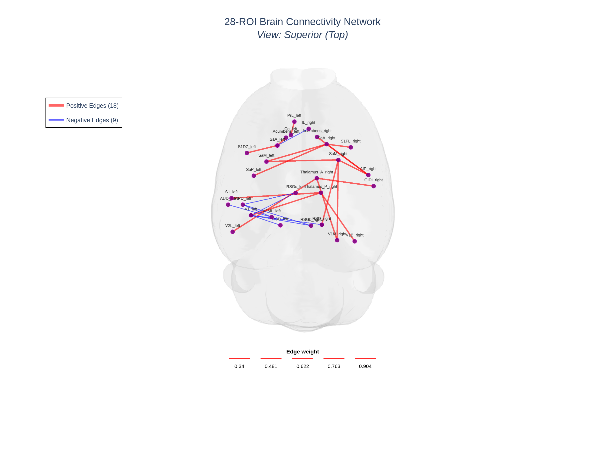
*Static snapshot of `output/test1_basic_28roi.html` — 28 nodes, sign-colored edges scaled by `|weight|`, viewed from above.*

### Expected Output

- 28 nodes, 27 edges
- Positive edges in red, negative in blue
- Edge widths scaled by connection strength
- Clicking legend toggles edges AND nodes

### Flag Explanations

| Flag | Description |
|------|-------------|
| `--mesh`, `-m` | Brain mesh file (.gii, .obj, .mz3, .ply) |
| `--coords`, `-c` | ROI coordinates CSV (columns: cog_x, cog_y, cog_z, roi_name) |
| `--matrix`, `-x` | Connectivity matrix (.npy, .csv, .edge, .txt, .mat) |
| `--output`, `-o` | Output HTML file |
| `--title`, `-t` | Plot title |
| `--node-size` | Node size (number or CSV file path) |
| `--edge-width-min` | Minimum edge width when scaling |
| `--edge-width-max` | Maximum edge width when scaling |
| `--camera` | View: oblique, anterior, posterior, left, right, superior, inferior |
| `--hide-nodes-with-hidden-edges` | Hide nodes when their edges are hidden |

---

## 5. 114-ROI Network with Metrics

Create a visualization with node metrics displayed on hover.

### Copy-Paste Command

```bash
hlplot plot \
  --mesh brain_mesh.gii \
  --coords atlas_114_coordinates.csv \
  --matrix k5_state_0/connectivity_matrix.csv \
  --output output/test2_114roi_metrics.html \
  --title "114-ROI Network with Metrics Hover" \
  --node-size 10 \
  --edge-width-min 0.5 \
  --edge-width-max 4.0 \
  --camera oblique \
  --node-metrics k5_state_0/combined_metrics.csv \
  --hide-nodes-with-hidden-edges
```


*Static snapshot of `output/test2_114roi_metrics.html` — full 114-node network in oblique view. In the live HTML each node's hover tooltip shows `module`, `participation_coef`, `within_module_zscore`, etc. from `combined_metrics.csv`.*

### Expected Output

- 114 nodes, 452 edges
- Hovering over nodes shows: module, participation_coef, within_module_zscore, etc.

### Flag Explanations

| Flag | Description |
|------|-------------|
| `--node-metrics` | CSV with node metrics. All columns shown on hover. One row per node. |

---

## 6. Utility Commands

### 6a. Check NIfTI ROI Count

Verify how many ROIs are in a NIfTI file:

```bash
python -c "
import nibabel as nib
import numpy as np
img = nib.load('brain_atlas_170.nii')
labels = np.unique(img.get_fdata())
labels = labels[labels != 0]
print(f'ROI count: {len(labels)}')
print(f'Label range: {labels.min():.0f} to {labels.max():.0f}')
"
```

### 6b. View Matrix Information

```bash
hlplot utils info --matrix node_edge_28/connectivity_28.edge
```

**Output shows:**
- Shape, non-zero values, density
- Min/max values, positive/negative edge counts
- Symmetry check

### 6c. View 114-ROI Matrix Info

```bash
hlplot utils info --matrix k5_state_0/connectivity_matrix.csv
```

### 6d. Validate File Compatibility

```bash
hlplot utils validate \
  --mesh brain_mesh.gii \
  --coords output/atlas_28_mapped/atlas_28_mapped_comma.csv \
  --matrix node_edge_28/connectivity_28.edge
```

### 6e. Inspect Coordinates File

```bash
hlplot coords load \
  --file atlas_170_coordinates.csv \
  --show-stats \
  --validate
```

---

## 7. Fixed Edge Width

All edges same width (no scaling by weight).

### Copy-Paste Command

```bash
hlplot plot \
  --mesh brain_mesh.gii \
  --coords atlas_114_coordinates.csv \
  --matrix k5_state_0/connectivity_matrix.csv \
  --output output/test4_fixed_width.html \
  --title "Fixed Edge Width (2.0)" \
  --node-size 10 \
  --edge-width-fixed 2.0 \
  --camera anterior
```

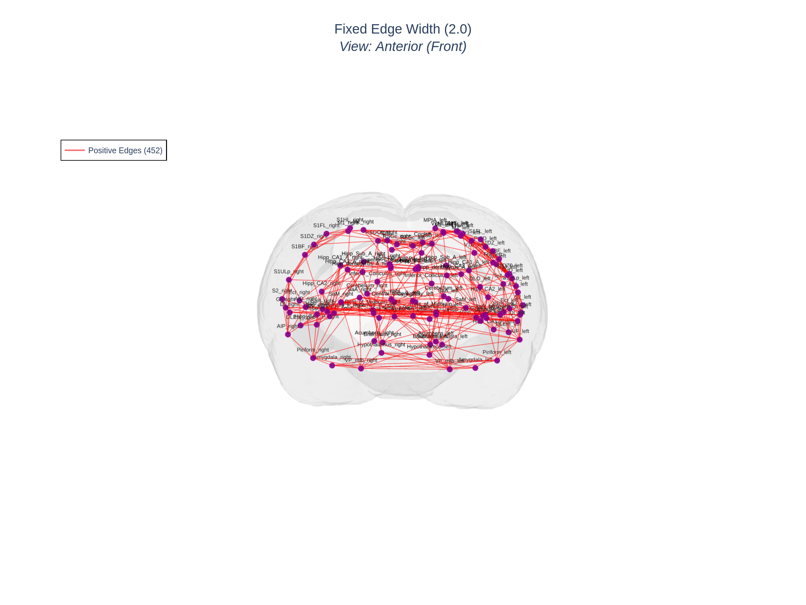
*Static snapshot — every edge renders at the same 2-px width regardless of `|weight|`. Useful when significance is encoded by color rather than width.*

### Flag Explanations

| Flag | Description |
|------|-------------|
| `--edge-width-fixed` | Fixed width for ALL edges. Ignores `--edge-width-min/max`. |

---

## 8. Static Image Exports

Export publication-quality images alongside interactive HTML.

### 8a. PNG Export (300 DPI)

```bash
hlplot plot \
  --mesh brain_mesh.gii \
  --coords atlas_114_coordinates.csv \
  --matrix k5_state_0/connectivity_matrix.csv \
  --output output/test5a_png.html \
  --title "PNG Export (300 DPI)" \
  --camera superior \
  --export-image output/test5a_brain_network.png \
  --image-dpi 300
```

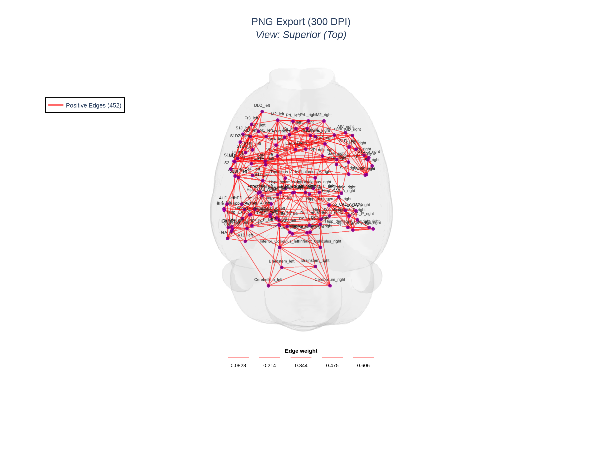
*Static snapshot of the same plot exported as a PNG. Sharp at any zoom; `--image-dpi` controls effective resolution.*

### 8b. SVG Export (Vector)

```bash
hlplot plot \
  --mesh brain_mesh.gii \
  --coords atlas_114_coordinates.csv \
  --matrix k5_state_0/connectivity_matrix.csv \
  --output output/test5b_svg.html \
  --title "SVG Export (Vector)" \
  --camera oblique \
  --export-image output/test5b_brain_network.svg
```

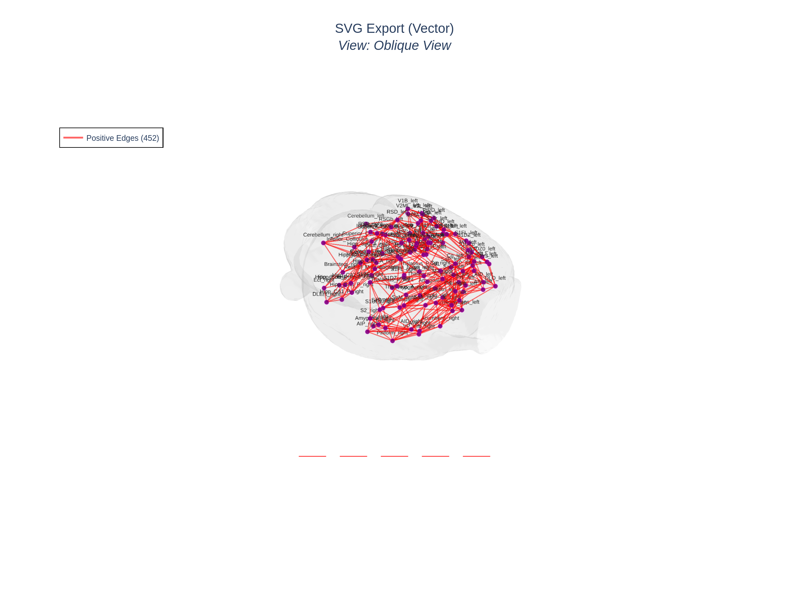
*PNG preview of the SVG content. The actual SVG output is resolution-independent (vectors), great for publication figures and arbitrary zoom.*

### 8c. PDF Export (Publication)

```bash
hlplot plot \
  --mesh brain_mesh.gii \
  --coords atlas_114_coordinates.csv \
  --matrix k5_state_0/connectivity_matrix.csv \
  --output output/test5c_pdf.html \
  --title "PDF Export" \
  --camera anterior \
  --export-image output/test5c_brain_network.pdf
```

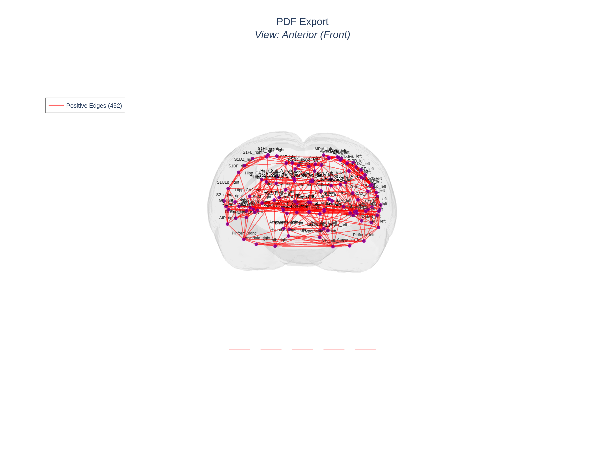
*PNG preview of the PDF export. Same vector quality as SVG, embeds cleanly in LaTeX/Word.*

### Flag Explanations

| Flag | Description |
|------|-------------|
| `--export-image` | Output path. Extension determines format (.png, .svg, .pdf) |
| `--image-dpi` | DPI for PNG. Max ~288 for memory safety. Default: 300 |
| `--image-format` | Format if path has no extension |

---

## 9. Clean Exports (No Title/Legend)

For publication figures where you add your own caption.

### 9a. Clean PNG

```bash
hlplot plot \
  --mesh brain_mesh.gii \
  --coords output/atlas_28_mapped/atlas_28_mapped_comma.csv \
  --matrix node_edge_28/connectivity_28.edge \
  --output output/test6a_clean.html \
  --title "This title will NOT appear" \
  --camera superior \
  --export-image output/test6a_clean.png \
  --export-no-title \
  --export-no-legend \
  --image-dpi 150
```

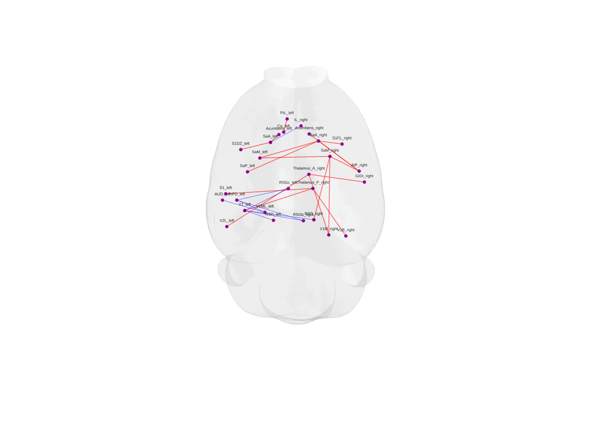
*Static snapshot — title and legend are stripped from the export so the figure drops straight into a paper with your own caption.*

### 9b. Title Only (No Legend)

```bash
hlplot plot \
  --mesh brain_mesh.gii \
  --coords output/atlas_28_mapped/atlas_28_mapped_comma.csv \
  --matrix node_edge_28/connectivity_28.edge \
  --output output/test6b_title_only.html \
  --title "Brain Connectivity Network" \
  --camera oblique \
  --export-image output/test6b_title_only.png \
  --export-no-legend
```

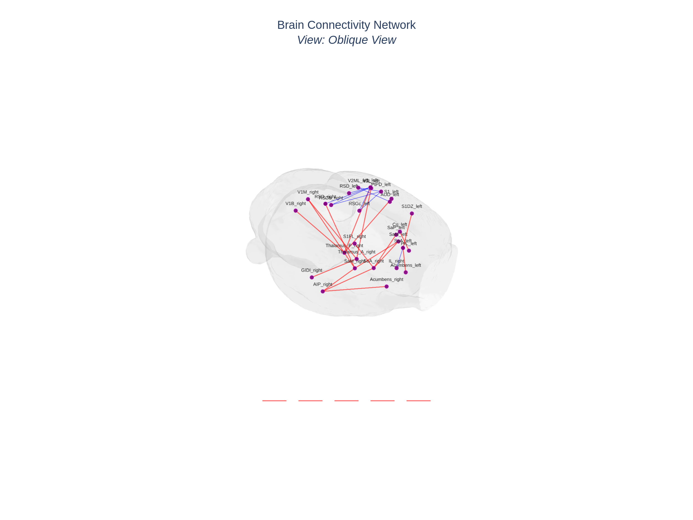
*Static snapshot — `--export-no-legend` removes the legend but keeps the title.*

### 9c. Clean PDF (Publication)

```bash
hlplot plot \
  --mesh brain_mesh.gii \
  --coords output/atlas_28_mapped/atlas_28_mapped_comma.csv \
  --matrix node_edge_28/connectivity_28.edge \
  --output output/test6c_clean.html \
  --camera left \
  --export-image output/test6c_clean.pdf \
  --export-no-title \
  --export-no-legend
```

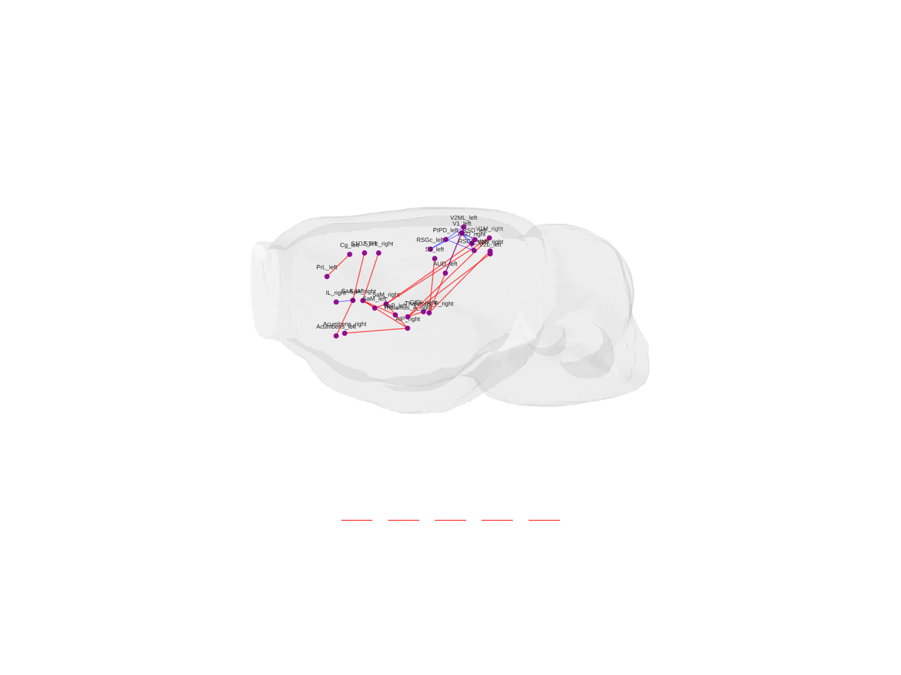
*PNG preview of the clean PDF export — same plot from the left lateral view, no title or legend, ready for a publication panel.*

### Flag Explanations

| Flag | Description |
|------|-------------|
| `--export-no-title` | Exclude title from exported image |
| `--export-no-legend` | Exclude legend from exported image |

---

## 10. Node Visibility with Edge Toggling

Nodes can be toggled along with their edges in the interactive legend.

### Copy-Paste Command

```bash
hlplot plot \
  --mesh brain_mesh.gii \
  --coords output/atlas_28_mapped/atlas_28_mapped_comma.csv \
  --matrix node_edge_28/connectivity_28.edge \
  --output output/test7_node_visibility.html \
  --title "Node Visibility with Edge Toggle" \
  --node-size 12 \
  --edge-width-min 1.0 \
  --edge-width-max 8.0 \
  --camera superior \
  --hide-nodes-with-hidden-edges
```

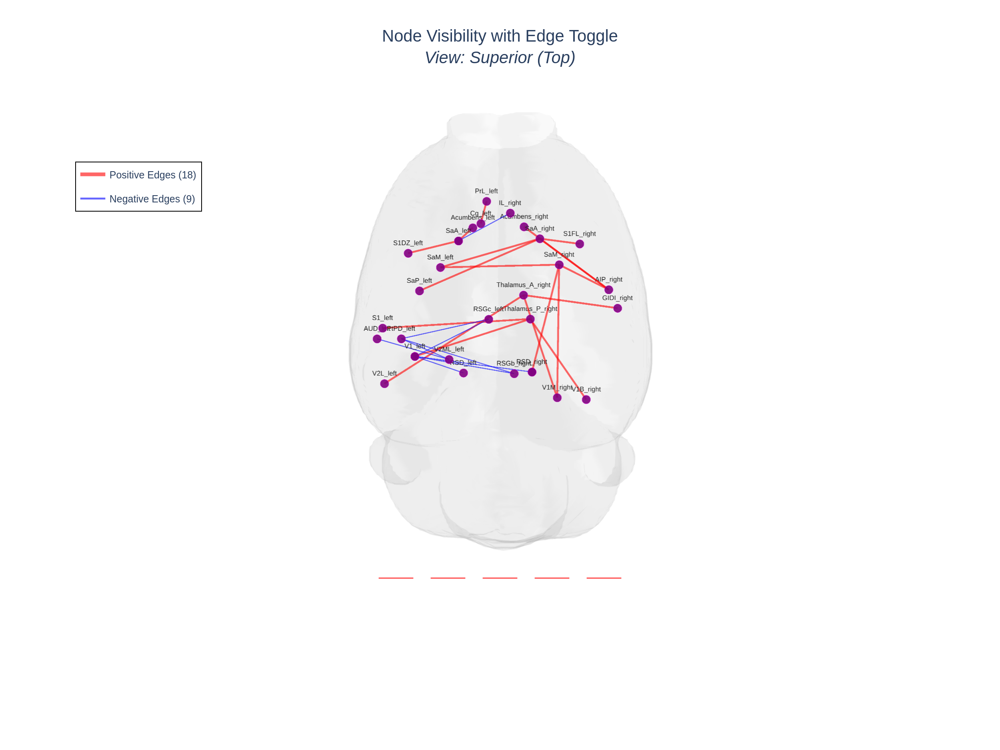
*Static snapshot — initial state with all nodes and edges visible. In the live HTML, clicking a legend entry hides both the edges AND their connected nodes.*

### Interactive Behavior

1. Click "Positive Edges" in legend → Positive edges AND their nodes hide
2. Click "Negative Edges" in legend → Negative edges AND their nodes hide
3. Click BOTH → ALL nodes and edges hide (only brain surface remains)

---

## 11. Node Colors from Modules

Color nodes by module/community assignment.

### 11a. Using Module CSV File

```bash
hlplot plot \
  --mesh brain_mesh.gii \
  --coords atlas_114_coordinates.csv \
  --matrix k5_state_0/connectivity_matrix.csv \
  --output output/test8a_module_colors.html \
  --title "Node Colors from Modules" \
  --node-size 10 \
  --node-color k5_state_0/module_assignments.csv \
  --node-border-color darkgray \
  --camera oblique
```

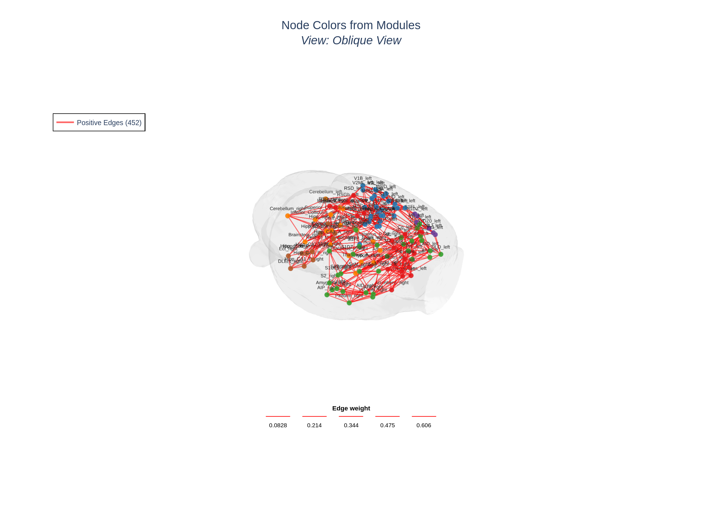
*Static snapshot — passing a CSV of module assignments to `--node-color` auto-generates 6 distinct colors (one per module). Nodes belonging to the same module render in the same color.*

### Expected Output

- Nodes colored by module (6 distinct colors for 6 modules)
- Colors auto-generated: Module 1=Red, 2=Green, 3=Blue, etc.

### Flag Explanations

| Flag | Description |
|------|-------------|
| `--node-color` | Accepts: color name, hex code, or CSV path with module assignments |
| `--node-border-color` | Border color for nodes |

### Module CSV Format

```csv
roi_index,module
0,1
1,2
2,1
3,3
...
```

---

## 12. Modularity Visualization

Use `hlplot modular` for dedicated modularity analysis.

### 12a. With Q and Z Scores

```bash
hlplot modular \
  --mesh brain_mesh.gii \
  --coords atlas_114_coordinates.csv \
  --matrix k5_state_0/connectivity_matrix.csv \
  --modules k5_state_0/module_assignments.csv \
  --output output/test9a_modularity.html \
  --title "Brain Network Modularity" \
  --q-score 0.452 \
  --z-score 3.21 \
  --node-size 10 \
  --camera oblique
```

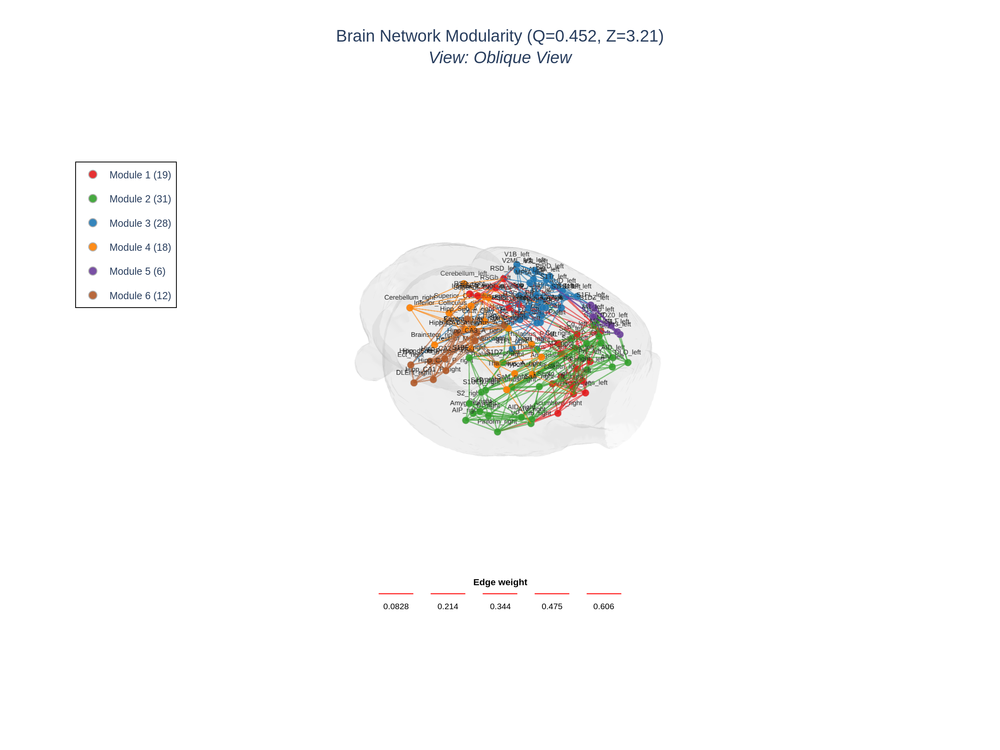
*Static snapshot — title automatically becomes `Brain Network Modularity (Q=0.452, Z=3.21)`. Default edge coloring is sign mode (red/blue).*

**Output title:** "Brain Network Modularity (Q=0.452, Z=3.21)"

### 12b. Module-Colored Edges

Edges colored by source node's module instead of positive/negative sign:

```bash
hlplot modular \
  --mesh brain_mesh.gii \
  --coords atlas_114_coordinates.csv \
  --matrix k5_state_0/connectivity_matrix.csv \
  --modules k5_state_0/module_assignments.csv \
  --output output/test9b_module_edges.html \
  --title "Module-Colored Edges" \
  --edge-color-mode module \
  --node-size 10 \
  --camera anterior
```

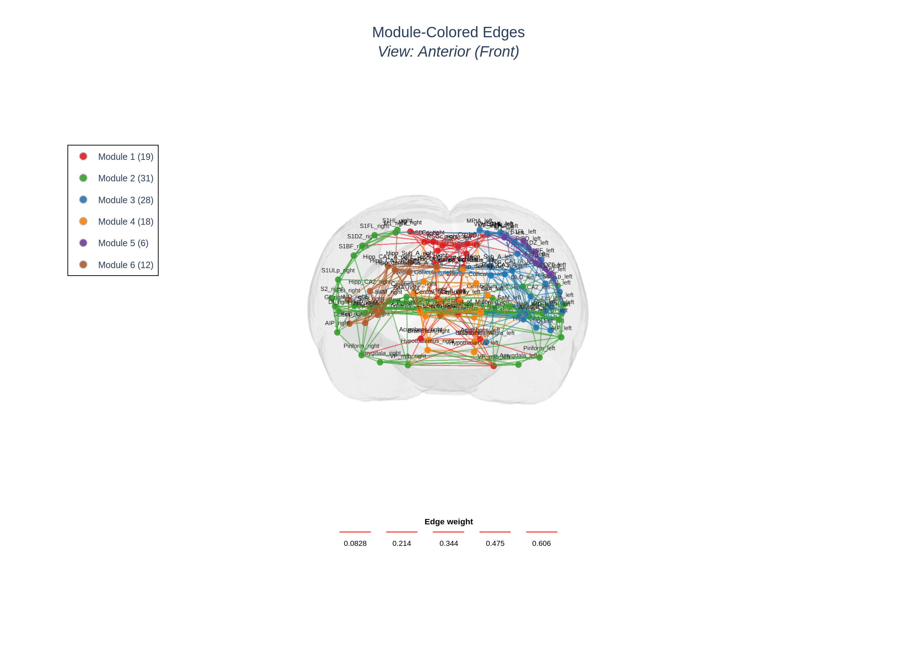
*Static snapshot — edges inherit their source module's color, so the within-module structure pops visually.*

### 12c. Sign-Colored Edges (Default)

```bash
hlplot modular \
  --mesh brain_mesh.gii \
  --coords atlas_114_coordinates.csv \
  --matrix k5_state_0/connectivity_matrix.csv \
  --modules k5_state_0/module_assignments.csv \
  --output output/test9c_sign_edges.html \
  --title "Sign-Colored Edges" \
  --edge-color-mode sign \
  --node-size 10 \
  --camera oblique
```

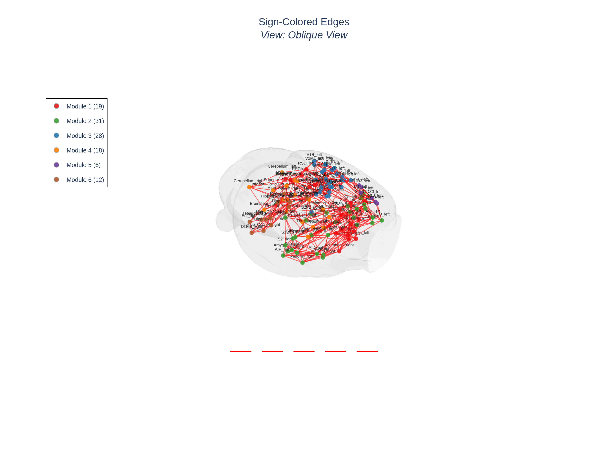
*Static snapshot — same modular plot but edges keep the conventional pos/neg sign coloring. Nodes still grouped and colored by module.*

### Flag Explanations

| Flag | Description |
|------|-------------|
| `--modules`, `-d` | Module assignments file (required) |
| `--q-score` | Modularity Q score for title |
| `--z-score` | Z-rand score for title |
| `--edge-color-mode` | `sign` (red/blue) or `module` (by source node) |

---

## 13. Vector Node Sizes from CSV

Node sizes can be loaded from a CSV or NPY file, allowing different sizes for each node.

### Create a Node Sizes CSV

First, create a CSV with per-node sizes based on a metric (e.g., participation coefficient):

```bash
python -c "
import pandas as pd
import numpy as np

# Load metrics
metrics = pd.read_csv('k5_state_0/combined_metrics.csv')

# Scale participation coefficient to node sizes 5-20
pc = metrics['participation_coef'].values
sizes = 5 + (pc / pc.max()) * 15

# Save as CSV (single column)
pd.DataFrame({'size': sizes}).to_csv('output/node_sizes_by_pc.csv', index=False)
print(f'Created node_sizes_by_pc.csv with {len(sizes)} sizes')
print(f'Size range: {sizes.min():.1f} to {sizes.max():.1f}')
"
```

### Use Vector Sizes in Plot

```bash
hlplot plot \
  --mesh brain_mesh.gii \
  --coords atlas_114_coordinates.csv \
  --matrix k5_state_0/connectivity_matrix.csv \
  --output output/test_vector_sizes.html \
  --title "Node Size = Participation Coefficient" \
  --node-size output/node_sizes_by_pc.csv \
  --node-metrics k5_state_0/combined_metrics.csv \
  --edge-width-min 0.5 \
  --edge-width-max 4.0 \
  --camera superior
```

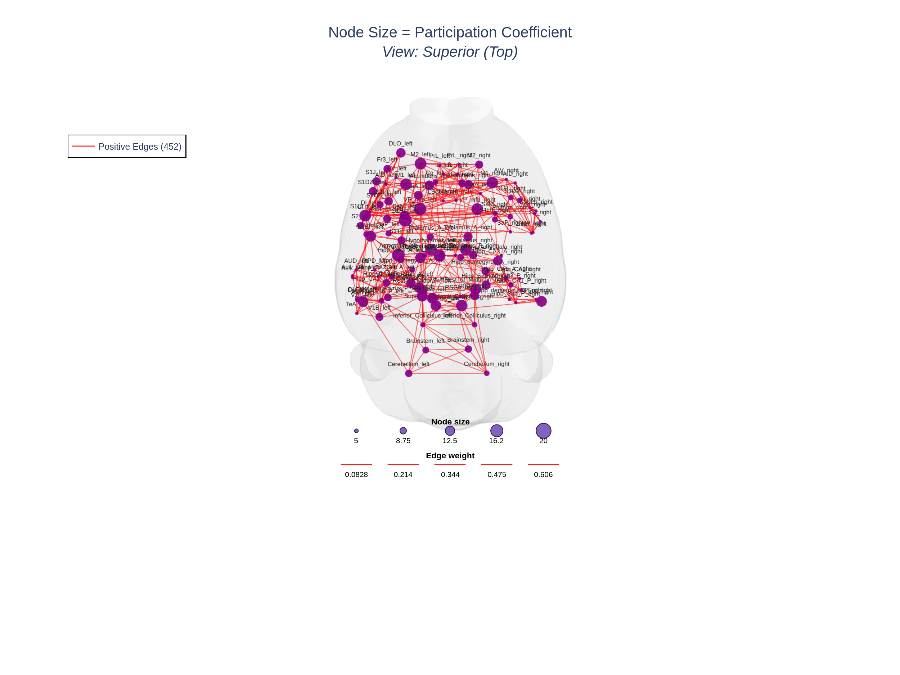
*Static snapshot — node sizes come from `output/node_sizes_by_pc.csv`, a per-node CSV mapping participation coefficient to a 5-20 px range. Nodes with higher PC are visibly larger.*

### Node Size Input Options

| Input Type | Example | Description |
|------------|---------|-------------|
| Single number | `--node-size 10` | All nodes same size |
| CSV file | `--node-size sizes.csv` | One size per node (first column) |
| NPY file | `--node-size sizes.npy` | NumPy array with sizes |

---

## 14. Selectively Labelling ROIs

Dense networks quickly become unreadable when every ROI gets a text label.
The `--show-node-labels` flag lets you label only the regions you want
to call out — for example, only the network's hub nodes — and hide the
rest, while still letting readers hover over any unlabelled node in the
saved HTML to discover its name. Hover tooltips are completely
independent of this flag.

The flag accepts three forms:

| Form | Effect |
|------|--------|
| `--show-node-labels true` *(default)* | Every ROI gets a persistent label. |
| `--show-node-labels false` | No persistent labels; hover still reveals names. |
| `--show-node-labels path/to/mask.csv` | Per-node 0/1 mask — `1` shows the label, `0` hides it. |

The same flag exists on `hlplot modular`, with identical semantics.

### 14a. Default — every ROI labelled

```bash
hlplot plot \
  --mesh brain_mesh.gii \
  --coords output/atlas_28_test_comma.csv \
  --matrix node_edge_28/connectivity_28.edge \
  --output output/labels_default.html \
  --export-image output/labels_default.png \
  --image-dpi 150
```

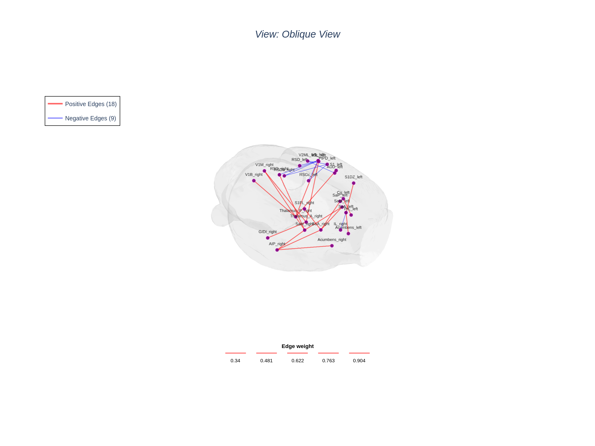
*Default `--show-node-labels true`: 28 ROI labels render at once. Useful
for exploration, dense at publication scale.*

### 14b. All labels off

```bash
hlplot plot \
  --mesh brain_mesh.gii \
  --coords output/atlas_28_test_comma.csv \
  --matrix node_edge_28/connectivity_28.edge \
  --show-node-labels false \
  --output output/labels_off.html \
  --export-image output/labels_off.png \
  --image-dpi 150
```

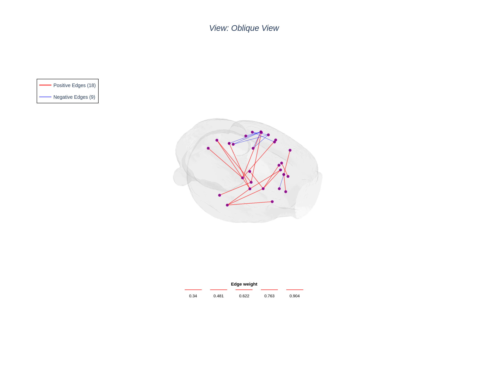
*With `--show-node-labels false` the brain renders cleanly with no text
clutter. The saved HTML still shows ROI names on hover.*

### 14c. Label only the hub nodes (mask CSV)

The repository ships an example mask that labels only the six
highest-degree ROIs in `connectivity_28.edge`:

```bash
hlplot plot \
  --mesh brain_mesh.gii \
  --coords output/atlas_28_test_comma.csv \
  --matrix node_edge_28/connectivity_28.edge \
  --show-node-labels node_edge_28/show_labels_hubs_28.csv \
  --output output/labels_hubs.html \
  --export-image output/labels_hubs.png \
  --image-dpi 150
```


*With a per-node mask CSV, only the six top-degree hubs (V1_left,
PtPD_left, SaA_right, SaM_right, Thalamus_A_right, SaA_left) are
labelled. Every other node still appears, edges are unaffected, and
hover tooltips still surface the unlabelled ROI names on demand.*

### CSV mask format

The mask is a single-column file with one row per ROI in the same
order as your coordinates and matrix. The header is optional; when
present, name it `show_label`:

```csv
show_label
0
1
0
0
0
0
0
1
... (28 rows total)
```

Values can be `0` / `1`, `True` / `False`, or boolean. The file may be
a `.csv`, `.txt` (tab- or comma-delimited, with or without header),
or a `.npy` array.

### Building your own mask

Any selection rule that produces a length-`N` 0/1 vector works. For the
canonical "label only the top-`k` hubs" recipe:

```python
import numpy as np
import pandas as pd

matrix = np.loadtxt("node_edge_28/connectivity_28.edge", delimiter="\t")
abs_mat = np.abs(matrix)
np.fill_diagonal(abs_mat, 0)
degree = (abs_mat > 0).sum(axis=0)

TOP = 6
hubs = np.argsort(degree)[::-1][:TOP]

mask = np.zeros(len(degree), dtype=int)
mask[hubs] = 1
pd.DataFrame({"show_label": mask}).to_csv(
    "node_edge_28/show_labels_hubs_28.csv", index=False
)
```

Other useful patterns:

- **One hemisphere only**: `mask = np.array(["_left" in name for name in roi_names], dtype=int)`.
- **One module only**: `mask = (modules == 1).astype(int)`.
- **Hand-picked ROIs**: edit the CSV by hand and write `1` next to the
  rows you want to call out.

### Python API

The same parameter is available directly on the Python plotting
functions and accepts `True`, `False`, a numpy array / list / pandas
Series of 0/1, or a CSV path:

```python
from HarrisLabPlotting import (
    load_mesh_file,
    create_brain_connectivity_plot,
    create_brain_connectivity_plot_with_modularity,
)

vertices, faces = load_mesh_file("brain_mesh.gii")
coords = pd.read_csv("output/atlas_28_test_comma.csv")

# Labels only on the hub ROIs (path)
fig, _ = create_brain_connectivity_plot(
    vertices=vertices, faces=faces, roi_coords_df=coords,
    connectivity_matrix="node_edge_28/connectivity_28.edge",
    show_node_labels="node_edge_28/show_labels_hubs_28.csv",
    save_path="output/labels_hubs.html",
)

# Equivalent with an explicit boolean array
import numpy as np
mask = np.zeros(28, dtype=bool)
mask[[1, 7, 16, 17, 18, 24]] = True  # the same six indices

fig, _ = create_brain_connectivity_plot_with_modularity(
    vertices=vertices, faces=faces, roi_coords_df=coords,
    connectivity_matrix="node_edge_28/connectivity_28.edge",
    module_assignments="node_edge_28/modules_28.csv",
    show_node_labels=mask,
    save_path="output/labels_hubs_modular.html",
)
```

> **Note:** `show_node_labels` only affects the *persistent* text
> label that draws next to each node marker. The hover tooltip in the
> saved HTML always shows the full ROI name, module, and any node
> metrics, regardless of mask.

---

## 15. Command Reference

### Main Commands

```bash
hlplot --help              # Main help
hlplot plot --help         # Connectivity plot
hlplot modular --help      # Modularity visualization
hlplot batch --help        # Batch processing
hlplot coords --help       # Coordinate utilities
hlplot utils --help        # Matrix utilities
```

### Coordinate Commands

```bash
hlplot coords generate --help    # Extract coords from NIfTI
hlplot coords map-subset --help  # Map ROI subset
hlplot coords load --help        # Inspect coordinates
hlplot coords extract --help     # Simple extraction (no labels)
```

### Utility Commands

```bash
hlplot utils info --help       # Matrix information
hlplot utils validate --help   # Validate file compatibility
hlplot utils threshold --help  # Threshold matrix
hlplot utils convert --help    # Convert file formats
```

### Camera View Presets

| View | Description |
|------|-------------|
| `oblique` | Default angled view |
| `anterior` | Front view |
| `posterior` | Back view |
| `left` | Left side |
| `right` | Right side |
| `superior` | Top (dorsal) |
| `inferior` | Bottom (ventral) |
| `lateral-left` | Left lateral |
| `lateral-right` | Right lateral |

---

## Complete Pipeline Example

Run the full pipeline from NIfTI to visualization:

```bash
# 1. Create output directory
mkdir -p output

# 2. Generate 170 ROI coordinates from NIfTI (optional - already provided)
hlplot coords generate \
  --volume brain_atlas_170.nii \
  --labels atlas_170_labels.txt \
  --output-dir output \
  --name atlas_170_generated

# 3. Map to 28-ROI subset
hlplot coords map-subset \
  --coords atlas_170_coordinates.csv \
  --subset node_edge_28/rois_28.node \
  --output-dir output \
  --name atlas_28

# 4. Create basic visualization
hlplot plot \
  --mesh brain_mesh.gii \
  --coords output/atlas_28/atlas_28_comma.csv \
  --matrix node_edge_28/connectivity_28.edge \
  --output output/brain_28.html \
  --title "28-ROI Brain Network"

# 5. Map to 114-ROI subset
hlplot coords map-subset \
  --coords atlas_170_coordinates.csv \
  --subset atlas_114_labels.txt \
  --output-dir output \
  --name atlas_114

# 6. Create modularity visualization
hlplot modular \
  --mesh brain_mesh.gii \
  --coords output/atlas_114/atlas_114_comma.csv \
  --matrix k5_state_0/connectivity_matrix.csv \
  --modules k5_state_0/module_assignments.csv \
  --output output/modularity_114.html \
  --title "114-ROI Modularity" \
  --q-score 0.452 \
  --z-score 3.21

# 7. Export publication figure
hlplot plot \
  --mesh brain_mesh.gii \
  --coords output/atlas_114/atlas_114_comma.csv \
  --matrix k5_state_0/connectivity_matrix.csv \
  --output output/publication.html \
  --node-color k5_state_0/module_assignments.csv \
  --camera anterior \
  --export-image output/publication.pdf \
  --export-no-title \
  --export-no-legend
```

---

*Generated from the Jupyter notebook: `bcp update to include node size vector test, edge width scaled to matrix, utils, etc.ipynb`*
