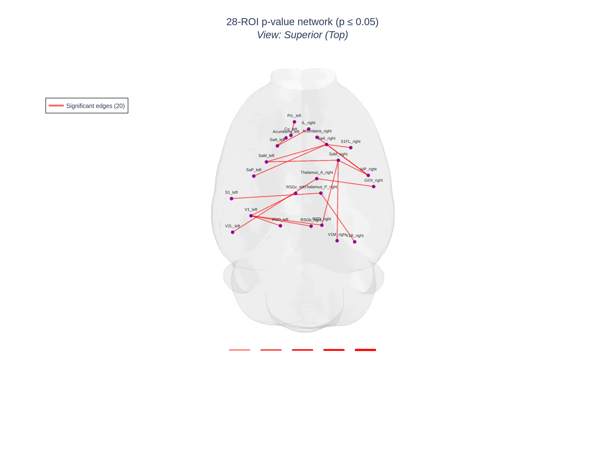
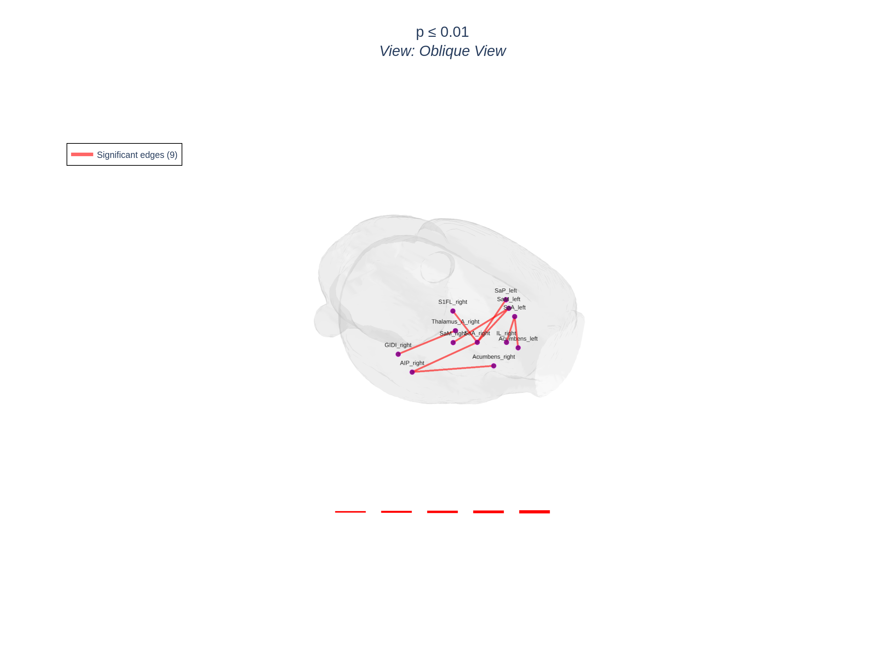
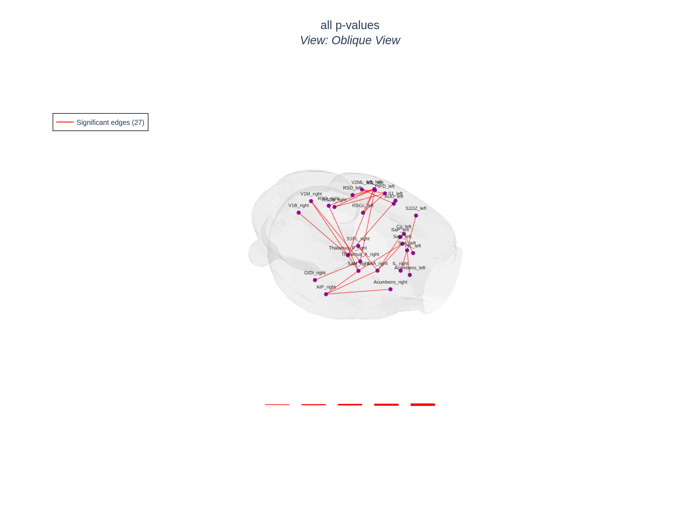
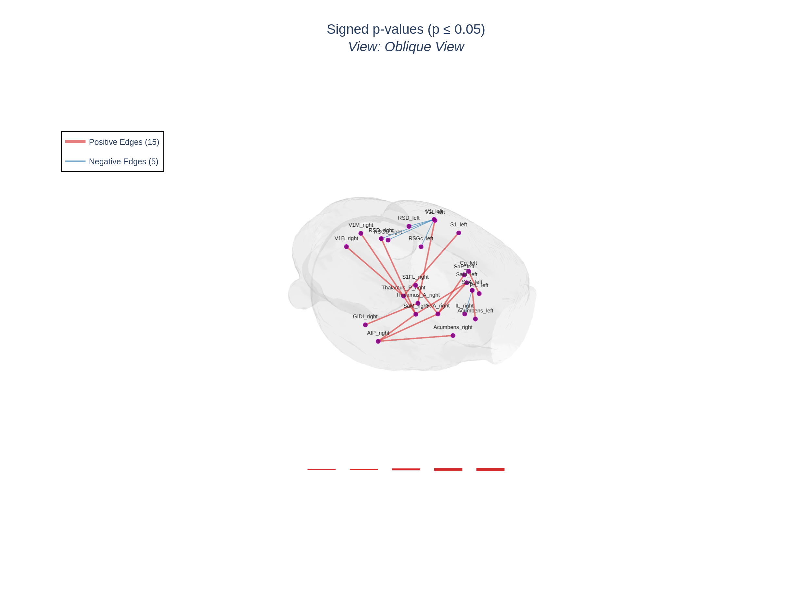
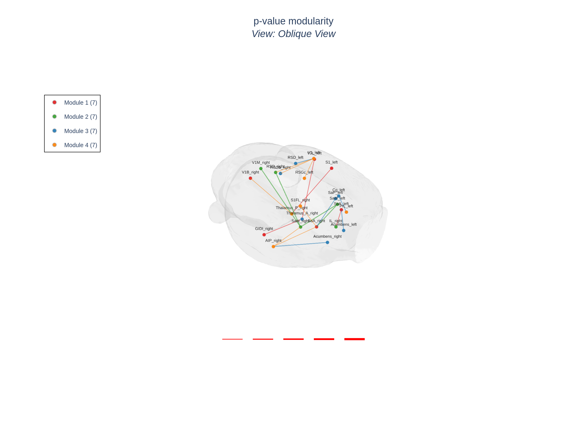
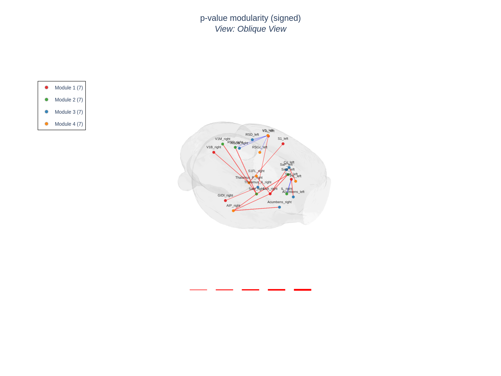
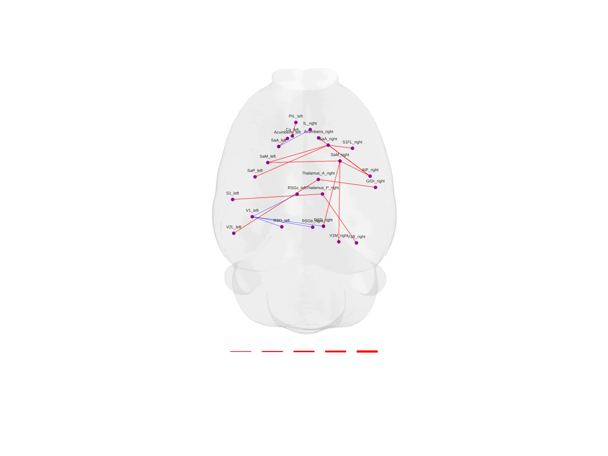
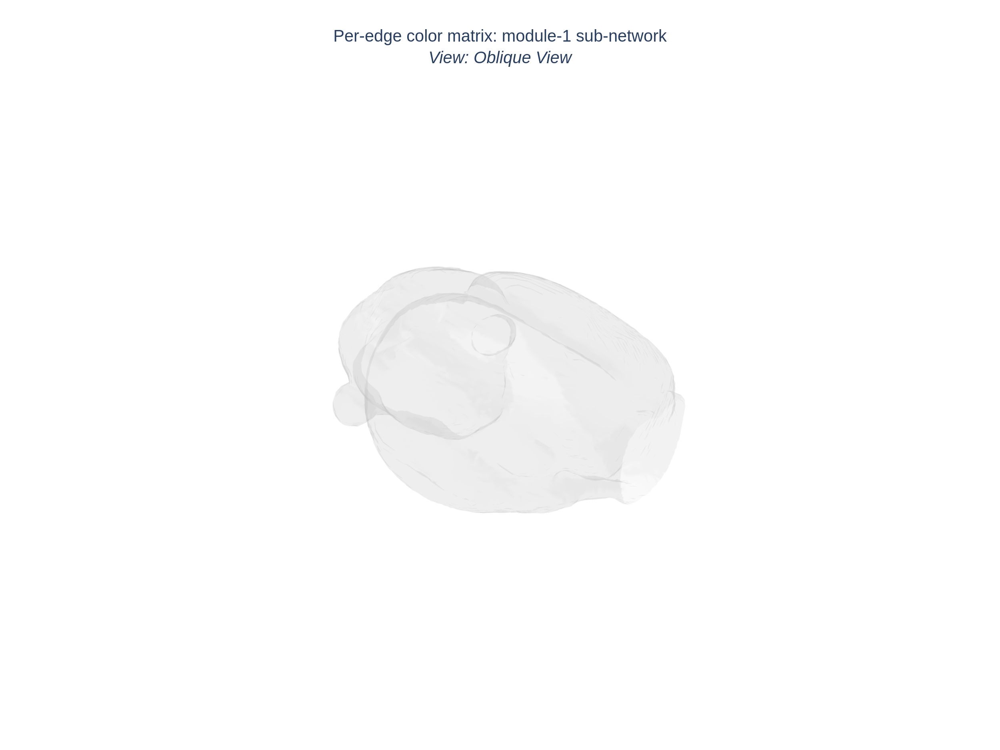

# HarrisLabPlotting — P-Value Plotting Tutorial

This tutorial shows how to plot a **matrix of p-values** on a brain mesh
with `hlplot`. P-value matrices come up everywhere in neuroscience: edges
of a network whose weight is "how significant is this connection". The
problem is that p-values are not weights — a p of `0.002` is much more
"significant" than a p of `0.04`, but their raw difference is tiny, while
their ratio (`1/p`) explodes (`500 vs 25`). Neither raw p nor `1/p`
makes a readable edge-width.

`hlplot` solves this with a `--matrix-type pvalue` mode that internally
transforms the matrix via `-log10(p)`:

| p-value | -log10(p) |
| ------: | --------: |
|    0.05 |      1.30 |
|    0.01 |      2.00 |
|   0.001 |      3.00 |
|  0.0001 |      4.00 |
| 0.00001 |      5.00 |

`-log10(p)` grows logarithmically, stays bounded, and the resulting
weights normalize cleanly into the existing `--edge-width-min` /
`--edge-width-max` range. Hover text always shows the **original
p-value**, never the transformed one.

This tutorial uses a small randomly-generated p-value matrix
(`pvalues_28.csv` / `pvalues_28.npy`) for the 28-ROI example network.
The matrix and its companion sign matrix
(`pvalues_28_signs.csv` / `pvalues_28_signs.npy`) are committed to
`test_files/tutorial_files/node_edge_28/` so you can reproduce every
example below without any setup.

---

## Table of Contents

1. [Prerequisites](#1-prerequisites)
2. [The data files](#2-the-data-files)
3. [Generating your own p-value matrix](#3-generating-your-own-p-value-matrix)
4. [Quickstart: plot p-values with `hlplot plot`](#4-quickstart-plot-p-values-with-hlplot-plot)
5. [Filtering by significance with `--pvalue-threshold`](#5-filtering-by-significance-with---pvalue-threshold)
6. [Signed p-values with `--sign-matrix`](#6-signed-p-values-with---sign-matrix)
7. [Modularity plots with p-values (`hlplot modular`)](#7-modularity-plots-with-p-values-hlplot-modular)
8. [Static image export](#8-static-image-export)
9. [Using p-values from Python](#9-using-p-values-from-python)
10. [Full flag reference](#10-full-flag-reference)
11. [How `-log10(p)` is computed under the hood](#11-how--log10p-is-computed-under-the-hood)

---

## 1. Prerequisites

All commands assume you are inside the tutorial files directory:

```bash
cd HarrisLabPlotting/test_files/tutorial_files
mkdir -p output
```

You should already have `hlplot` installed (`pip install -e .` from the
repo root) and the standard 28-ROI tutorial files in
`node_edge_28/`. If you haven't worked through the regular CLI tutorial
(`tutorial/CLI_TUTORIAL.md`) yet, do steps 1–4 of that tutorial first to
generate `output/atlas_28_mapped/atlas_28_mapped_comma.csv`. Every plot
command below references that coordinates file.

---

## 2. The data files

```
node_edge_28/
├── connectivity_28.edge      # original 28x28 weighted matrix
├── rois_28.node              # ROI names + xyz for the 28 nodes
├── pvalues_28.csv            # 28x28 p-value matrix (committed)
├── pvalues_28.npy            #   …same content, NumPy binary
├── pvalues_28_signs.csv      # 28x28 sign matrix (+1 / 0 / -1)
└── pvalues_28_signs.npy
```

The p-value matrix was generated **from** `connectivity_28.edge` by
mapping the absolute connection strength to a small p-value (stronger
edges → smaller p) plus a noise term, so significance lines up with
where actual connections live in the original network. The sign matrix
records the sign of the original connection so you can demonstrate
signed p-value coloring.

---

## 3. Generating your own p-value matrix

If you want to recreate the committed `pvalues_28.*` files yourself
(e.g. with a different random seed or a different effect strength) the
recipe lives in the companion notebook
[`pvalue plotting tutorial.ipynb`](pvalue%20plotting%20tutorial.ipynb).
The full code is also reproduced here so you can drop it into a script:

```python
import numpy as np
import pandas as pd
from pathlib import Path

mat = np.loadtxt('node_edge_28/connectivity_28.edge', delimiter='\t')

n = mat.shape[0]
rng = np.random.default_rng(seed=42)

abs_w = np.abs(mat)
norm = abs_w / max(abs_w.max(), 1.0)

# stronger edges -> smaller p
base = (1.0 - 0.95 * norm) ** 5
noise = rng.uniform(0.0005, 1.0, size=mat.shape)
p = (base * noise + (base * noise).T) / 2     # symmetric
np.fill_diagonal(p, 1.0)
p[mat == 0] = 1.0                              # no edge -> p = 1
p = np.clip(p, 1e-6, 1.0)

sign = np.sign(mat).astype(int)               # +1 / 0 / -1

out = Path('node_edge_28')
np.save(out / 'pvalues_28.npy', p)
pd.DataFrame(p).to_csv(out / 'pvalues_28.csv', index=False, header=False)
np.save(out / 'pvalues_28_signs.npy', sign)
pd.DataFrame(sign).to_csv(out / 'pvalues_28_signs.csv', index=False, header=False)
```

For real experimental data you would replace this with the actual
p-value matrix from your statistical pipeline (permutation test, NBS,
GLM, …) — `hlplot` doesn't care where the p-values came from as long as
the matrix is square and the cells are in `(0, 1]`.

---

## 4. Quickstart: plot p-values with `hlplot plot`

The minimum command — pass the p-value matrix as `--matrix` and tell
`hlplot` how to interpret it with `--matrix-type pvalue`:

```bash
hlplot plot \
  --mesh brain_mesh.gii \
  --coords output/atlas_28_mapped/atlas_28_mapped_comma.csv \
  --matrix node_edge_28/pvalues_28.csv \
  --matrix-type pvalue \
  --output output/test_pval_basic.html \
  --title "28-ROI p-value network (p ≤ 0.05)" \
  --camera superior \
  --edge-width-min 1 \
  --edge-width-max 8
```


*Static snapshot of `output/test_pval_basic.html` — 28-ROI p-value network in superior view, default `p ≤ 0.05` threshold, all surviving edges drawn in red and width-scaled by `-log10(p)`.*

What happens:

- `hlplot` loads the matrix, transforms it via `-log10(p)`, and drops
  every cell with `p > 0.05` (the default threshold).
- The remaining edges are scaled into `[1, 8]` line widths in proportion
  to their `-log10(p)`.
- Every edge is drawn in `--pos-edge-color` (default red), because no
  sign matrix was supplied.
- Hover text on each edge shows the **original** p-value plus the
  transformed `-log10(p)` value.

---

## 5. Filtering by significance with `--pvalue-threshold`

`--pvalue-threshold` controls which edges are drawn at all. Cells with
`p > threshold` are dropped before plotting; the default is `0.05` (the
standard significance cutoff).

```bash
# Stricter: only the highly significant edges (p ≤ 0.01)
hlplot plot \
  --mesh brain_mesh.gii \
  --coords output/atlas_28_mapped/atlas_28_mapped_comma.csv \
  --matrix node_edge_28/pvalues_28.csv \
  --matrix-type pvalue \
  --pvalue-threshold 0.01 \
  --output output/test_pval_strict.html \
  --title "p ≤ 0.01" \
  --edge-width-min 1 --edge-width-max 8
```


*Static snapshot — far fewer edges survive at the stricter `p ≤ 0.01` cutoff. Compare with the loose plot below.*

```bash
# Loose: keep every p-value, no significance filter
hlplot plot \
  --mesh brain_mesh.gii \
  --coords output/atlas_28_mapped/atlas_28_mapped_comma.csv \
  --matrix node_edge_28/pvalues_28.csv \
  --matrix-type pvalue \
  --pvalue-threshold 1.0 \
  --output output/test_pval_all.html \
  --title "all p-values" \
  --edge-width-min 0.5 --edge-width-max 6
```


*Static snapshot — with `--pvalue-threshold 1.0` no edges are dropped; line widths still scale by `-log10(p)` so the most significant connections stand out without losing the heatmap-like view.*

> **Tip:** Setting `--pvalue-threshold 1.0` is the right call when you
> want a heatmap-like plot of *every* connection, with width encoding
> significance.

---

## 6. Signed p-values with `--sign-matrix`

Real experiments often produce a p-value **and** a sign (e.g. positive
vs. negative correlation). Pass the sign matrix via `--sign-matrix` and
`hlplot` will:

1. transform the p-values via `-log10(p)`,
2. multiply each cell by the sign of the corresponding `--sign-matrix`
   cell,
3. draw cells with positive sign in `--pos-edge-color` (default red) and
   cells with negative sign in `--neg-edge-color` (default blue).

```bash
hlplot plot \
  --mesh brain_mesh.gii \
  --coords output/atlas_28_mapped/atlas_28_mapped_comma.csv \
  --matrix node_edge_28/pvalues_28.csv \
  --matrix-type pvalue \
  --sign-matrix node_edge_28/pvalues_28_signs.csv \
  --pvalue-threshold 0.05 \
  --pos-edge-color "#d62728" \
  --neg-edge-color "#1f77b4" \
  --output output/test_pval_signed.html \
  --title "Signed p-values (p ≤ 0.05)" \
  --edge-width-min 1 --edge-width-max 8 \
  --camera oblique
```


*Static snapshot — edges that have a positive sign in `pvalues_28_signs.csv` render in red (`#d62728`), negative-sign edges render in blue (`#1f77b4`); width still scales by `-log10(p)`.*

The sign matrix must be the same shape as the p-value matrix. Cells
with sign `0` are kept but drawn in `--pos-edge-color` (treated as
unsigned).

---

## 7. Modularity plots with p-values (`hlplot modular`)

All of the above also works with the modularity command. The
modularity plot will color **nodes** by their module assignment and
clicking a module entry in the legend hides that module's nodes and
edges.

```bash
# Module-colored network where edge widths are -log10(p)
hlplot modular \
  --mesh brain_mesh.gii \
  --coords output/atlas_28_mapped/atlas_28_mapped_comma.csv \
  --matrix node_edge_28/pvalues_28.csv \
  --modules node_edge_28/modules_28.csv \
  --matrix-type pvalue \
  --pvalue-threshold 0.05 \
  --edge-color-mode module \
  --output output/test_pval_modular.html \
  --title "p-value modularity"
```


*Static snapshot — nodes colored by module (4 modules), edges inherit their source module's color, width scaled by `-log10(p)`. Click a module legend entry in the HTML to hide that module's nodes and edges.*

> If you don't have a `modules_28.csv` for the 28-ROI network, the
> companion notebook generates a tiny synthetic one
> (`(np.arange(28) % 4) + 1`) just so the modular plot has something to
> visualise.

For signed p-values combined with modules, switch to the sign edge
coloring:

```bash
hlplot modular \
  --mesh brain_mesh.gii \
  --coords output/atlas_28_mapped/atlas_28_mapped_comma.csv \
  --matrix node_edge_28/pvalues_28.csv \
  --modules node_edge_28/modules_28.csv \
  --matrix-type pvalue \
  --sign-matrix node_edge_28/pvalues_28_signs.csv \
  --pvalue-threshold 0.05 \
  --edge-color-mode sign \
  --output output/test_pval_modular_signed.html \
  --title "p-value modularity (signed)"
```


*Static snapshot — same network as above but with `--edge-color-mode sign`: nodes still colored by module, edges colored red/blue by the sign of the underlying effect.*

---

## 8. Static image export

Combine `--export-image` with any of the commands above to drop a
publication-quality PNG/SVG/PDF alongside the HTML:

```bash
hlplot plot \
  --mesh brain_mesh.gii \
  --coords output/atlas_28_mapped/atlas_28_mapped_comma.csv \
  --matrix node_edge_28/pvalues_28.csv \
  --matrix-type pvalue \
  --sign-matrix node_edge_28/pvalues_28_signs.csv \
  --output output/test_pval_export.html \
  --title "Signed p-values, p ≤ 0.05" \
  --camera superior \
  --export-image output/test_pval_export.pdf \
  --export-no-title --export-no-legend
```


*Static snapshot — same plot rendered with `--export-no-title --export-no-legend` so it can drop straight into a paper figure. The bash command exports a PDF; this preview is a PNG of the same configuration.*

---

## 9. Using p-values from Python

Both Python plotting functions accept the same parameters:

```python
from HarrisLabPlotting import (
    load_mesh_file,
    create_brain_connectivity_plot,
    create_brain_connectivity_plot_with_modularity,
)
import pandas as pd

vertices, faces = load_mesh_file('brain_mesh.gii')
coords = pd.read_csv('output/atlas_28_mapped/atlas_28_mapped_comma.csv')

# Basic p-value plot
fig, stats = create_brain_connectivity_plot(
    vertices=vertices,
    faces=faces,
    roi_coords_df=coords,
    connectivity_matrix='node_edge_28/pvalues_28.npy',
    matrix_type='pvalue',
    pvalue_threshold=0.05,
    sign_matrix='node_edge_28/pvalues_28_signs.npy',
    edge_width=(1.0, 8.0),
    pos_edge_color='#d62728',
    neg_edge_color='#1f77b4',
    save_path='output/pval_python.html',
    plot_title='From Python',
)

# Modularity p-value plot
import numpy as np
modules = (np.arange(28) % 4) + 1
fig, stats = create_brain_connectivity_plot_with_modularity(
    vertices=vertices,
    faces=faces,
    roi_coords_df=coords,
    connectivity_matrix='node_edge_28/pvalues_28.npy',
    module_assignments=modules,
    matrix_type='pvalue',
    pvalue_threshold=0.05,
    sign_matrix='node_edge_28/pvalues_28_signs.npy',
    edge_color_mode='sign',
    save_path='output/pval_modular_python.html',
)
```

You can also run the transform alone if you only want the
`-log10(p)` weight matrix:

```python
from HarrisLabPlotting import transform_pvalue_matrix
weights, p_clean = transform_pvalue_matrix(
    pvalue_matrix=p,                  # np.ndarray of p-values
    pvalue_threshold=0.05,
    sign_matrix=sign,                 # optional
)
```

---

## 10. Full flag reference

This is the **complete** set of `hlplot plot` / `hlplot modular`
flags relevant to p-value plotting (and the related per-edge color
matrix feature). See `hlplot plot --help` and `hlplot modular --help`
for everything else.

| Flag | Default | Description |
| --- | --- | --- |
| `--matrix`, `-x` | *required* | Connectivity OR p-value matrix file (`.csv`, `.npy`, `.txt`, `.mat`, `.edge`). |
| `--matrix-type` | `weight` | `weight` (default) treats `--matrix` as connection strengths. `pvalue` treats it as p-values in `(0, 1]` and transforms via `-log10(p)`. |
| `--pvalue-threshold` | `0.05` | Only used when `--matrix-type pvalue`. Edges with `p > threshold` are dropped. Set to `1.0` to keep every p-value, set to `0.01`/`0.001` to be stricter. |
| `--sign-matrix` | *(none)* | Only used when `--matrix-type pvalue`. Same-shape matrix whose sign indicates the direction of the underlying effect (`+1` positive, `-1` negative, `0` unsigned). When provided, positive effects are drawn in `--pos-edge-color` and negative effects in `--neg-edge-color`. |
| `--pos-edge-color` | `red` | Color for positive (or unsigned) edges. Used by both signed-p-value and weight modes. |
| `--neg-edge-color` | `blue` | Color for negative edges. Used when `--sign-matrix` is provided in p-value mode, or when `--matrix-type weight` and the cell is negative. |
| `--edge-width-min` / `--edge-width-max` | `1.0` / `5.0` | Edge widths are linearly scaled into this range based on `-log10(p)` (or absolute weight in weight mode). |
| `--edge-width-fixed` | *(off)* | If set, all edges use this fixed width and `--edge-width-min/max` are ignored. Useful when you want significance to be encoded by *color* and width to be uniform. |
| `--edge-width-scale` | `1.0` | Uniform multiplier applied to every edge width AFTER all other scaling. Use this when you've tuned your `--edge-width-min/max` (or `--edge-width-fixed`) and just want every edge proportionally thicker or thinner for a single figure. Example: `--edge-width-min 1 --edge-width-max 5 --edge-width-scale 5` → final widths in `[5, 25]`. |
| `--mesh-style` | *(unset)* | Brain mesh lighting preset: `default` / `flat` / `matte` / `smooth` / `glossy` / `mirror`. `default` (or omitted) keeps the legacy look. The other presets apply hand-tuned `lighting` values to the `Mesh3d` trace. See the notebook section 10 for examples. |
| `--mesh-ambient` / `--mesh-diffuse` / `--mesh-specular` / `--mesh-roughness` / `--mesh-fresnel` | *(unset)* | Per-knob overrides of the mesh lighting params. Each value, if passed, overrides the corresponding entry in the `--mesh-style` preset. `--mesh-specular` (0-2) is the "glossy" knob; `--mesh-roughness` (0-1) is the "shiny" knob (lower = sharper highlight). |
| `--mesh-light-position` | *(plotly default)* | `'x,y,z'` for the directional light position. Affects where the highlight lands on the mesh. |
| `--custom-camera-eye` / `--custom-camera-center` / `--custom-camera-up` / `--custom-camera-name` | *(unset / 0,0,0 / 0,0,1 / "Custom View")* | Open the plot at an exact camera position. The view is appended to the camera dropdown in the HTML and inherited by `--export-image` PNG/SVG/PDF. Wins over `--camera` (with a warning). |
| `--show-camera-readout` / `--no-camera-readout` | `--no-camera-readout` | Inject a small live overlay into the saved HTML showing the current camera eye/center/up + a copy-pastable `--custom-camera-…` block as the user rotates the brain. **Pass `--no-camera-readout` (or just leave it off) if you do not want the overlay in your HTML.** Never appears in static image exports. |
| `--edge-threshold` | `0.0` | Filter on the *transformed* matrix (i.e. on `-log10(p)`), not on the raw p-values. You almost always want `--pvalue-threshold` instead. |
| `--edge-color-matrix` | *(none)* | Override per-edge colors entirely (see below). |
| `--edge-color-mode` (`hlplot modular` only) | `module` | `module` colors edges by source node's module. `sign` colors them red/blue. With `--sign-matrix` in p-value mode, prefer `sign`. |

### `--edge-color-matrix` (per-edge color override)

`--edge-color-matrix` accepts a same-shape matrix where each cell `[i, j]`
specifies the color for the edge between ROI `i` and ROI `j`. It works
in both weight mode and p-value mode and **overrides** the
positive/negative coloring entirely. Cells may contain:

- **Color strings** — `"red"`, `"#FF0000"`, `"rgb(255,0,0)"`, …
- **Integer labels** — `1`, `2`, `3`, … All edges sharing the same label
  get the same auto-generated color from the same palette
  `hlplot` uses for module assignments. Use this when you want
  categorical edge groups but don't want to pick colors yourself.
- **Empty / NaN / 0** — the edge is **skipped** (not drawn).

Example: highlight a single sub-network in green, leave everything else
default:

```bash
hlplot plot \
  --mesh brain_mesh.gii \
  --coords output/atlas_28_mapped/atlas_28_mapped_comma.csv \
  --matrix node_edge_28/pvalues_28.csv \
  --matrix-type pvalue \
  --edge-color-matrix node_edge_28/edge_groups.csv \
  --output output/test_pval_grouped.html
```


*Static snapshot — `edge_groups.csv` (shipped under `node_edge_28/`) labels module-1 intra-edges with `1` and leaves every other cell as `0` (skip). The package auto-colors all `1`-labeled edges with the same palette color, drawing only the highlighted sub-network.*

---

## 11. How `-log10(p)` is computed under the hood

The transform lives in
`HarrisLabPlotting.utils.transform_pvalue_matrix`. The exact rules:

1. Cells with `NaN`, `p ≤ 0`, `p > 1`, or `p > pvalue_threshold` are
   marked **invalid** and end up as `0` in the output weight matrix.
2. Valid cells are floored at `epsilon = 1e-300` (to avoid
   `-log10(0) = inf`) and then transformed: `weight = -log10(p)`.
3. If a `sign_matrix` was provided, the weights are multiplied by
   `sign(sign_matrix)` (with `0` treated as `+1`), giving signed
   weights ready for the existing positive/negative edge coloring.
4. The original (cleaned) p-values are returned alongside the weight
   matrix and used by the plot functions to populate the hover text:
   the user always sees the actual p-value, never the transformed
   number.

This is done **once**, before the regular weight-based plotting
pipeline runs. After the transform there is no special-case code path:
the rest of `create_brain_connectivity_plot` and
`create_brain_connectivity_plot_with_modularity` see a normal weighted
matrix and behave exactly as they would for a real correlation matrix.

---

*Companion notebook:
[`pvalue plotting tutorial.ipynb`](pvalue%20plotting%20tutorial.ipynb) —
runs every command in this tutorial end-to-end and regenerates the
random p-value matrix from `connectivity_28.edge`.*
