# HarrisLabPlotting — Voxel Maps on a Glass Brain

Everything else in `hlplot` is **ROI-level**: a region is a dot, a connection is
a line. This tutorial is about **voxel-level** data — a z-map, t-map or beta map
straight out of FSL or SPM — rendered as a soft cloud inside a translucent
"glass" brain.

```bash
hlplot volume --mesh brain.obj --volume zmap.nii.gz --output out.html
```

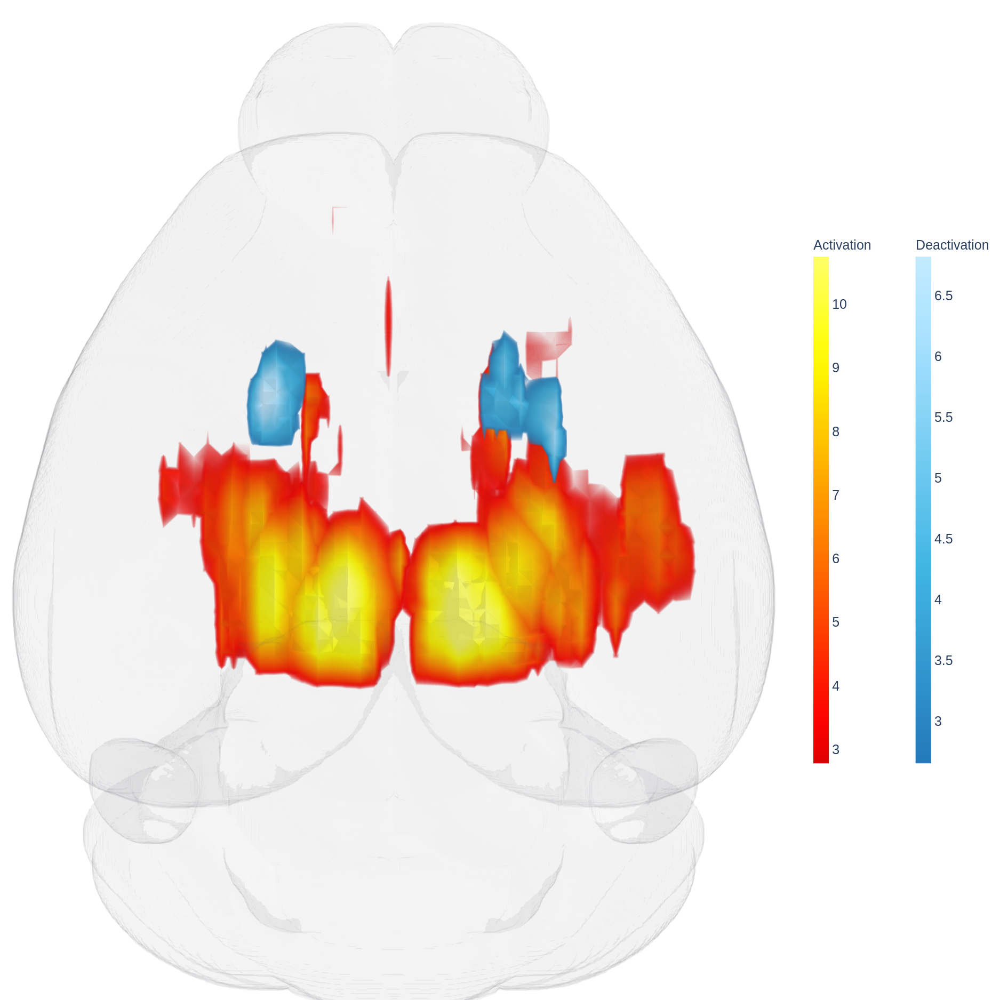
*Mouse fUSI activation (`hot32`) and deactivation (`ice28`) at z ≥ 3.1, on the
Allen surface.*

---

## Table of contents

1. [Quick start](#1-quick-start)
2. [Same space, or nothing works](#2-same-space-or-nothing-works)
3. [Thresholds](#3-thresholds)
4. [Colours](#4-colours)
5. [Smoothing — and why your map may need it](#5-smoothing--and-why-your-map-may-need-it)
6. [Where the cloud's edge sits](#6-where-the-clouds-edge-sits)
7. [The look: opacity, gamma, surfaces](#7-the-look-opacity-gamma-surfaces)
8. [Several maps at once, and spec files](#8-several-maps-at-once-and-spec-files)
9. [Multi-view and export](#9-multi-view-and-export)
10. [Appendix: how the grid works and what it costs](#10-appendix-how-the-grid-works-and-what-it-costs)

The examples use the mouse Fig 1 data shipped in
`test_files/tutorial_files/mouse/`. Run from `test_files/tutorial_files`.

---

## 1. Quick start

```bash
hlplot volume \
  --mesh mouse/bin_dilD_Parc_Atlas_0.obj \
  --volume mouse/Fig1_RM_Sham_pos_z_allen.nii.gz \
      --volume-cmap hot32 --volume-name Activation \
  --volume mouse/Fig1_RM_Sham_neg_z_allen.nii.gz \
      --volume-cmap ice28 --volume-name Deactivation \
  --volume-threshold 3.1 \
  --volume-smooth-fwhm "0.54,0.11,0.11" \
  --volume-step 7 \
  --camera superior --zoom 1.25 \
  --no-html --export-image output/voxels.png
```

```python
from HarrisLabPlotting import create_brain_volume_plot

fig, info = create_brain_volume_plot(
    mesh="mouse/bin_dilD_Parc_Atlas_0.obj",
    volumes=[
        dict(path="mouse/Fig1_RM_Sham_pos_z_allen.nii.gz", name="Activation",
             cmap="hot32", threshold=3.1, smooth_fwhm=[0.54, 0.11, 0.11], step=7),
        dict(path="mouse/Fig1_RM_Sham_neg_z_allen.nii.gz", name="Deactivation",
             cmap="ice28", threshold=3.1, smooth_fwhm=[0.54, 0.11, 0.11], step=7),
    ],
    camera_view="superior", zoom=1.25,
    no_html=True, export_image="output/voxels.png",
)
```

Every run reports what it did, to **stderr**:

```
  volume Activation:
    value range   : 0.000 .. 14.506 (3,673,093 nonzero voxels)
    distribution  : p50=2.14  p75=4.35  p90=6.38  p95=7.81  p99=10.21
    threshold     : 3.100  [absolute 3.1]
    voxels kept   : 1,412,841
    cropped to suprathreshold bbox +6 vox: 285x300x297 (was 528x320x456)
      world mm  x -3.57..3.83  y -3.78..3.32  z -2.31..5.17
    smoothing     : explicit [0.54, 0.11, 0.11] mm
    level         : 3.100 -> 2.773 (volume-preserving)
    render grid   : 43x41x43 = 75,809 voxels (step 7)
    projected cost: ~19 MB HTML, ~28 s per panel
    space check   : bbox overlap 100%, centroid offset 1.92 mm -> PASS
```

The value range and distribution are there so an unusual map is obvious
immediately — if your data doesn't follow the usual conventions, set the colour
range yourself with `--volume-range LOW,HIGH`.

---

## 2. Same space, or nothing works

### What "space" means

A NIfTI carries an **affine**: a 4×4 matrix mapping voxel indices `(i, j, k)` to
**world coordinates in millimetres**. A surface mesh has no affine — its
vertices are *already* world millimetres. `hlplot` puts your voxels into world
mm using the affine and draws them next to the mesh vertices. They only line up
if both came from the same template.

Nothing errors when they don't. The cloud just renders somewhere else — often
entirely outside the brain. That is why the space check runs on every volume
render, and why this section exists.

```bash
hlplot utils check-alignment --volume map.nii.gz --mesh brain.obj
```

### Which way do I warp?

* **To atlas space** (e.g. Allen) when you want to render on an atlas-derived
  surface. The surface is fixed, so the map comes to it. *This is the case in
  this tutorial.*
* **To your study space** when you want atlas ROIs on top of your own data —
  ROI coordinates for a connectivity plot, say. Your data is fixed, so the atlas
  comes to it.

### Getting the transform

If you have the transform one way, the inverse is one command:

```bash
convert_xfm -omat MDT_to_Allen.mat -inverse Allen_to_MDT.mat
```

### Applying it

The `-ref` image is what defines the output grid — that is what actually sets
the space:

```bash
# a statistical map -> atlas space, to render on the atlas surface
flirt -in thresh_zstat37.nii.gz \
      -ref bin_ROI_Selected_Atlas_fill_dilD.nii.gz \
      -applyxfm -init MDT_to_Allen.mat \
      -interp trilinear \
      -out pos_z_allen.nii.gz

# an atlas / label volume -> study space
flirt -in ROI_Selected_Atlas_fill_dilD.nii.gz \
      -ref MDT_template.nii.gz \
      -applyxfm -init Allen_to_MDT.mat \
      -interp nearestneighbour \
      -out ROI_in_study_space.nii.gz
```

### Which `-interp`, and why it matters

| interpolation | use for | why |
|---|---|---|
| `trilinear` | **continuous statistics** (z, t, beta) | averages neighbours; the safe default |
| `nearestneighbour` | **label / atlas volumes** | never invents a label that isn't there |
| `spline` | smoother continuous data, *with care* | overshoots — see below |

**`nearestneighbour` is mandatory for label volumes.** Averaging label 3 with
label 9 gives label 6 — a real region, just the wrong one. Nothing errors; your
ROI coordinates simply land in the wrong place and the figure looks fine.

**`spline` overshoots.** Re-warping this study's positive map with `-interp
spline` — a map that is non-negative by construction — produced:

| | min | max | nonzero | negative voxels | file |
|---|---|---|---|---|---|
| `trilinear` | 0.000 | 14.506 | 3,673,093 | 0 | 14 MB |
| `spline` | **−5.870** | 15.685 | 46,358,835 | **22,123,466** | 180 MB |

Every negative value is ringing; 89 % of the volume is |v| < 0.01 numerical
noise, and above threshold it inflates the cluster ~6 %. If you use spline,
clamp at zero (`--volume-clamp-negative`). **Trilinear is the recommendation.**

### What if I skip the resampling entirely?

Nothing crashes. The overlay renders in its own world space, usually nowhere
near the mesh, and the space check reports `bbox overlap 0%` with a large
centroid offset. That is the whole failure mode: silent, not loud.

### Warping does not create resolution

Resampling 16 coronal slices at 0.54 mm onto a 25 µm grid gives you 25 µm voxels
carrying 0.54 mm of information. The extra voxels are interpolation, not data —
which is exactly where the stair-steps in the next section come from.

---

## 3. Thresholds

Four ways to decide what is drawn. **Use exactly one** — passing two is a
warning, not a silent preference.

| Flag | Meaning | Units |
|---|---|---|
| `--volume-threshold 3.1` | an absolute value | the map's own (z, t, …) |
| `--volume-top-percent 10` | the strongest N % of suprathreshold voxels | percent |
| `--volume-percentile 99` | the Nth percentile of nonzero magnitudes | percent |
| *(none)* | auto: the smallest nonzero magnitude, i.e. show what's in the file | — |

Auto is the right default for an FSL map that is *already* cluster-thresholded —
"draw what survived" — and the report always says which threshold was used and
how many voxels it kept.

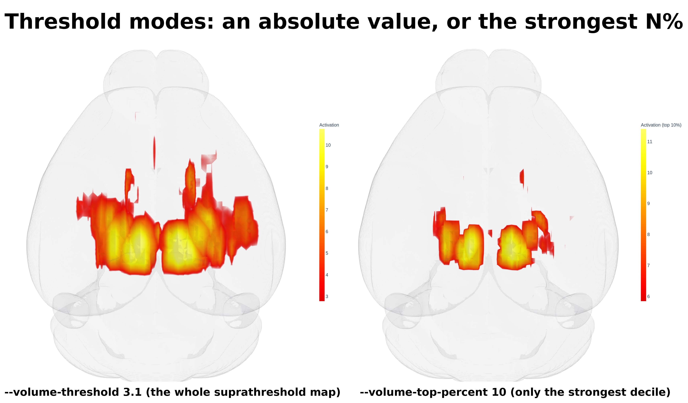
*Absolute `z ≥ 3.1` versus `--volume-top-percent 10`, which reproduces a
top-decile mask without needing a separate file.*

`--volume-range LOW,HIGH` is separate: it sets the **colour** range, not which
voxels are drawn. Use it when the automatic range (threshold → 99.5th
percentile) doesn't suit your data, or to hold two maps on one scale.

---

## 4. Colours

Two built-in scales, taken from this study's own 2-D figures so the 3-D renders
match them:

* **`hot32`** — matplotlib `hot`, truncated at 0.32. Bright red at the
  threshold → orange → yellow → white-hot at the peak. The activation default.
* **`ice28`** — a custom blue ramp truncated at 0.28, for deactivation.

Any plotly colorscale name (`Viridis`, `Hot`, `Turbo`, …) also works.

### Light backgrounds truncate the top automatically

`hot32` runs all the way to pure `#ffffff`. On a white page the highest-z core
would be **invisible**. So on a light background `hot32` and `ice28`
automatically switch to `_light` variants whose top stops at a saturated yellow.
This is announced, and `--volume-cmap-no-adapt` turns it off.

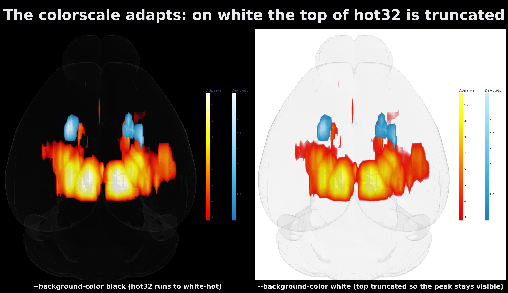
*The same data on black and on white. The peak stays visible in both.*

### Two-sided data: two files or one?

**Two separate files is the recommendation** — activation in `hot32`,
deactivation in `ice28`. Each keeps its own colourbar, its own threshold and its
own toggle.

A single signed file works too and is drawn on one diverging scale, but the two
signs then share one range set by the stronger one, so the weaker side reads as
weaker than it would on its own.

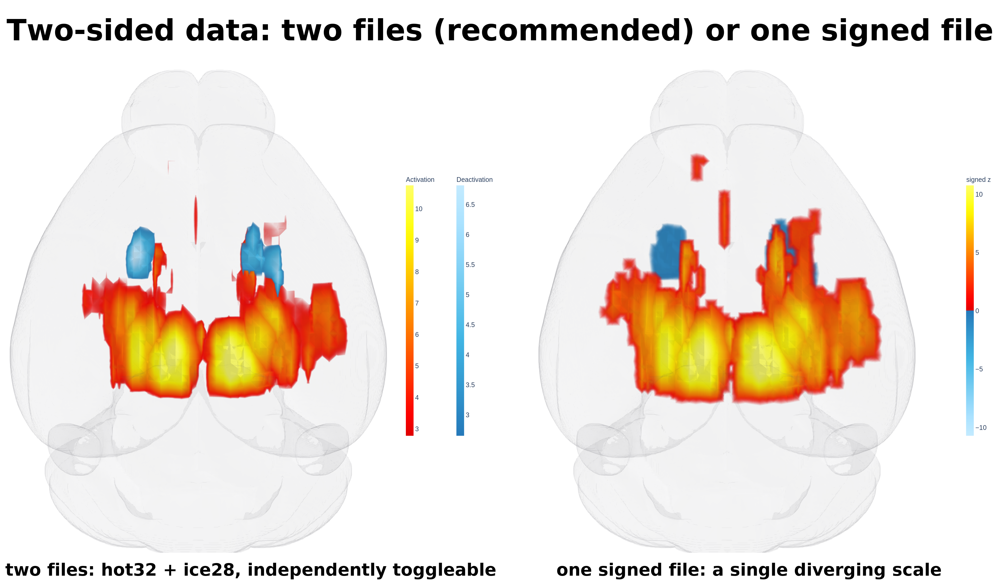

---

## 5. Smoothing — and why your map may need it

### What it is

A 3-D Gaussian blur of the map before rendering. The width is given as **FWHM in
millimetres, per axis**, and converted internally to a per-axis sigma in voxels:

```
sigma_voxels = fwhm_mm × 0.4247 / voxel_size_mm
```

### Why you might need it

This study's z-maps were acquired as **16 coronal slices at 0.54 mm**, then
warped onto a 25 µm grid. Trilinear interpolation between 16 slices is
piecewise-linear, with a crease at every slice plane — which renders as visible
stair-steps.

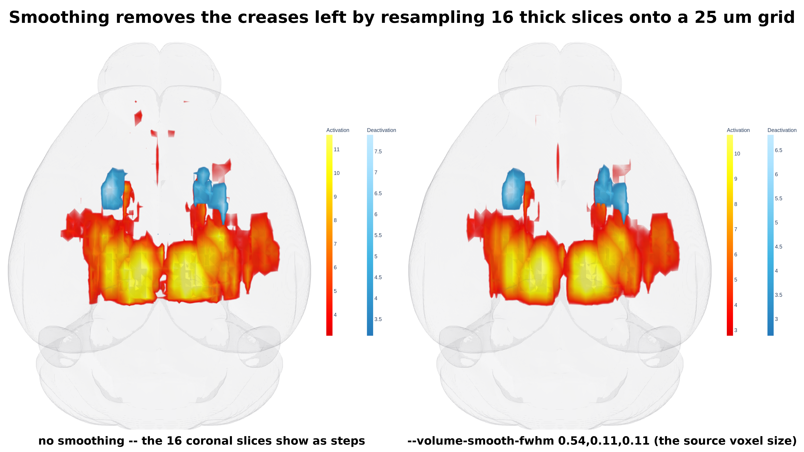
*Left: no smoothing — the 16 slices are plainly visible as steps. Right:
`--volume-smooth-fwhm "0.54,0.11,0.11"`.*

### Choosing the numbers

**Pass the voxel size of the ORIGINAL, pre-warp volume.** Here that is
`(0.1134, 0.5410, 0.1037)` mm, which in the target's axis order is
`0.54,0.11,0.11` — so each axis is blurred by about one original voxel: a lot
along the thick-slice axis, very little in plane.

| setting | meaning |
|---|---|
| *(default)* none | no blur; what's in the file is what's drawn |
| `--volume-smooth-fwhm 0.5` | isotropic — 0.5 mm on every axis |
| `--volume-smooth-fwhm "0.54,0.11,0.11"` | **anisotropic — recommended** |
| `--volume-smooth-fwhm auto` | probe the data (see the caveat) |

**Do not blur isotropically at the thick-slice width.** `0.54,0.54,0.54` would
over-blur the two fine in-plane axes about 5× and destroy real detail.

**The `auto` caveat.** Auto probes how far each axis can be coarsened before the
data changes. It correctly identifies *which* axis is coarse, but under-reports
*how much* — on this map it returns `[4, 2, 2]` voxels where the truth is nearer
`[22, 4, 4]`, because the data is piecewise-**linear** along the coarse axis and
decimation registers error at every knot. It is better than nothing, but the
explicit form is better still. Auto says so when it runs.

---

## 6. Where the cloud's edge sits

`isomin` is the value below which voxels are simply not drawn. Blurring **lowers
the peak**, so drawing at the original threshold after smoothing pulls the
boundary inward and eats the cluster:

| smoothing | peak after | voxels visible at a fixed 3.1 |
|---|---|---|
| none | 14.51 | 1,412,841 (100 %) |
| `0.54,0.11,0.11` | 12.41 | 1,250,609 (88.5 %) |
| isotropic `0.54` | 9.88 | 856,435 (**60.6 %**) |

So when smoothing is applied, `hlplot` corrects the level: it counts the voxels
above threshold in the *original* map, then picks the level on the *smoothed*
map enclosing that same count. All three rows above return to ~100 %.

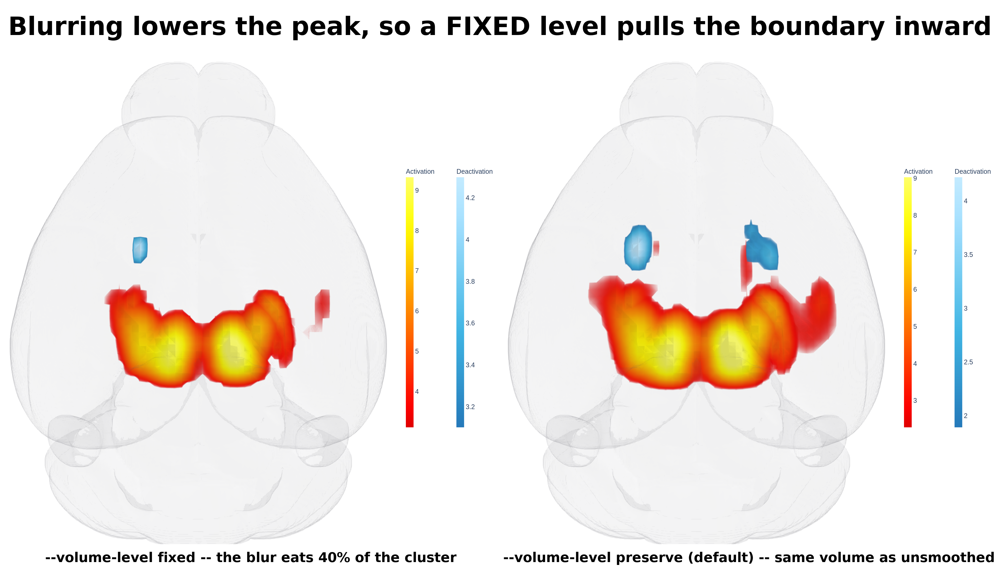

* `--volume-level preserve` **(default)** — keep the cluster's size
* `--volume-level fixed` — draw at the literal threshold you asked for

With no smoothing there is nothing to correct and the two are identical.

---

## 7. The look: opacity, gamma, surfaces

The renderer is a ray-cast: a ray steps through `--volume-surfaces` internal
shells, and each voxel's **opacity ramps with its value**. That ramp is what
makes it a soft cloud instead of a hard shell.

```
opacity(v) = floor + (ceiling − floor) × v^gamma
```

### `--volume-opacity` — the ceiling (default 1.0)

> **This is the VOXEL MAP's opacity, not the brain's.** The brain shell is
> `--ghost-opacity` (default 0.04). Raising `--volume-opacity` makes
> suprathreshold voxels more solid; it does nothing to the brain.

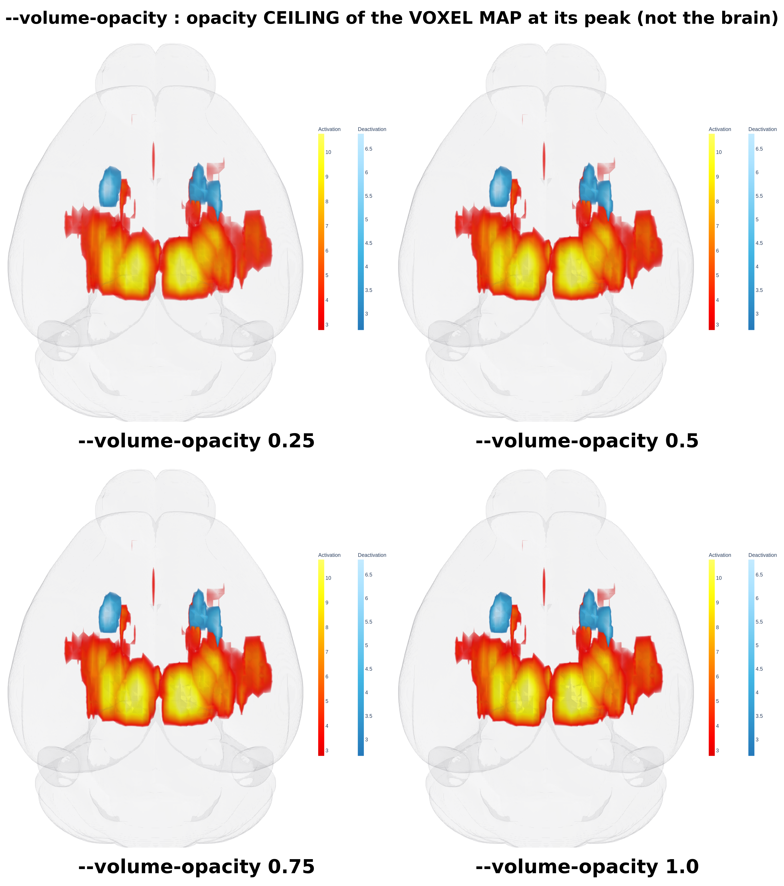

### `--volume-opacity-floor` — the opacity *at* the threshold (default 0.15)

Without a floor the ramp starts at zero, so voxels sitting exactly at the
threshold are fully transparent and the cluster fringe disappears — measured,
**14.2 %** of visible positive voxels and **10.2 %** of negative ones rendered
below 5 % opacity. The floor is what makes the whole map visible.

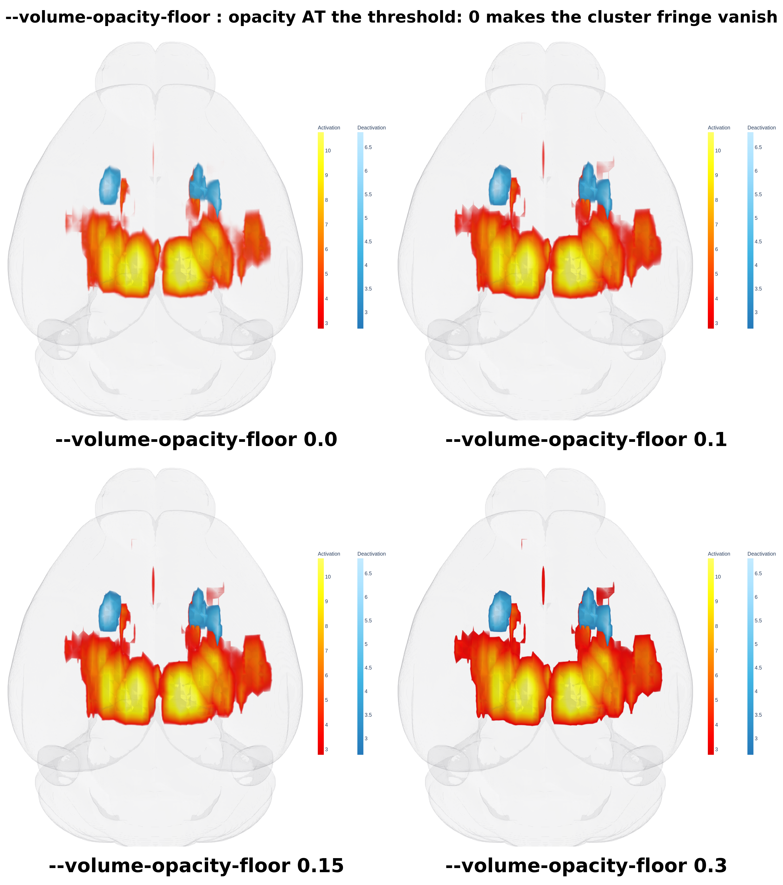

### `--volume-gamma` — the shape of the ramp (default 1.0)

Low gamma lights up the whole cluster; high gamma leaves only the core.

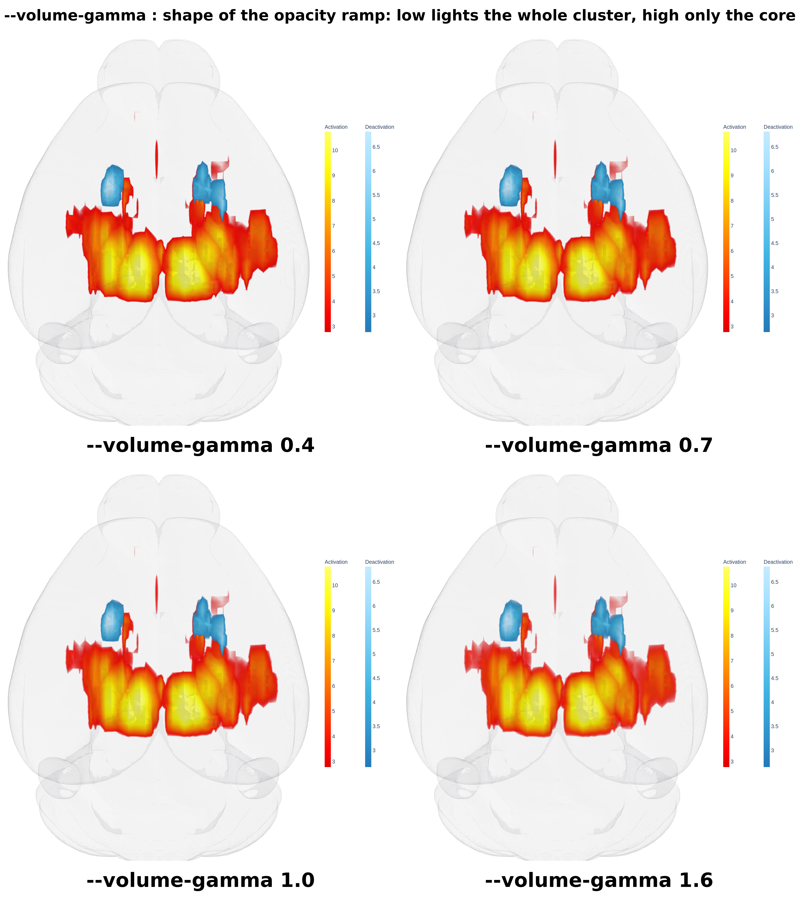

### `--volume-surfaces` — how many shells (default 200)

More shells = a smoother cloud and a **slower** render. 200 is both the default
and the ceiling.

> **If a render is taking too long, lower this first.** 100 is roughly twice as
> fast and very hard to tell apart.

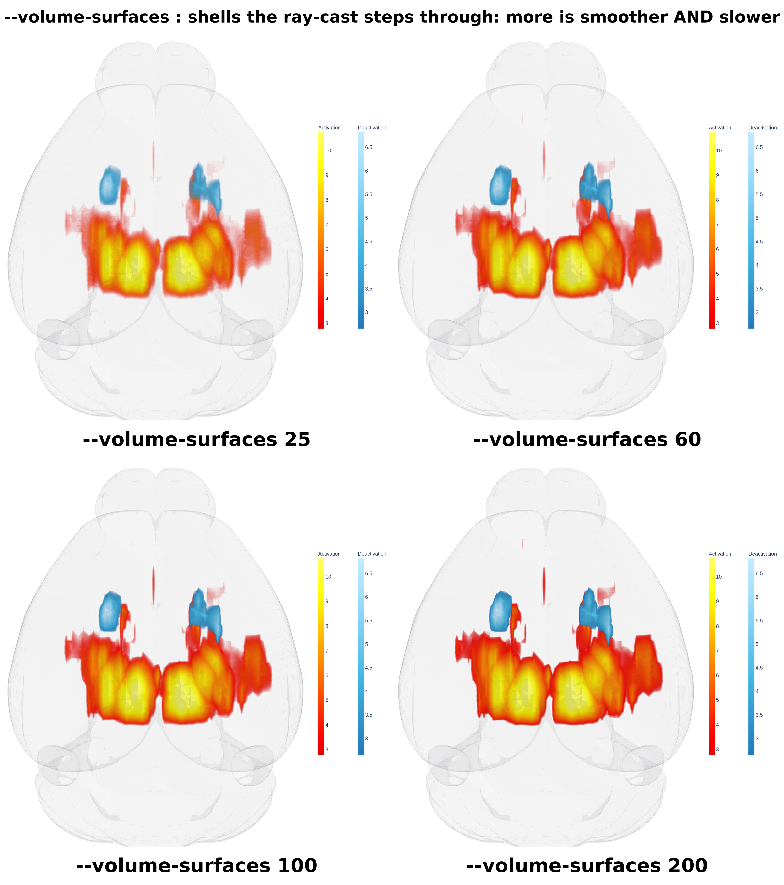

### `--ghost-opacity` / `--glass` — the brain shell

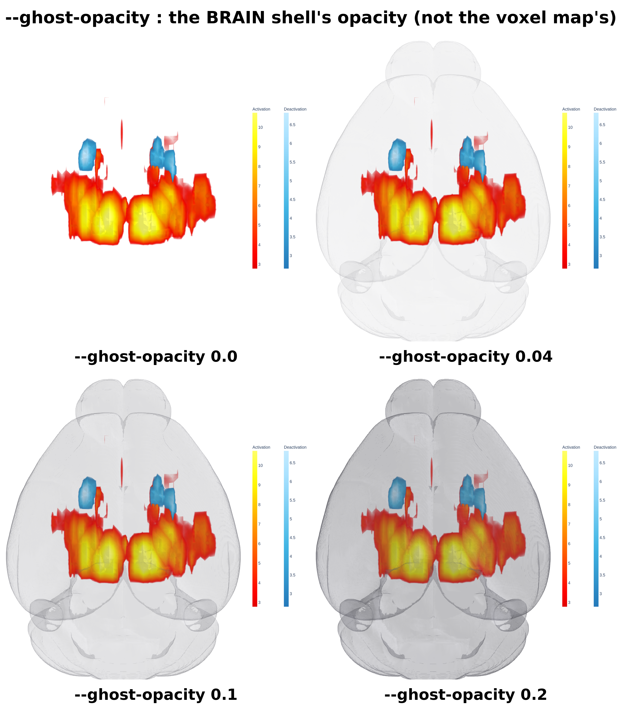

---

## 8. Several maps at once, and spec files

Repeat `--volume`; every per-map flag is repeatable too and matched **by
position**. Give a flag once and it applies to all maps.

```bash
hlplot volume --mesh brain.obj \
  --volume pos.nii.gz --volume-cmap hot32 --volume-name Activation \
  --volume neg.nii.gz --volume-cmap ice28 --volume-name Deactivation \
  --volume-threshold 3.1                       # one value -> both maps
```

For anything you want to keep, use a YAML spec:

```yaml
# maps.yaml
volumes:
  - path: mouse/Fig1_RM_Sham_pos_z_allen.nii.gz
    name: Activation
    cmap: hot32
    threshold: 3.1
    smooth_fwhm: [0.54, 0.11, 0.11]
    step: 7
  - path: mouse/Fig1_RM_Sham_neg_z_allen.nii.gz
    name: Deactivation
    cmap: ice28
    threshold: 3.1
    smooth_fwhm: [0.54, 0.11, 0.11]
    step: 7
```

```bash
hlplot volume --mesh brain.obj --volume-spec maps.yaml
```

### Precedence

> **CLI flag  >  spec entry  >  built-in default.**

A flag given on the command line overrides that key for **every** map in the
spec file, which is how you sweep one parameter without editing the file:

```bash
hlplot volume --volume-spec maps.yaml --volume-threshold 4.0
```

Valid spec keys: `path`, `name`, `cmap`, `threshold`, `top_percent`,
`percentile`, `range`, `smooth_fwhm`, `source_space`, `level`, `sign`,
`opacity`, `opacity_floor`, `gamma`, `surfaces`, `step`, `max_voxels`, `crop`,
`clamp_negative`. An unknown key is an error, not a silent no-op.

In Python the same thing accepts any of four forms:

```python
volumes="map.nii.gz"                       # one path
volumes=["pos.nii.gz", "neg.nii.gz"]       # several paths
volumes=[dict(path="pos.nii.gz", cmap="hot32", threshold=3.1)]
volumes="maps.yaml"                        # a spec file
```

---

## 9. Multi-view and export

Identical to the rest of `hlplot`:

```bash
hlplot volume --mesh brain.obj --volume pos.nii.gz \
  --multi-view "left,superior,posterior" \
  --multi-view-panel-size "700,700" \
  --no-html --export-image figure.png --image-dpi 300
```

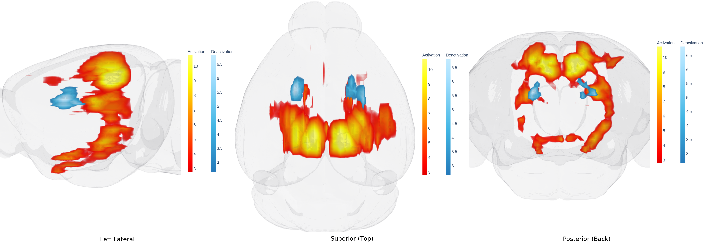

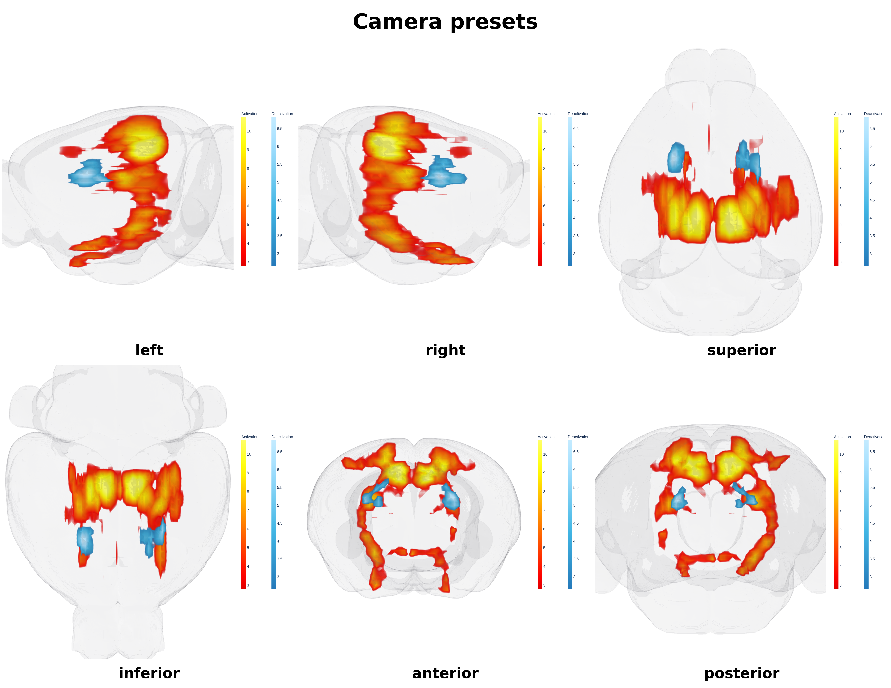

> **Use `--no-html` for voxel figures.** The interactive file carries the whole
> grid, so it is far larger than the PNG — see the appendix.

---

## 10. Appendix: how the grid works and what it costs

### What actually gets sent to the browser

Volume rendering is done by plotly's `go.Volume`, which needs a **regular grid**:
for every voxel it receives an `x`, a `y`, a `z` **and** a `value` — four full
arrays. So cost scales with the **voxel count**, not with `--volume-surfaces`.

`hlplot` reorders your data onto an axis-aligned world grid using the affine.
Permutations and flips are fine (the Allen affine is one). A genuine **rotation**
has no regular world grid and raises an error — resample first.

### Measured cost

| voxels | HTML | seconds per panel |
|---:|---:|---:|
| 56,000 | 18 MB | 27 |
| 127,000 | 22 MB | 42 |
| 439,000 | 42 MB | 107 |

Roughly **63 MB and 209 s per million voxels**. The projection is printed before
rendering, so a big job is a choice rather than a surprise.

### Nothing is downsampled unless you ask

A full-resolution 25 µm map is large. This study's positive map, *already
cropped to its bounding box*, is **25.4 M voxels** — about **1.6 GB of HTML and
90 minutes per panel**. `hlplot` will do it if you ask; it will not do it behind
your back.

Two ways to cut it down:

```bash
--volume-step 7          # take every 7th voxel along each axis
--volume-max-voxels 120000   # or state a budget and let it pick the step
```

**A coarse grid costs you nothing visually when you are smoothing.** With a
0.54 mm kernel, a step of 7 (175 µm) is indistinguishable from full resolution —
the blur is three times wider than the sampling either way. Every figure in this
tutorial uses `--volume-step 7`: 75,809 voxels, ~19 MB, ~28 s per panel.

### Cropping

On by default: the volume is trimmed to the bounding box of suprathreshold
voxels plus a 6-voxel margin. It only discards empty space — the picture is
identical — but on this map that alone is 77.0 M → 25.4 M voxels. The report
gives the box in voxels *and* world mm so you can check it against your 2-D
figures. `--no-volume-crop` turns it off.

---

## Regenerating the figures

```bash
cd test_files/tutorial_files/new_atlas_demo
python render_voxels.py            # -> docs/images/voxel/
```

## See also

* [`ALIGNMENT_CHECKS.md`](ALIGNMENT_CHECKS.md) — pre-flight checks for a new
  atlas/mesh pair
* [`COMBINED_VOXEL_NETWORK.md`](COMBINED_VOXEL_NETWORK.md) — voxel maps and a
  connectivity network in one figure
* [`MESH_CREATION_GUIDE.md`](MESH_CREATION_GUIDE.md) — turning a NIfTI into a
  surface
